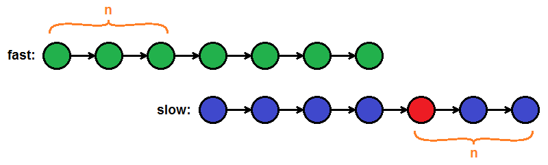
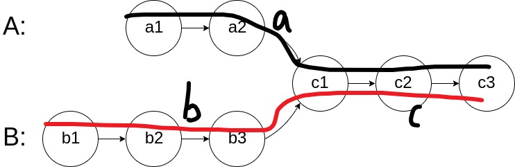

## [24. 两两交换链表中的节点](https://leetcode.cn/problems/swap-nodes-in-pairs/description/)

> 两两交换其中相邻的节点，并返回交换后链表的头节点

如图所示: 


=== "Java"

    ```java linenums="1"
    class Solution {
        public ListNode swapPairs(ListNode head) {
            if(head == null || head.next == null) return head;
            ListNode dummy = new ListNode(-1);
            dummy.next = head;
            ListNode prev = dummy, curr = head;
            while(curr != null && curr.next != null) {
                prev.next = curr.next;
                curr.next = prev.next.next;
                prev.next.next = curr;
                prev = curr; curr = curr.next;
            }
            head = dummy.next;
            return head;
        }
    }
    ```

=== "C++"

    ```c++ linenums="1"
    ListNode* swapPairs(ListNode* head) {
        if (!head || !head->next) return head;
        ListNode* dummy = new ListNode(0);
        dummy->next = head;
        ListNode* prev = dummy, * curr = head;
        while(curr && curr->next) {
            prev->next = curr->next; // step1
            curr->next = prev->next->next; // step2
            prev->next->next = curr; // step3

            prev = curr;
            curr = curr->next;
        }
        head = dummy->next;
        delete dummy;
        return head;
    }
    ```

## [19.删除链表的倒数第N个节点](https://leetcode.cn/problems/remove-nth-node-from-end-of-list/)

双指针，fast先移动n步，然后fast和low同时走，fast到结尾，此时slow指向要删除节点的前一个


=== "Java"

    ```java linenums="1"
    class Solution {
        public ListNode removeNthFromEnd(ListNode head, int n) {
            ListNode f = head, s = head;
            for(int i = 0; i < n; i ++) f = f.next;
            if(f == null) return head.next;
            while(f.next != null)  {
                f = f.next; s = s.next;
            }
            s.next = s.next.next;
            return head;
        }
    }
    ```

=== "C++"

    ```c++ linenums="1"
    ListNode* removeNthFromEnd(ListNode* head, int n) {
        ListNode* fast = head, *slow = head;
        for (int i = 0; i < n; i ++) fast = fast->next;
        if(!fast) return head->next;
        while(fast->next) fast = fast->next, slow = slow->next;
        slow->next = slow->next->next;
        return head; 
    }
    ```

## [160.链表相交](https://leetcode.cn/problems/intersection-of-two-linked-lists/description/)

**很巧妙的方法: 一个从A走，一个从B走，谁先走到空，再绕到另一个开头走**

- 定会相交的起始节点碰面（即$a + c + b = b + c + a$）




=== "Java"

    ```java linenums="1"
    public class Solution {
        public ListNode getIntersectionNode(ListNode headA, ListNode headB) {
        ListNode p = headA, q = headB;
        while(p != q) {
                p = p != null ? p.next : headB;
                q = q != null ? q.next : headA;
            }
            return p;
        }
    }
    ```

=== "C++"

    ```c++ linenums="1"
    ListNode *getIntersectionNode(ListNode *headA, ListNode *headB) {
        ListNode*p = headA, *q = headB;
        while(p != q) {
            p = p ? p->next : headB; 
            q = q ? q->next : headA;
        }
        return p;
    }
    ```

## [142.环形链表II](https://leetcode.cn/problems/linked-list-cycle-ii/)

Q: 如何判断有环？ 判断出了如何找环的入口?

- 快慢指针: 快的每次走两个，慢的走一个，若相遇则存在环
- 找入口 --> [动图参考](https://code-thinking.cdn.bcebos.com/gifs/142.%E7%8E%AF%E5%BD%A2%E9%93%BE%E8%A1%A8II%EF%BC%88%E6%B1%82%E5%85%A5%E5%8F%A3%EF%BC%89.gif), **太妙了!!**
    * 头结点出发一个指针，相遇节点也出发一个指针，每次均只走一个节点，当两指针相遇即环形入口的节点 

=== "Java"

    ```java linenums="1"
    public class Solution {
        public ListNode detectCycle(ListNode head) {
            ListNode f = head, s = head;
            while(f != null && f.next != null) {
                f = f.next.next;
                s = s.next;
                if(s == f) {
                    ListNode idx1 = f, idx2 = head;
                    while(idx1 != idx2) {
                        idx1 = idx1.next;
                        idx2 = idx2.next;
                    }
                    return idx1;
                }
            }
            return null;
        }
    }
    ```

=== "C++"

    ```c++ linenums="1"
    ListNode *detectCycle(ListNode *head) {
        ListNode* fast = head, *slow = head;
        while(fast && fast->next) {
            slow = slow->next, fast = fast->next->next;
            if (slow == fast) {
                ListNode* idx1 = fast, *idx2 = head;
                while(idx1 != idx2) idx1 = idx1->next, idx2 = idx2->next;
                return idx1;
            }
        }
        return nullptr;
    }
    ```