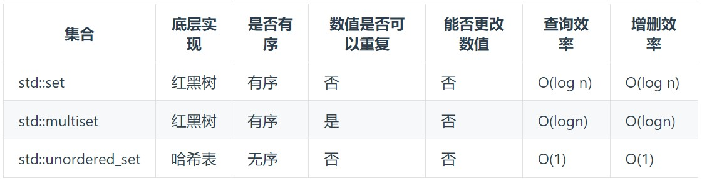

## 介绍

> HashTable: 用来快速判断一个元素是否出现在集合中

用哈希法，一般选择三种数据结构: 

- 数组：长度受到限制，若元素少而哈希值大则造成内存空间泄露
- set(集合)：里面放的只能是一个key
- map(映射)：`<key, value>`的存储结构

在C++中，set 和 map 分别提供三种数据结构: 


总：**当要使用集合来解决哈希问题的时候，优先使用`unordered_set`**，因为它的查询和增删效率是最优的，如果需要集合是 **有序** 的，那么就用`set`，如果要求不仅 **有序还要有重复数据** 的话，那么就用`multiset`

## [242.有效的字母异位词](https://leetcode.cn/problems/valid-anagram/description/)

> 判断字符串s是否可以通过改变顺序的方式变成字符串t

**思路：映射到26bits的数组即可(`a:0,b:1...`)**，对每个s中的元素在数组中对应加1，对t的每个元素在数组中对应减1。若可以转变，则数组应该都为0，返回true，否则返回false  --> [动图Ref](https://code-thinking.cdn.bcebos.com/gifs/242.%E6%9C%89%E6%95%88%E7%9A%84%E5%AD%97%E6%AF%8D%E5%BC%82%E4%BD%8D%E8%AF%8D.gif)

=== "Java"

    ```java linenums="1"
    class Solution {
        public boolean isAnagram(String s, String t) {
            int[] h = new int[26];
            for(int i = 0; i < s.length(); i ++) h[s.charAt(i) - 'a'] ++;
            for(int i = 0; i < t.length(); i ++) h[t.charAt(i) - 'a'] --;
            for(int i = 0; i < 26; i ++)
                if(h[i] != 0) return false;
            return true;
        }
    }
    ```

=== "C++"

    ```c++ linenums="1"
    bool isAnagram(string s, string t) {
        int hash[26] = {0};
        for (int i = 0; i < s.size(); i ++) hash[s[i] - 'a'] ++;
        for (int i = 0; i < t.size(); i ++) hash[t[i] - 'a'] --;
        for (int i = 0; i < 26; i ++ )
            if (hash[i]) return false;
        return true;
    }
    ```

## [349.两个数组的交集](https://leetcode.cn/problems/intersection-of-two-arrays/description/)

1、最直接的思路: **排序+双指针**  --> 时间$O(n^2)$

=== "Java"

    ```java linenums="1"
    class Solution {
        public int[] intersection(int[] nums1, int[] nums2) {
            Arrays.sort(nums1); Arrays.sort(nums2);
            int idx1 = 0, idx2 = 0, idx = 0;
            int [] arr = new int[1010];
            while(idx1 < nums1.length && idx2 < nums2.length) {
                if(nums1[idx1] == nums2[idx2]) {
                    if(idx == 0 || arr[idx - 1] != nums1[idx1])
                        arr[idx ++] = nums1[idx1];
                    idx1 ++; idx2 ++;
                }
                else if(nums1[idx1] < nums2[idx2]) idx1 ++;
                else idx2 ++;
            }
            return Arrays.copyOfRange(arr, 0, idx);
        }
    }
    ```

=== "C++"

    ```c++ linenums="1"
    vector<int> intersection(vector<int>& nums1, vector<int>& nums2) {
        sort(nums1.begin(), nums1.end()), sort(nums2.begin(), nums2.end());
        int idx1 = 0, idx2 = 0;
        vector<int> res;
        while(idx1 < nums1.size() && idx2 < nums2.size()) {
            if (nums1[idx1] == nums2[idx2]) {
                if (!res.size() || res.back() != nums1[idx1]) //保证唯一
                    res.push_back(nums1[idx1]);
                idx1 ++, idx2 ++;
            }
            else if (nums1[idx1] < nums2[idx2]) idx1 ++;
            else idx2 ++;
        }
        return res;
    }
    ```

2、哈希

=== "Java"

    ```java linenums="1"
    class Solution {
        public int[] intersection(int[] nums1, int[] nums2) {
            int[] h1 = new int[1010];
            int[] h2 = new int[1010];
            for(int c : nums1) h1[c] ++;
            for(int c : nums2) h2[c] ++;
            int[] res = new int[1010];
            int idx = 0;
            for(int i = 0; i < 1010; i ++) {
                if(h1[i] != 0 && h2[i] != 0) res[idx ++] = i;
            }
            return Arrays.copyOfRange(res, 0, idx);
        }
    }
    ```
=== "Java-HashSet"

    ```java linenums="1"
    class Solution {
        public int[] intersection(int[] nums1, int[] nums2) {
            Set<Integer> s1 = new HashSet<Integer>();
            Set<Integer> s2 = new HashSet<Integer>();
            for(int i = 0; i < nums1.length; i ++) s1.add(nums1[i]);
            for(int i = 0; i < nums2.length; i ++) 
                if(s1.contains(nums2[i])) s2.add(nums2[i]);
            int [] res = new int[s2.size()];
            int idx = 0;
            for(int c : s2) res[idx ++] = c; 
            return res;
        }
    }
    ```

=== "C++"
    
    - `unordered_set`读写效率是最高的，不需要对数据进行排序，而且数据不重复 
    - `unordered_set::find` --> `iterator find ( const key_type& k );` 
        * 在容器中搜索以k为值的元素，若没找到返回一个迭代器`unordered_set::end`(超过容器末尾的元素)。

    ```c++ linenums="1" hl_lines="2"
    vector<int> intersection(vector<int>& nums1, vector<int>& nums2) {
        unordered_set set(nums1.begin(), nums1.end()), res;
        for (int item : nums2) {
            if (set.find(item) != set.end()) 
                res.insert(item);
        }
        return vector<int> (res.begin(), res.end());
    }
    ```

## [202.快乐数](https://leetcode.cn/problems/happy-number/description/)

1. 对n进行求和，赋给另一个数，循环判断是否为1
```c++ linenums="1"
int getSum(int n) {
    int res = 0;
    while(n) {
        int t = n % 10;
        res += t * t;
        n /= 10;
    }
    return res;
}
bool isHappy(int n) {
    int num1 = n, num2 = getSum(n);
    while (num1 != num2) {
        num1 = getSum(num1);
        num2 = getSum(getSum(num2));
    }
    return num1 == 1;
}
```
2. 哈希

=== "Java"

    ```java linenums="1"
    class Solution {
        public int getSum(int n) {
            int sum = 0;
            while( n != 0) {
                int t = n % 10; sum += t * t; n /= 10;
            }
            return sum;
        }
        public boolean isHappy(int n) {
            Set<Integer> s = new HashSet<Integer>();
            while(n != 1 && !s.contains(n)) {
                s.add(n);
                n = getSum(n);
            }
            return n == 1;
        }
    }
    ```

=== "C++"
    
    - `unordered_set::count` --> `size_type count ( const key_type& k ) const;`
        * 在容器中搜索值为k的元素，并返回找到的元素个数。因`unordered_set`不允许重复的值，意味着如果容器中存在具有重复值的元素，则函数实际上返回1，否则返回0。

    ```c++ linenums="1" hl_lines="2"
    bool isHappy(int n) {
        unordered_set<int> set;
        while(n != 1 && !set.count(n)) {
            set.insert(n);
            n = getSum(n);
        }
        return n == 1;
    }
    ```


## [1.两数之和](https://leetcode.cn/problems/two-sum/description/)

1、暴力 --> 时间复杂度$O(n^2)$

=== "Java"

    ```java linenums="1"
    class Solution {
        public int[] twoSum(int[] nums, int target) {
            int idx[] = new int[2];
            for(int i = 0; i < nums.length; i ++) {
                for(int j = i + 1; j < nums.length; j ++) {
                    if(nums[i] + nums[j] == target) {
                        idx[0] = i; idx[1] = j;
                    }
                }
            } 
            return idx;
        }
    }
    ```

=== "C++"

    ```c++ linenums="1"
    vector<int> twoSum(vector<int>& nums, int target) {
        for (int i = 0; i < nums.size(); i ++) {
            for(int j = i + 1; j < nums.size(); j ++) {
                if (nums[i] + nums[j] == target) return {i, j};
            }
        }
        return {};
    }
    ```


2、 利用哈希 

=== "Java"

    ```java linenums="1"
    class Solution {
        public int[] twoSum(int[] nums, int target) {
            Map<Integer, Integer> map = new HashMap<>();
            int [] res = new int[2];
            for(int i = 0; i < nums.length; i ++) {
                if(map.containsKey(target - nums[i])){
                    res[0] = map.get(target - nums[i]);
                    res[1] = i;
                    return res;
                }
                map.put(nums[i], i);
            }
            return res;
        }
    }
    ```

=== "C++"
    
    - 不需要key有序，用`std::unordered_map`
        * 结构为{key:数据元素,value:数组元素对应的下标}

    ```c++ linenums="1" hl_lines="2"
    vector<int> twoSum(vector<int>& nums, int target) {
        unordered_map<int, int> hashtable;
        for (int i = 0;i < nums.size();i ++) {
            auto item = hashtable.find(target - nums[i]);
            if (item != hashtable.end()) return {item->second, i};
            hashtable[nums[i]] = i;
            // 或 hashtable.insert(pair<int, int>(nums[i], i));
        }
        return {};
    }
    ```


