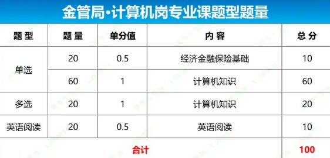

> National Financial Regulatory Administration(金融监管局)，是中华人民共和国国务院于2023年5月设立的，主管银行、保险等行业监督管理工作的国务院直属机构，之前叫银保监会

## 考试大纲

> 金融监管计算机类考试侧重考察信息技术理论与实务，包括信息系统架构、软件工程与项目管理、数据库与数据挖掘分析、网络技术及应用、信息安全及信息科技风险管理等
>
> 行测：申论：专业 = 25%、25%、50%



**重点**：

- 计算机网络和信息安全 （20分+）
- 数据库和数据挖掘（15+）
- 软件工程和项目管理（15+）

## 试题摘录

### 18年

24.结构化程序设计主要强调的是 **^^程序的易读性^^**，而非程序的规模

- PS: 结构化程序设计 = 清晰的结构 + 模块化 + 不用goto

33.操作系统中最基本的两个特征 **^^并发和共享^^**

- 并发：指多个程序在同一时间段内运行（宏观上同时，微观上交替）
- 共享：指系统中的资源（CPU、内存、I/O设备等）可供多个并发执行的进程共同使用
- PS. 虚拟并不是最基本的(重要的特征), 如虚拟内存、虚拟CPU是为了更好地实现并发与共享而采用的技术手段

38.软件开发过程中，抽取和整理用户需求并建立问题域精确模型的过程叫 **^^面向对象分析^^**

- OOA（面向对象分析）：建立问题域的对象模型；
- OOD（面向对象设计）：将模型转化为解域的架构；
- OOP（面向对象程序设计）：编码实现

39.提高软件质量和可靠性的技术大致可分为两大类:其中一类就是避开错误技术，但避开错误技术无法做法完美无缺和绝无错误，这就需要(**容错**)，选成了（检测错误），不应该!

!!! Note ""

    42.软件设计阶段一般又可分为()
    
    A.逻辑设计与功能设计；B.概要设计与详细设计 ✅
    
    C.概念设计与物理设计；D.模型设计与程序设计
    
    - 概要设计（架构设计、模块划分、接口定义）
    - 详细设计（模块内部算法、数据结构、流程图等）
    - 概念设计与物理设计 （属于数据库设计）

46.常用于找出导致项目问题产生的潜在原因的质量管理工具是(**鱼骨图**)

- [鱼骨图](https://www.processon.com/fishbone)又叫因果图、石川图，是以鱼骨架一样的图形形式，将问题的原因进行分解，从而帮助识别问题的根本原因

48.数据库中概念模型是现实世界的第一层抽象，这一类模型中最著名的是（**实体关系/ER模型**）

- **基本数据模型**:是按计算机系统的观点对数据建模，是现实世界数据特征的抽象用于 DBMS 的实现。基本数据模型有:层次模型、网状模型、**关系模型**

51.只有出现并发操作时，才有可能出现死锁 ✅

- 死锁的本质是多个事务并发执行时，因互相等待对方释放资源而造成的永久阻塞

!!! Note ""

    52.关系数据库中的关系要满足第一范式，下面"部门"关系中，因(  )属性而使它不满足第一范式。部门(部门号，部门名，部门成员，部门总经理)
    
    A.部门总经理; B.部门成员; C.部门名; D.部门号

    **第一范式: 每个字段必须是原子值，不可再分**

    - "部门成员"通常存储一组人名（如"张三,李四"），属于可重复、多值集合，违背原子性

    范式：**1NF 拆原子，2NF 拆部分，3NF 拆传递，BCNF 拆决定，4NF 拆多值** 

    | 范式       | 一句话背记              | 违反的典型例子            | 解决口诀         |
    | -------- | ------------------ | ------------------ | ------------ |
    | **1NF**  | 字段原子不可分            | 同一格存“张三,李四”        | 拆列或拆行        |
    | **2NF**  | 非主属性必须完全依赖整个主键 | 主键(学号,课号)→成绩√；→姓名× | 把"部分依赖"抽出新表  |
    | **3NF**  | 消除传递依赖         | 学号→系号→系名           | 把"系名"抽到系表    |
    | **BCNF** | 每个决定因素都是超键(消除主属性对码的部分和传递依赖) | 教师→课程，但教师不是超键 | 继续拆，让左侧必含候选键 |
    | **4NF**  | 消除多值依赖       | 学生→电话，学生→爱好，两列互相独立 | 一列一表，各存各的    |


53.SQL语言中，建立视图后，数据字典存放的是(**视图的定义**)

- 建立视图时，DBMS 只把 **视图的定义（即 SELECT 语句）** 存进数据字典，**视图数据并不实际存储，下次查询再按定义实时生成结果**

!!! Warning ""

    54.数据仓库中，以下( )项不属于 OLAP 的基本操作
    
    A.上钻 B.下钻 C.切片 D.平移

    - OLAP 经典五大操作是：^^钻取（上钻/下钻）、切片、切块、旋转（Pivot）^^

60.Window中，跟踪到达某主机的命令：`tracert` (Trace Route)

- `netstat` : 列出本机所有 TCP/UDP 连接与监听端口
- `route`: 只看/改本机路由表

```shell
PS C:\Windows\System32> tracert www.baidu.com
通过最多 30 个跃点跟踪
到 www.a.shifen.com [39.156.70.46] 的路由:

  1     4 ms     2 ms     3 ms  172.16.92.1
  2     7 ms     4 ms     2 ms  10.1.5.254
  3     2 ms     3 ms     2 ms  10.254.2.105
  4     2 ms     1 ms     3 ms  10.254.2.145
  5     *        4 ms     2 ms  10.254.1.34
  6     8 ms     3 ms     5 ms
```

!!! Note ""

    73.某项目为了修正一个错误而进行了修改。错误修改后，还需要进行( )以发现这一修改是否引起原本正确运行的代码出错。

    A.单元测试; B.接收测试; C.安装测试; D.回归测试

    - 改完bug后，重新执行已有测试用例，确认"旧代码"是否被新改动带崩，即 **回归测试**

79.连接两个TCP/IP局域网要求( **路由器** )硬件，并不需要 ^^网桥和集线器^^

- 路由器工作在网络层（第3层），能够根据 IP 地址在不同局域网（LAN）之间转发数据包，实现跨子网通信，是连接两个 TCP/IP 局域网的核心硬件。**交换机**: 数据链路层，基于MAC地址(仅限同一局域网内部)；**集线器**: 物理层，广播所有数据

!!! Note ""

    85.需求获取是从用户、客户等人群中选择系统需求的过程。以下属于需求获取方法的有()
    
    A.头脑风暴法✅ B.蒙特卡洛法 C.会谈✅ D.调查问卷✅

    - **蒙特卡洛法** → 随机模拟算法，用于风险/性能分析

88.数据仓库初期建设过程主要包括 **^^数据抽取、数据转换、数据清洗、数据装载^^**

89.在数据库中，并发操作会带来的数据不一致性有()

- A.丢失修改✅ B.不可重复读✅ C.读脏数据✅ D.死锁

92.访问控制列表(ACL)是利用 **交换机** 实现安全管理的重要手段。利用ACL能实现的功能是()
 
- A.限制MAC地址✅ B.限制IP地址✅ C.限制TCP端口✅ D.限制数据率

- ACL是由一条或多条规则组成的集合（本质:报文过滤器）, 设备通过应用ACL来阻止和允许特定流量的流入和流出


### 19年

NAT的基本思路是IP地址重用，以缓解IP地址短缺 ✅

- **NAT网络地址转换**：内网IP --> NAT设备转成公网IP

!!! Note ""

    **SQL注入安全防范措施**：

    A. 防止重要参数被篡改 ❎  B. 替换或删除敏感的字符或字符串✅

    C. 将动态SQL语句替换为存储过程✅ D. 对输入内容进行转义处理✅

    A属于应用层安全控制，比如使用签名、加密、校验和等手段防止参数在传输过程中被篡改。虽有助于整体安全，但不直接防止SQL注入，因为SQL注入是通过构造恶意输入在服务器端拼接SQL语句实现的 

**数据仓库** 是一个 ^^面向主题的、集成的、相对稳定的(非易失的)、反映历史变化的(时变的)^^ 数据集合，用于支持企业或组织的决策分析处理

某主机开放了25和110端口，最可能是：**邮件服务器**

> Port 25 is used for sending emails via SMTP, while port 110 is used for receiving emails with POP3. PS. **DNS: 53**

!!! Note "数据处理"

    === "题目" 
    
        71.从时间、地区和高品种类三个维度来分析某电器商品销售数据属于（ ）。

        A.ETL. B.OLAP C.OLTP D.Data Mining

    === "分析"

        多维分析，即从多个角度对数据进行汇总、切片、钻取等操作

        A.ETL = Extract-Transform-Load

        - 数据仓库的预处理过程：**抽取、转换、加载(为分析做准备)**

        B. OLAP = On-Line **Analytical** Processing （联机分析处理）

        C. OLTP = On-Line Transaction Processing

        - 联机事务处理，如银行转账等高频、低延迟的增删改操作(面向业务)

        D. Data Mining数据挖掘，从大量数据中自动发现隐藏模式、规律或知识，如聚类、分类、预测、关联规则等

**软件维护**：

- 适应性维护：为使软件适应外部环境变化（OS、DB、硬件、法规等）
- 完善性维护：**增强性能、可维护性、功能扩展等**，满足用户新需求或提升质量
    * e.g. 针对软件在运行期的数据特点，修改其排序算法使其高效 (**完善性维护**)

软件需求分析阶段：^^需求获取、需求分析、编写需求规格说明书、**需求评审**^^

!!! Note ""

    === "题目"

        61.（）调度算法有利于CPU繁忙型的作业，而不利于I/O繁忙型的作业

        A.时间片轮转 B.先来先服务 C.短作业（进程）D.优先权

    === "分析"

        - CPU 繁忙型：长时间占用 CPU 进行计算，很少发起 I/O 请求
        - I/O 繁忙型：频繁地读写磁盘、网络等，CPU 区间很短，大部分时间处于等待 I/O 完成而阻塞的状态

        利于CPU即：调度算法一旦把CPU分配给某个进程，就会让它长时间连续运行，不会频繁切换，明显是B


在关系代数运算中，五种基本运算为：**^^并、差、选择、投影、笛卡尔积^^**

版本管理是对系统不同的版本进行 **^^标识和跟踪^^** 的过程

!!! Warning ""

    === "题目"

        33.为有效捕获系统需求、软件开发模型适合采用（ ）
        
        A.瀑布模型 B.V模型 C.原型模型 D.增量模型

    === "解析"

        原型模型通过快速构建可运行的“样品”让用户试用、反馈，再迭代细化，从而有效捕获真实需求

        - 瀑布、V 模型都要求需求一次性冻结，不适合需求模糊的场景
        - 增量模型虽可分批交付，但第一增量前仍需较完整的需求基线

如果I/O操作所花费的时间比CPU处理时间短得多，则缓冲区 **^^几乎无效^^**

- **缓冲区的根本作用是掩盖I/O比CPU慢带来的速度差距**

### 20

!!! Note "RAID"

    === "25RAD容量"
    
        用3块容量是1T的硬盘做RAID5阵列，则这个阵列的容量是（**2T**）

        ---

        **RAID(独立磁盘冗余阵列)**: 把多块硬盘按不同策略组合成一个逻辑盘组，获得更大容量、更高性能、更强容错能力的一种存储技术

          - **条带化**：把数据切成块，分散写到多块盘，可并行读写，提高吞吐
          - **镜像**：同一份数据写两份或多份，盘坏一块也不丢数据
          - **奇偶校验**：用数学算法生成冗余信息，坏盘时可根据其余盘“算”回丢失数据，节省镜像所需的50%空间
        
        RAID5容量公式：**^^总容量=(N-1) × 单盘容量^^**，其中N为盘数
        
        - RAID只能应对磁盘物理损坏，对误删、病毒、勒索软件、火灾盗窃等或场地灾难无效

    === "48HDFS"

        HDFS用来为大数据提供可靠存储，以下不属于HDFS高可靠性与可用性机制的是()

        A. 数据冗余存储 B.副本存放策略 C.RAID❎ D.数据容错与恢复机制

        ---

        HDFS: Hadoop Distributed File System，专为"一次写入、多次读取"的大文件而设计

        - A. 数据冗余存储——默认3副本，是HDFS最核心的可靠性手段
        - B. 副本存放策略——第一副本本地，第二副本异机架，第三副本与第二同机架不同节点，防止整机架断电/掉线
        - D. 数据容错与恢复机制——DataNode定期心跳与块报告，NameNode发现副本数不足即自动触发再复制，丢失块可自动恢复到目标副本系数

    === "99磁盘阵列"

        在金融行业中，可有效降低软硬件故障带来的网络和系统稳定性风险的手段包括()

        A.系统和数据备份 B.磁盘阵列 C.双机热备 D.服务器集群

    === "99解析"

        **磁盘阵列**: 主要解决"单块硬盘物理损坏"导致的数据丢失或停机，对软硬件故障中的存储节点失效确实有效；但它既不能防止服务器整机宕机，也不能防止网络、操作系统或应用层故障

        答案ABCD，B在金融级高可用架构里，它属于基础局部保护

27.UML提供的实体中，哪一个是最基本的需求分析模型（）

- A.部署视图 B.进程视图 C.逻辑视图 D.用例视图 ✅
    * 逻辑视图（类、对象、协作）是设计阶段产物
    * 进程视图：关注运行期线程/进程并发
    * 部署视图：解决硬件节点与软件映射，均属设计/实施视角

!!! Note ""

    28.以下关于网络存储的叙述，不正确的是（ ）
    
    A.NAS设备可有自己的OS  B.FCSAN的网络介质为光纤通道
    
    C.IPSAN使用标准的以太网 D.DAS支持跨平台文件共享功能 ❎

    ---

    - NAS(Network-Attached Storage)本质是一台精简的专用服务器，运行嵌入式OS
    - FCSAN(Fibre Channel Storage Area Network)使用FC协议和光纤/铜缆FC通道，与以太网物理层不同
    - IPSAN(IP-based Storage Area Network)用标准TCP/IP以太网承载 iSCSI 协议，无需专用 FC 设备
    - DAS(Direct-Attached Storage)只是“本地磁盘”或“JBOD”，通过 SAS/SATA/FC 线缆直接连到一台主机，由该主机的本地文件系统管理
        * PS. 磁盘连续捆束阵列(JBOD, Just a Bunch Of Disks) 

30.微服务: **提倡轻量级的通信方式**

> 微服务（Microservices）是一种把单一应用拆成一组极小型、独立部署、自治服务的架构风格。每个服务围绕单一业务功能构建，跑在自己的进程里，通过轻量协议（HTTP/REST、gRPC、消息队列）通信，可独立开发、测试、部署、扩容、重构，甚至用不同语言/数据库

A.与 SOA 相比，微服务粒度要粗一些 ❎  （微服务是 SOA 的细粒度演进）

> SOA（Service-Oriented Architecture，面向服务的架构）一种把企业级 IT 系统拆成“服务”的软件架构风格

C. 微服务需要企业服务总线支持服务间通信 ❎

- 经典SOA才依赖 **ESB（企业服务总线）** 做集中路由、协议转换

!!! Note ""

    32.下列哪个设计策略有助于提升系统的性能？（ ）
    
    A.分层结构 B.事务机制 C.主动冗余 D.队列调度

    ---

    - A降低耦合、提高可维护性，提升可扩展性，对吞吐量无直接收益
    - B保证 ACID，提升一致性/可靠性（锁、日志、两阶段提交都会增加开销）
    - C热备/集群，提升可用性/容错
    - D.请求先入队，后端按需并发/削峰处理 ✅

33.MVC架构，业务数据和业务逻辑主要是由（**模型**）负责

- 模型（Model）：保存业务数据 + 实现业务规则/逻辑
- 视图（View）：只负责展示数据，不加工业务
- 控制器（Controller）：接收输入、调用模型、选择视图，不包含业务规则

35.虚拟存储器发生页面失效时，需要进行外部地址变换 （**虚地址到辅存物理地址**）

> CPU 发出的虚拟地址在 MMU 查页表 时发现 有效位＝0 → 该页不在实存RAM中
>
> 操作系统作为异常处理者，需要做“外部地址变换”——即 把缺失页从辅存（磁盘 swap 区 或 可执行文件）读进物理内存，并更新页表

38.ITIL（信息科技基础设施库）的最核心模块是（ **服务管理** ）

> ITIL核心思想是将IT服务作为业务驱动的核心

46.（**IS审计师**）应主要负责在新系统正式使用前对数据准确性和完整性进行审阅并签字

50.**差异备份** 包括 ^^上次完全备份之后^^ 修改的数据库内容，但通常不包含日志等其他内容

51.**日志文件中检查点记录** : 提高系统出现故障后的恢复效率

- 日志必须按事务实际执行的顺序记录（即 **先写日志原则**，Write-Ahead Logging，WAL），否则无法保证一致性恢复。这是数据库恢复机制的核心要求
- 系统故障恢复必须使用日志文件以保证数据库系统重启时能正常恢复，事务故障恢复不一定需要使用日志文件 ❎
    * 事务故障（如死锁、用户回滚）：需要undo日志来回滚未提交事务
    * 系统故障：需要redo/undo日志来恢复已提交未写入磁盘的事务，回滚未提交事务

53.数据库中对未提交更新的依赖（即脏数据的读出）是事务的 **隔离性** 遭到了破坏

> 脏读（Dirty Read） 是指一个事务读到了另一个未提交事务修改的数据

54.机器学习的非监督学习算法：^^聚类(K-means、DBSCAN)、降维（如 PCA、t-SNE）^^

- 非监督: 训练数据没有标签，目标是发现数据中的结构、模式或分布
- 监督学习：训练数据由标签，目标是学习从输入到输出的映射
    * 分类（决策树、SVM、随机森林）和回归（线性回归）

!!! Note ""

    59.某网络的 IP 地址空间为 192.168.5.0/24，采用定长子网划分，子网掩码为255.255.255.248，则该网络中的最大子网个数、每个子网的最大可分配地址个数分别是 ( )
    
    A.32、8 B.32、6 C.8、32 D.8、30

    ---

    ```
    原网络：192.168.5.0/24
    掩码 255.255.255.0 → 主机位 8 位
    新掩码：255.255.255.248
    248 = 11111000₂ → 主机位 3 位，子网位 5 位。
    最大子网数：2⁵ = 32 个（定长划分，全 0 全 1 子网均可用）
    每个子网可用地址：2³ – 2 = 6 个（减去全 0 网络地址、全 1 广播地址）
    ```

61.网络物理隔离是指 **两个网络间链路层、网络层在任何时刻都不能直接通讯**

64.减少信息系统的 **社会工程攻击事件**，最有效的措施是（ ）

- A.强化数据的物理访问控制 B.安装数据库审计软件 C.所有员工的安全意识培训✅ D.监控员工邮件

!!! Note "70.漏洞检查与渗透测试"

    **漏洞检查通过分析IT基础构架来检测漏洞，而渗透测试则利用漏洞来分析可能对信息系统的破坏**
    
    - 漏洞检查是“找门”——扫描、识别系统存在的安全缺陷
    - 渗透测试是“进门”——手工或工具实际利用漏洞，验证其危害并展示破坏路径

    > 渗透测试是一种黑盒安全测试方法，安全专家通过模拟真实黑客的技术手段对目标进行漏洞检测，突破系统的安全防护手段，深入评估漏洞可能造成的实际影响

72.数据资产所有者履行安全责任的首要任务是（**确定数据的敏感性等级**）

!!! Note ""

    77.为了满足企业业务持续运作的要求，对数据的备份时间间隔不能超过在灾难情形下业务所要求的（ ）
    
    A.恢复点目标（RPO）✅ B.恢复时间目标（RTO） C.服务水平目标（SLO） D.系统年平均无故障时间

    ---
    
    - **RPO(Recovery Point Objective)**——“能丢多少数据”，即灾难发生后可接受的数据丢失量对应的时间长度。备份间隔必须 ≤ RPO，才能保证恢复时数据不会“丢过头”
        * e.g.如果RPO要求是4小时，那么备份间隔就不能超过4小时，以确保灾难发生时最多只丢失4小时的数据 
    - RTO 关注“多长时间能恢复业务”，与备份间隔无关；它关注的是系统宕机的时间长度，而不是数据的丢失量

82.在分布式数据框架下，下列哪些方法可以提升系统的可扩展性？（ **ABCD** ）

- A.数据复制 B.数据垂直切分 C.数据水平切分 D.缓存

```
数据复制: 
    - 将同一份数据复制到多个节点上
    - 通过增加副本节点，可以水平扩展读能力
    - 支持更多并发读请求
数据垂直切分：将一个表按列（字段）拆分成多个子表，不同列存储在不同节点或数据库中
- 通过将不同业务数据分散到不同节点，可以独立扩展各个模块，提升整体系统扩展能力
数据水平切分：将一个表按行（记录）拆分成多个子表，分散存储在不同节点上
- 这是最核心的扩展手段之一。通过增加分片节点，可以线性扩展系统的存储和处理能力
- e.g. 用户表按用户ID分10个分片，分布在10台服务器上，数据量和请求量均可扩展
缓存：将热点数据存储在高速存储（如内存）中，减少后端数据库访问
    - 缓存本身不直接扩展存储容量
    - 但通过减轻后端压力，使系统能够用更少的数据库资源支撑更高的并发
    - 间接提升系统的可扩展性
```

PS: 有两个扩展性: Extensibility和Scalability

> Extensibility指软件的设计质量，即系统是否易于添加新功能或修改现有功能，而无需修改大量现有代码或破坏现有结构。它关注的是系统的灵活性和可维护性（软件工程的设计原则）
>
> Scalability系统处理不断增长的工作负载的能力。当负载增加时（例如用户数、数据量、请求量增加），系统能否通过增加资源（如更多的服务器）来平滑地提升其性能（如吞吐量、响应速度）。它关注的是系统的性能和容量

83.提高关系型数据库性能的一种方式是建立数据库集群，以下哪些是在数据库集群中经常用到的技术方案？（ **ABCD** ）
 
- A.虚拟化 B.读写分离 C.分库分表 D.缓存

> **数据库集群**：由多个数据库节点（服务器）组成的统一系统，通过网络协同工作，共同提供数据存储、查询、高可用、高性能等服务

```
虚拟化: 通过虚拟机或容器（如VMware、KVM、Docker）将物理资源抽象为多个逻辑实例
    - 数据库集群节点常部署在虚拟机或容器中,构建集群的基础支撑技术
    - 并不能提升性能，但问的是“数据库集群中经常用到的技术方案”
读写分离：通过主从复制，将写操作发送到主库，读操作分发到多个从库
    - 扩展读能力、减轻主库压力、提高并发性能
分库分表：将大表或大库按规则拆分成多个小表或小库，分布到不同节点
    - 应对大数据量和高并发的关键手段
    - 突破单机存储和性能瓶颈，实现水平扩展
缓存：将热点数据存储在高速存储（如Redis）中，减少数据库访问
    - 非数据库内部技术，但是数据库集群架构中不可或缺的组成部分
```

84.以下有关存储区域网络（SAN）的描述中，正确的是（ ）

- A.采用文件共享存取方式❎ B.采用块（block）级别存储✅
- C.可基于光纤或IP网络实现✅ D.将存储设备从传统的以太网中分离出来✅

> SAN 提供的是块级存储，文件系统由主机本地挂载；**文件共享存取是 NAS 做的事**
>
> NAS（Network Attached Storage，网络附加存储）
> = “文件级的共享存储”，把存储设备直接挂到以太网上，通过 TCP/IP提供文件服务

89.虚拟现实技术的重要特性（存在感、交互性、多感知性）

- 没有自主性（AI的自我决策能力）

91.数据挖掘的一种方法是机器学习，以下哪些属于使用机器学习构建AI模型的相关步骤？（ ）

- A.特征工程 B.样本切分 C.算法选取  D.模型评估

```
A. 特征工程——决定喂给模型什么数据
B. 样本切分——训练集/验证集/测试集划分，保证模型可泛化
C. 算法选取——挑合适的算法（树、神经网络等）去训练
D. 模型评估——用指标、曲线、误差等判断模型好坏并迭代
```

93.Hadoop的两大核心组件：（**HDFS、MapReduce**）

- HDFS 分布式文件系统；MapReduce 分布式计算框架

94.以下哪些是数据仓库的特点？（ **ACD** ）

A.面向主题的 B.面向事务的 C.反映历史数据且随时间变化的 D.数据是相对稳定的

- B是操作型数据库（OLTP）的特点，数据仓库用于分析处理（OLAP）

!!! Note "Cookie和Session"

    98.下列关于 Cookie的说法中，正确的是（ ）。
    
    A.Cookie存储在服务器端❎ B.Cookie是服务器产生的✅

    C.Cookie会威胁客户隐私✅ D.Cookie的作用是跟踪用户的访问和状态✅

    > Cookie 由浏览器保存在客户端硬盘或内存里

    | 维度        | Cookie                   | Session                                       |
    | --------- | ------------------------ | --------------------------------------------- |
    | **存储位置**  | 客户端（浏览器）                 | 服务端（内存、Redis、DB）                              |
    | **谁产生**   | 服务器生成，通过 `Set-Cookie` 下发 | 服务器创建，返回给浏览器的只是 **SessionID**（通常仍放在 Cookie 里） |
    | **生命周期**  | 可设过期时间；支持长期              | 默认用户关闭浏览器或超时（30 min）即失效                       |
    | **容量限制**  | 单个 ≤ 4 KB   | 几乎无大小限制（只存 ID，数据在服务端）                         |
    | **安全性**   | 明文存客户端       | 数据在服务端，客户端只拿随机 ID，泄露风险低                       |
    | **隐私影响** | 高，可被跨站追踪                 | 低，仅 ID 暴露                                     |
    | **典型用途**  | 记住登录名、广告追踪       | 保存登录态、购物车、权限信息                                |
    

### 21

24.在重新启动Linux系统的同时把内存中的信息写入硬盘，应使用（ ）命令实现

```
A.#reboot  B.#halt C.#guanji D.#shutdown -r now
```

- reboot会删除所有进程导致非平稳终止，应D


25.Windows、Unix 系统内，对文件、数据等资源的访问一般都采用（ **自主访问控制** ）策略

> 自主访问控制(discretionary access control, DAC) 是一种软件机制，用于控制用户对文件和目录的访问，DAC 的两种形式是 UNIX 权限位和访问控制列表 (access control list, ACL)
>
> 强制访问控制 (mandatory access control, MAC) 是一种基于标签关系的、由系统强制执行的访问控制机制

28.采用 **微内核结构** 的操作系统提高了系统的灵活性和可扩展性，（ ）

```
A.并增强了系统的可靠性和可移植性，可运行于分布式系统中 ✅
B.并增强了系统的可靠性和可移植性，但不适用于分布式系统
C.但降低了系统的可靠性和可移植性，可运行于分布式系统中
D.但降低了系统的可靠性和可移植性，不适用于分布式系统
```

> 微内核是将系统服务的实现，与系统的基本操作规则区分开来。实现的方式，是将内核功能模块化，划分成几个独立的进程，各自运行，这些进程被称为服务

29.云计算基础架构的基石是（^^答案给的是分布式，但感觉应该是虚拟化^^）

- 虚拟化是云计算能够实现资源池化、弹性伸缩、多租户隔离等关键特性的前提

32.某公司拟开发一个VIP会员管理系统，系统需根据不同的商场活动，不定期更新VIP会员的审核标准和VIP折扣 **标准**。针对需求，采用（ **规则系统** ）架构风格最为合适

- A.规则系统 B.过程控制 C.事件驱动 D.管道—过滤器

35.下面哪个不是Java关键词？（ ）

```
A.integer  B.double C.float D.default
```

**Java关键字**: `abstract、assert、boolean、break、byte、case、catch、char、class、continue、default、do、double、else、enum、extends、final、finally、float、for、if、implements、import、int、interface、instanceof、long、native、new、package、private、protected、public、return、short、static、strictfp、super、switch、synchronized、this、throw、throws、transient、try、void、volatile、while`

- 没有`integer`，而应该是`int`

!!! Note ""

    36.下列哪项不属于软件开发中 **配置识别** 的内容？
    
    ```
    A.给每个产品和它的组件及相关的文档分配唯一的标识
    B.定义每个配置项的重要特征以及识别其所有者
    C.维护文档和组件的修订与产品版本之间的关系
    D.确定配置库程序的标志和管理机制
    ```

    配置识别的核心任务是“把将来要受控的东西找出来、命名好、描述清楚”
    
    - 给每个即将纳入配置管理的工作产品（代码、文档、模型、脚本等）分配唯一标识（A）
    - 记录它的关键特征（版本号、类别、接口、状态）并指定责任人/所有者（B）
    - 建立版本与文档、组件之间的追踪关系，以便后续审计和回溯（C）

    D属于配置管理体系的建设层面


38.与 C/S 体系结构相比，B/S体系结构也有许多不足之处，以下说法正确的是（ ）

```
A.B/S 体系结构缺乏对动态页面的支持能力，没有集成有效的数据库处理能力
B.B/S 体系结构的系统扩展能力差，但是安全性比较容易控制 ❎ （安全性控制并不容易，反而是复杂）
C.采用B/S体系结构的应用系统，在数据查询等响应速度上，要远远高于C/S体系结构 ❎ （低于）
D.B/S 体系结构的数据提交一般以页面为单位，数据的动态交互性不强，利于在线事务处理（OLTP）应用❎ （不利于OLTP）
```

- 答案给出的A [参考](https://zhuanlan.zhihu.com/p/375931900#:~:text=B/S%20%E4%BD%93%E7%B3%BB%E7%BB%93%E6%9E%84%E7%BC%BA%E4%B9%8F%E5%AF%B9%E5%8A%A8%E6%80%81%E9%A1%B5%E9%9D%A2%E7%9A%84%E6%94%AF%E6%8C%81%E8%83%BD%E5%8A%9B%EF%BC%8C%E6%B2%A1%E6%9C%89%E9%9B%86%E6%88%90%E6%9C%89%E6%95%88%E7%9A%84%E6%95%B0%E6%8D%AE%E5%BA%93%E5%A4%84%E7%90%86%E5%8A%9F%E8%83%BD%EF%BC%9B)

42.以下关于集成测试的内容正确的有（ ）

```
①集成测试也叫组装测试或者联合测试 ✅
②在把各个模块连接起来的时候，穿越模块接口的数据是否会丢失 ✅
③一个模块的功能是否会对另一个模块的功能产生不利的影响 ✅
④各个子功能组合起来，能否达到预期要求的父功能 ✅
⑤全局数据结构是否有问题 ✅
⑥单个模块的误差累积起来，是否会放大，从而达到不能接受的程度 ✅
```

45.CMU/SEI 推出的（）将软件组织的过程能力分为五个成熟度级别，每一个级别定义一组过程能力目标，并描述了要达到这些目标应该具备的实践活动。

- A.CMM ✅ B.PSP C.TSP D.SSE-CMM

> CMM把软件组织的过程能力划分为5个成熟度级别（初始级、可重复级、已定义级、已管理级、优化级）

PS. PSP = Personal Software Process, TSP = Team Software Process，SSE-CMM = Systems Security Engineering Capability Maturity Model

47.以下关于项目变更管理的叙述中，不正确的是（ ）

```
A.项目的任何干系人都可以提出变更请求 ✅
B.所有的变更请求都必须以书面形式记录 ✅
C.所有的变更请求都必须交由变更控制委员会审批 ❎
    - 只有对范围、基准（进度、成本、质量）、合同、关键接口等产生显著影响的变更才必须提交 CCB 审批
D.客户也可以作为变更控制委员会成员 ✅
```

50.**TRUNCATE 命令不记录日志，DELETE命令记录日志**

57.联机分析处理（OLAP）与联机事务处理（OLTP）的区别是（ ）

```
A.OLAP 针对数据库，OLTP针对数据仓库  （反了）
B.OLAP 要求响应时间合理，OLTP要求响应时间快 ✅
C.OLAP 主要用于更新事务，OLTP用于分析数据
    - OLTP 负责增删改查日常事务；OLAP 只读为主，做多维分析，不用于更新业务数据
D.OLAP 面向操作人员，OLTP面向决策人员
    - OLTP 面向一线操作员/业务系统；OLAP 面向分析师、管理层、决策人员
```

72.（）是创建防火墙策略的第一步内容

```
A.以成本效益分析的方法确保应用程序 （管理层面）
B.需要识别在外部访问的网络应用 ✅
C.需要识别在外部要访问的网络应用的脆弱性 （风险评估阶段）
D.创建一个应用程序的流量矩阵现实保护方式 （规则设计阶段）
``` 

> 制定防火墙策略的第一步是“认清保护对象”——即先列出哪些外部需要访问的本网应用/服务（如 Web、DNS、邮件、VPN 等）


74.商业银行（ **法定代表人** ）是本机构信息科技风险管理的第一责任人

- A.信息科技部总经理 B.风险管理部负责人 C.法定代表人 D.首席信息官

78.下列选项中（ ）不是APT攻击的特点

- A.目标明确 B.持续性强C.手段多样 D.攻击少见 ❎

> APT（Advanced Persistent Threat，高级持续性威胁）一种“有组织的、目标驱动的、长期潜伏”的网络攻击形态，常被国家背景或大型犯罪集团用来窃取高价值信息或破坏关键系统

79.区块链系统根据应用场景和设计体系的不同而分为多种链，下列说法不正确的是（ ）

```
A.公有链的各个节点可以自由加入和退出网络，网络中不存在任何中心化的服务端节点
B.联盟链的各个节点通常有与之对应的实体机构组织，通过授权后才能加入与退出网络，并共同维护区块链的健康运转
C.私有链的各个节点的写入权限收归内部控制，而读取权限可视需求有选择性地对外开放
D.只有公有链和联盟链的共识机制、规则等可以通过一致的、开源的源代码进行验证 ❎
    - 共识机制与规则是否“可通过一致、开源的源代码验证”取决于项目方是否开源，而与链的类型无必然关系
```

85.关于中间件，以下描述正确的有（ ）。

```
A.使用中间件可以提高应用软件的可移植性 ✅
    - 中间件把底层 OS、网络、数据库的差异封装起来，应用只需调用统一 API，换平台时无需重写业务代码
B.使用中间件会增加应用软件设计的复杂度 ❎
    - 中间件封装了并发、事务、消息、缓存等复杂细节，降低了应用层的设计复杂度
C.使用中间件有助于提高开发效率 ✅
D.中间件为应用软件提供特定功能的服务 ✅
```

88.下面属于软件工程原则的是（ **ABD** ）

- A.抽象 B.模块化 C.自底向上❎ D.信息隐蔽
- 自底向上是一种集成或设计策略，而非普适原则
  

90.关于事务，下列说法正确的是（ ）

```
A.当执行一个DDL语句时，事务就开始了 ❎
    - DDL（如CREATE/ALTER/DROP）在多数数据库里会自动提交当前事务（所谓 autocommit DDL），而不是“开始”事务；事务早已在第一条 DML 或显式 START TRANSACTION 时开启
B.当执行insert,update,delete 语句时事务即开始了 ✅
C.可以通过set autocommit on修改事务的状态 ❎
    - 只是开关自动提交，并未“修改事务状态”本身
D.当执行rollback 或是commit时事务即结束 ✅
```

91.下列关于Bloom Filter的描述正确的是（ ）。

- A.是一个很长的二进制向量和一系列随机映射函数✅ B.没有误算率 C.有一定的误算率✅ D.可以在Bloom Filter 中删除元素

> Bloom Filter 一种概率型、空间效率极高的集合存在性检测数据结构，核心即“长 bit 数组 + k 个哈希函数”，不可删除

93.防火墙需要定期监控的指标有（ ）

- A.CPU 利用率✅ B.故障切换活动✅ C.conn 表大小✅ D.防火墙吞吐率✅

### 23

22.IT战略规划4个步骤：**^^业务分析、评估现行系统、识别机会、选择方案^^**

> IT战略规划是企业为实现战略目标而制定的信息技术发展规划，包含IT战略制定和信息技术行动计划两部分

!!! Note ""

    能够在一趟排序后确定至少一个元素最终位置的排序算法有：^^冒泡排序、快速排序、选择排序和堆排序^^

    - 希尔排序(插入排序的升级版): 把整个序列按增量（gap） 分成若干子序列，对每个子序列做插入排序

Win10中的`net`命令，用于管理网络环境、服务、用户和登录

- `net user` 管理用户账户

25.银行内部多个异构系统（平台、语言、协议、数据格式都不同）需要互联互通，最合适的架构是 **企业服务总线（ESB，Enterprise Service Bus）**

- **工作流**: 主要用于业务流程编排，不具备底层通信转换能力

29.Redis中的 **TPS** ：Transactions Per Second即每秒最大能处理的请求数，只有`EXEC`成功一次才算1次

- **QPS**：Queries Per Second，每条命令都计数；`SET/GET`各算1次

!!! Note "==和equal"

    - `==` 比的是 “地址/身份”
    - `equals` 比的是 “内容/逻辑值”

    ```java
    //基本类型 x == y，直接比的是对应的值
    // 引用类型
    String s1 = "abc", s2 = "abc"; 
    s1 == s2 // true (常量池复用)
    s1.equals(s2) // true
    String s3 = new String("abc"), s4 = new String("abc");
    s3 == s4// false, 两个堆上的不同对象
    s3.equals(s4); //true
    ``` 

34.抽象方法没有方法体: `public abstract void method();`

!!! Note ""

    37.下列关于软件版本控制的叙述中，正确的是：
    
    - A.软件开发人员对源文件的修改在配置库中进行
    - B.受控库用于管理当前基线和控制对基线的变更 ✅
    - C.版本管理与发布由CCB 执行
    - D.软件版本升级后，新基线存入产品库且版本号更新，旧版本可删除

    **三库**: 开发库(动态库)、受控库（主库）、产品库（静态库）

    | 仓库       | 别名          | 存放内容                  | 谁用        | 作用          |
    | -------- | ----------- | --------------------- | --------- | ----------- |
    | 开发库 | 程序员的“沙箱”    | 正在改动的源文件、临时脚本         | 开发人员      | 随便改，不受控     |
    | 受控库| 配置管理员的“保险柜” | 通过评审的 **基线**（代码、文档、数据） | PM、CCB、QA | 管基线、管变更、管版本 |
    | 产品库| 发布仓库        | 对外发布的最终产品包、上线介质       | 发布经理、运维   | 只进不出，永久保存   |

    CCB（配置控制委员会）只负责审批变更和批准基线建立/发布

40.项目时间管理包括使项目按时完成所必需的管理过程，活动定义是其中的一个重要过程。通常可以使用（ ）来进行活动定义

- A.鱼骨图 B.工作分解结构（WBS）✅ C.层次分解结构 D.功能分解图

> 活动定义的第一步就是把“可交付成果”拆成最小、可管理的工作包，而WBS正是项目范围里官方、最细、最完整的分解结构，直接拿来用即可。

45.**视图** = 一条“存起来的 SELECT 语句”，不存真实数据，只存定义。每次查询视图，数据库把它替换成定义里的 SELECT，再对基表实时跑一遍

| 目的           | 举例                                                                               |
| ------------ | -------------------------------------------------------------------------------- |
| **简化复杂 SQL** | 把 5 表 JOIN + 聚合 封装成 `create view v_report as ...`，用户直接 `select * from v_report;` |
| **统一接口**     | 业务系统只访问视图，基表结构随便改，只要视图字段不变，代码零影响。             |
| **安全/隔离**    | 给财务只建 `view_salary` 显示工号、应发，屏蔽真实工资字段。       |
| **逻辑数据独立性**  | 基表拆分、字段改名，改视图定义即可，上层应用无感知。|

46.从"Hello World" 提取出"ello world"的SQL语句

```sql
select lower (substr('Hello World',1)) fromDual  // ❎，从第一个字符开始，还是H
改: select lower (substr('Hello World', 2)) fromDual
select lower (trim('H' from 'Hello World')) fromDual // ✅
```

!!! Note ""

    48.下列关于数据库数据字典的叙述中，错误的是（）
   
    - A.数据字典中保存关于数据库的描述信息 ✅
    - B.数据字典与元数据是不同的概念
    - C.程序访问数据库数据时，由DBMS查询数据字典确定被访问的数据 ✅
    - D.数据独立性是指存储在数据库的数据字典中的数据文件结构，与访问它的程序之间是相互分离的

    *PS. 答案给的D，但存疑*

    > 数据独立性表示应用程序与数据库中存储的数据不存在依赖关系，包括数据的物理独立性和数据的逻辑独立性
    > D正是描述了物理数据独立性的一个方面，即程序与数据文件结构的分离

    **数据字典 = 元数据的集合容器**，概念上等同，只是工程语境叫法不同

51.**一级封锁协议** 解决了事务的并发操作带来的（）不一致性的问题

- A.数据丢失修改 B.数据不可重复读 C.读脏数据 D.数据重复修改

> 一级封锁协议: 给写操作加 X锁(排他锁)，直到事务结束
>
> - 可防止丢失修改

**二级封锁协议**：一级基础上加上了事务T在读取数据之前必须先对其加 **S锁(共享锁)**，读完后即可释放S锁

- 防丢失修改以及读“脏”数据

**三级封锁协议**：一级基础上加上事务T在读取数据之前必须先对其加S锁，**直到事务结束才释放**

- 防止了丢失修改和读“脏”数据，还防止了不可重复读

52.NoSQL数据库保证BASE特性 ✅ （保证ACID ❎）

- BA - Basically Available 基本可用：允许损失部分功能或降级，但核心服务一直可访问
- S - Soft State 软状态：数据存在中间状态，同一时刻不同副本的值可以不同
- E - Eventually Consistent 最终一致性：副本间的差异在一定时间内自动收敛，最终所有节点数据一致

!!! Note ""

    === "53T"

        53.Hadoop和Spark的差异是：

        - A.不存在差异
        - B.数据计算时主要依赖I/O还是内存
        - C.使用场景分别是OLTP和OLAP场景
        - D.分别擅长跑批分析和实时计算

        > Hadoop MapReduce 每轮结果强制写 HDFS，磁盘 I/O 密集；Spark 把中间数据尽量缓存到内存，内存密集，迭代快 10~100 倍

        C. 两者都用OLAP
    
    === "Hadoop"

        Hadoop：专为大规模、高容错的批处理而生
    
        - 核心是HDFS和MapReduce：Hadoop是一个生态系统，但其核心计算组件是MapReduce

        - **基于磁盘的计算**：MapReduce的每个阶段（Map、Shuffle、Reduce）结束后，中间结果都会写入磁盘。这带来了极高的容错性（如果一个节点失败，只需从磁盘重新读取上一个阶段的结果即可），但也导致了巨大的I/O开销和延迟。

        - 典型的批处理场景：非常适合处理海量历史数据，对处理时间不敏感的任务。如：全量日志分析、ETL（数据抽取、转换、加载）过程、大规模数据挖掘

    === "Spark"

        Spark: 基于内存的通用计算引擎 

        - 核心创新：**弹性分布式数据集（RDD）**：Spark将数据尽可能多地保留在内存中进行计算，避免了Hadoop MapReduce频繁读写磁盘的开销。这使得它的计算速度比MapReduce快几个数量级

        **Spark 是 Hadoop MapReduce 计算模型的一个高速替代品和功能扩展** 


56.Windows远程桌面连接默认端口（），smtp默认端口（），dns默认端口（），https默认端口（）

- A.22，25，52，443 B.3389，25，53，443✅ C.22，24，53，443 D.3389，24，52，80
- 22是SSH的默认端口

!!! Note ""

    60.以下关于BGP的说法中，正确的是：
    
    - A.BGP是一种链路状态协议 B.BGP通过UDP发布路由信息
    - C.BGP能够检查路由循环D.BGP依据延迟来计算网络代价

    ----

    A. BGP是路径向量协议，**链路状态协议**（OSPF） 

    B. BGP使用TCP端口179建立邻居关系并传输路由信息

    C.BGP通过`AS_PATH`属性来检测路由循环 ✅

    D. BGP选路基于策略和属性，而不是延迟

    89.OSPF相对于RIP的优势在于（）

    - A.没有跳数限制✅ B.支持可变长子网掩码（VLSM）✅ C.支持网络规模大✅ D.收敛速度快✅

    > OSPF：企业网/运营商核心，快、准、大；RIP：小办公室，简单、小、慢 

61.（）是指将交换机一个或多个端口接收或发送的数据帧，完全相同的复制给指定的一个或多个端口

- A.端口复用 B.端口镜像 ✅ C.端口指定 D.端口复制

> 端口复用: 指多个逻辑会话共享同一物理端口（如通过 VLAN、子接口或协议复用），与“复制帧”无关
>
> CD非标准术语

!!! warning ""

    63.下面消除交换机上MAC地址漂移告警的方法中，描述正确的是：
    
    ①人工把发生漂移的接口shutdown ✅
    ②在接口上配置error-down，自动Down掉漂移的端口 ✅
    ③在接口上配置quit-vlan，使发生漂移的接口指定VLAN域内退出 ✅
    ④在接口上配置stp tc-protection解决MAC地址漂移 ❎

    > MAC 地址漂移（flapping）是指同一个 MAC 在短时间内出现在交换机不同端口上，一般是环路、双网卡桥接或攻击造成。消除思路就是阻断/隔离产生漂移的端口或VLAN


64.VPN即虚拟化专用网，是一种依靠ISP和其他NSP在公用网络建立专用的、安全的数据通信通道的技术。以下关于虚拟化专用网VPN的描述中，错误的是：

- A.VPN采用隧道技术实现安全通信 ✅
- B.第2层隧道协议L2TP主要由LAC和LNS构成 ✅
- C.IPSec可以实现数据的加密传输 ✅
- D.点对点隧道协议PPTP中的身份验证机制包括RAP、CHAP、MPPE ❎

> PPTP 的身份验证只支持 PAP、CHAP、EAP，MPPE是微软点对点的加密协议，不是验证机制

67.木马采用（**反向连接**）技术不仅可以解决内网IP地址和动态IP地址所带来的连接问题，还有一个很重要的功能是可以绕过防火墙的限制

> 反向连接让木马主动向外的公网控制端发起连接；由于流量方向与正常上网一致，防火墙一般放通 outbound 流量，NAT 也无需端口映射，从而绕过限制并解决动态 IP问题

68.TCP SYN拒绝服务攻击的原理是利用了 (**TCP三次握手过程**)

> 利用了 TCP 三次握手过程中服务器资源的分配机制——服务器在收到第一次 SYN 报文后，会立即分配并维持一个半开连接的队列，等待客户端回复第三次 ACK；攻击者伪造大量源 IP 不断发送 SYN 包却不回复 ACK，把这条队列迅速耗尽，导致后续正常用户的连接请求无法被响应，服务因而被拒绝

71.网络加密方式的（**链路加密**）是把网络上传输的数据报文的每一位进行加密，而且把路由信息、校验和等控制信息全部加密

72.在混合加密方式下，真正用来加解密通信过程中所传输数据（明文）的密钥是：

- A.非对称算法的公钥 B.对称算法的密钥✅ C.非对称算法的私钥 D.CA中心的公钥

> 非对称算法（公/私钥）只用来安全协商或封装那个一次性的会话密钥；**真正对海量明文做加解密的是对称算法**，因为对称加解密速度比非对称快 2–3 个数量级

76.职责分离是信息安全管理的一个基本原则，其目的是权力不能过分集中在某一个人手中，以确保没有单独的人员（单独进行操作）可以对应用程序系统特征或控制功能进行破坏。当以下哪一类人员访问安全系统软件时，会违背职责分离原则？

- A.数据安全管理员 B.数据安全分析员 C.程序开发员✅ D.系统审核品

> 职责分离要求开发、运维/管理、审计三权分立；若开发人员能直接访问并可能修改该软件，就同时拥有“开发权”和“运营控制权”，可植入后门或绕过控制，违背职责分离原则

78.中华人民共和国网络安全法，规定留存相关的网络日志不少于（**6个月**）

81.下列常用的 RAID 中，具有数据冗余能力的是

- A.RAID 0  B.RAID 1✅ C.RAID 5✅ D.RAID 0+5✅

> RAID 1（镜像，100% 冗余）, RAID 5（分布式奇偶校验，允许 1 块盘失效），RAID 0+5 = RAID 50，RAID 5组再做RAID 0（先条带后镜像）

!!! Note ""

    86.数据挖掘是从海量数据中提取或“挖据”知识，以下哪些属于常见的数据挖掘分析方法？
    
    - A.分类✅ B.聚集✅ C.关联规则✅ D.时序模式✅

    ---

    A. 分类：有监督学习，给样本打标签，典型算法：决策树、SVM、神经网络
    
    B. 聚集：无监督学习，把对象按相似度分成“簇”，如 K-means、DBSCAN
    
    C. 关联规则：发现项之间的共现关系

    D. **时序模式**：从带时间戳的数据中发现趋势、周期、异常，如LSTM 

87.`TRUNCATE TABLE`删除表中的所有行，但表结构及其列、约束、索引等保持不变

- A.会将列上的自增长值恢复至种子值 ✅
- B.会将所删除的数据保存到回滚段（rollbacksegment）中 ❎
- C.表的索引和约束保持不变 ✅
- D.不会触发触发器（trigger）✅

92.**网络风暴** 本质是广播/多播帧在二层环路或冲突域内无限泛洪，解决办法：

- A.划分 VLAN 并配置ACL（访问控制列表） ✅
- B.减少网络中的主机数量 ❎
- C.增加防火墙 ❎ （三层设备，默认不过滤二层广播）
- D.私有 VLAN 方式 ✅

94.以下有关 WAF 的说法正确的是：

- A.WAF 可对客户端的非法请求予以实时阻断 ✅
- B.WAF 可防范 SQL 注入、XSS 等专门针对 Web应用的攻击 ✅
- C.WAF 可对来自 Web应用程序客户端的各类请求进行内容检测✅
- D.WAF工作在网络层 ❎ （**应用层**）

> WAF=Web Application Firewall，WAF 的核心功能就是在线检测并实时阻断非法/恶意 HTTP(S)请求

96.移动应用开发可以使用以下哪些技术保证应用安全？

A.应用 TSL/SSL✅ B.对应用代码进行签名✅ C.本地加密存储敏感信息✅ D.进行代码混淆✅

> A. 应用 TLS/SSL → 传输层加密，防窃听、防中间人
> 
> B. 对应用代码进行签名 → 确保包完整性、来源可信，防篡改
> 
> C. 本地加密存储敏感信息 → 防 root/越狱后数据被拖库
> 
> D. 代码混淆 → 增大逆向难度，保护算法与逻辑