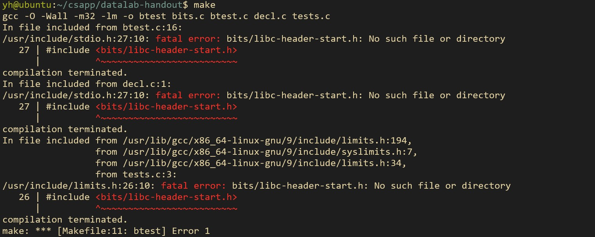

# 介绍

!!! Abstract
    记录大名鼎鼎的[CSAPP](https://csapp.cs.cmu.edu/3e/labs.html)的lab实验

    虽然对目前自身可能有些困难！


## 实验环境

从官网找到对应的tar实验文件，以[lab1](https://csapp.cs.cmu.edu/3e/datalab-handout.tar)为例

- 在本机上采用了虚拟机ubuntu20.04-64bit，利用ssh进行连接。
    * 通过[scp](https://linuxize.com/post/how-to-use-scp-command-to-securely-transfer-files/#:~:text=SCP%20Command%20Syntax%20%23)命令将文件传输过去
    * `scp datalab-handout.tar yh@192.168.10.129:~/csapp` (需找到下载文件的路径)
- 对应目录下解压即可`tar -xvf datalab-handout.tar`
- 读`README`文件，做实验即可

执行`make`，若出错需要进行安装对应包，不出错则环境正确

- 具体操作Google进行搜索即可（很可能需要执行`sudo apt-get update`）

??? Example "例子"

    

    执行`sudo apt-get install gcc-multilib`即可

    再`make`,无错误，就可以`./btest`进行测试正确与否

PS: 可以通过写个小脚本`run.sh`进行快速测试
```shell
#/bin/bash
make clean
make
./btest
chmod 777 run.sh #别忘记改成执行权限
```
