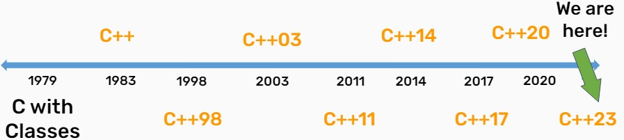

## 1.介绍

> [CS106L](https://web.stanford.edu/class/cs106l/)——Standard C++ Programming
>
> - Focus is on code: what makes it good, what powerful and elegant code looks like
> - The real deal: No Stanford libraries, only STL
> - Understand **how and why** C++ was made

C++历史（C++的演变）：



- 1983年C++被[Bjarne Stroustrup](https://www.stroustrup.com/)设计 （**[C++设计哲学](https://isocpp.github.io/CppCoreGuidelines/CppCoreGuidelines#S-philosophy)**）

## 2. 类型和结构体

!!! Note 
    STL(Standard Template Library): 包含大量强大和维护良好的通用功能
    
    - e.g: `maps, sets, vectors...`
    - 使用`std::`进行访问，即STL的命名空间

### Type

!!! Note "基础类型"

    ```c++
    int val = 5; // 32bits (usually)
    char ch = 'f' // 8bits
    float decimalVal1 = 5.0; // 32bits
    double decimalval2 = 5.0; // 64bits
    bool bVal = true; // 1bit
    std::string str = "Haven";
    ```

    **c++是一种静态类型（statical type）语言** --> 编译执行（compiled）

    - 动态类型语言: 如Python --> 解释执行 (interpreted)

> 静态类型: 所有有名字的东西(如变量，函数)在运行前被给定一个类型

### struct

!!! Tip "auto关键字"

    在声明变量时用来代替某类型的关键字，告诉编译器来推断该类型

    ```c++
    auto a = 3; //int
    auto b = 4.3; // double
    auto c = 'x'; // char
    auto d = "hello"; // char* (a C string)
    ```

`struct`是一组命名的变量，每个变量都有自己的类型，允许程序员将不同的类型捆绑在一起!

<span id = "jump1">示例 ：</span>

```c++ 
struct Student {
    string name; // these are called fields（字段）
    string state;
};
Student s;  
s.name = "yh"; // use . to access fields
```

STL有自己的struct --> `std::pair` (具有任意类型的两个字段的STL内置结构体)

- `std::pair`是一个template，通过`<>`指定内部字段的类型
- 在`std::pair`中的两个字段被命名为first和second

```c++
std::pair<int, string> p = {1, "st"};
std::cout << p.first << p.second; //打印： 1st
```

## 3. 初始化和引用

### [Initialization](https://en.cppreference.com/w/cpp/language/initialization)

**What?**：在最初构建的时候给出最初的值

**How?** ：

1. 直接初始化(Direct initialization)
      * `int numOne = 12; int numTwo(12.0); // ok` 
2. 一致性(uniform)初始化 **『C++11』** : 一种使用`{}`普遍且安全的初始化方法
      *  e.g. `int num{12.0}; // error` 此初始化关心类型！
      *  此初始化是安全的，可避免narrowing conversions

!!! example "uniform (map)"

    ```c++
    // uniform initialization of a map.
    std::map<std::string, int> ages {
        {"Alice", 25},
        {"Bob", 30},
        {"yh", 20}
    };  
    cout << ages["Alice"] << endl; // 访问
    ```

关于上述的提到的结构体的[示例](#jump1)，初始化方式则变为如下：
```c++
struct Student {
    string name;
    string state;
    int age;
};
Student s{"Bob", "AR", 21};
```

3.Structured Binding **『C++17』**

- 在编译时从固定大小的数据结构中初始化一些变量的方法
- 访问函数返回的多个值的能力

```c++ linenums="1"
std::tuple<std::string, std::string, std::string> getClassInfo() {
    std::string className = "CS106L";
    std::string bindName = "Turing";
    std::string language = "CPP";
    return {className, bindName, language};
}
int main() {
    auto[a, b, c] = getClassInfo(); // 1
    std::cout << a << b << c << std::endl;
    auto classInfo = getClassInfo(); // 2
    std::string className = std::get<0>(classInfo); // 使用<0>,<1>,<2>
    std::cout << className << std::endl; 
    return 0;
}
```

### [References](https://en.cppreference.com/w/cpp/language/reference) 

> 引用： 已经存在的东西的别名；（使用`&`）

```c++
int num = 5;
int &ref = num;
ref = 10;
std::cout << num << std::endl; // 打印10
```

引用和它的关联变量指向相同的内存!

!!! example "A classic reference-copy bug"

    === "have bug"

        ```c++
        void shift(vector<pair<int, int>> &nums) {
            for(auto[num1, num2] : nums) {
                num1 ++, num2 ++;
            }
        }
        ```
    
    === "fixed"

        循环体内的`num1`和`num2`只是临时变量，值不会改变。**用引用或迭代器**
        
        ```c++
        void shift(vector<pair<int, int>> &nums) {
            for(auto& [num1, num2] : nums) {
                num1 ++, num2 ++;
            }
        }
        ```

### 左值和右值

**l-value** : 在等号的左边或右边

- e.g. `int y = x; x = 344;` x可以是l-value

**r-value**：仅仅在等号的右边 (r-values are temporary)

- e.g. `int y = 21;` 21可以是r-value

### const

> 对象的限定符，声明它们不能被修改

!!! example "例子"

    ```c++
    vector<int> vec{1, 2, 3}; //a normal vector
    const vector<int> const_vec{1, 2, 3}; //a const vector
    vector<int> &ref_vec{ vec }; //a reference to 'vec'
    const vector<int> &const_ref { vec }; // a const reference 

    vec.push_back(4); // ok
    const_vec.push_back(4); // error
    ref_vec.push_back(5); // ok 
    const_ref.push_back(5); // error
    ```

不能对const变量的声明非const引用， 如下：
```c++
const vector<int> const_vec{1, 2, 3}; //a const vector
vector<int> &bad_ref{ const_vec }; // error
const vector<int>& const_ref_vec { const_vec }; // good!
```

## 4. Streams

> "Designing and implementing a general **{++input/output++}** facility for a programming language is notoriously difficult" ——Bjarne Stroustrup

!!! Quote "Streams"

    a general **input/output(IO)** ==abstraction== for C++
    
    - abstraction提供了统一的 **接口(interface)**, 在 **streams** 的接口是 **reading和writing数据**
    - Streams允许以一种通用的方式处理外部数据

### cout和cin

- output streams: `std::cout` 是一个stream, 并且它是`std::ostream`的实例(instance) `std::cout << ` 
- input streams: `std::cin` 是控制台输入流，并且是`std::istream`的实例 `std::cin >> `
      
`std::stringstream` : 一种将字符串视为流的方法

!!! example 
    
    读取某字符串到stringstream中，再利用stringstream把字符串读出来

    ```c++ linenums="1"
    #include <iostream>
    #include <sstream>      
    int main() {
        std::string s = "Bjarne Stroustrup C makes it easy to xxx";
        // initialize stringstream with string constructor
        std::stringstream ss(s); // 或定义之后使用 ss << s;
        std::string a, b, c, d;
        ss >> a >> b >> c >> d;
        std::cout << a << " " << b << " said this: " << c << " " << d;
        // 打印：Bjarne Stroustrup C makes
    }
    ``` 

    但 `>>` 读直到下一个空格就会停止了，要想读取完整，需要使用`getline()`  

    - `istream& getline(istream& is, string& str, char delim)`
        * 读input stream(`is`)直到`delim`字符结束，并存入buffer(`str`)中
        * 一般delim默认为`\n` 

    上述6,7行进行修改为如下：

    ```c++  
    ss >> a >> b >> c;
    std::getline(ss, d);
    ```

### output file stream

`std::ofstream` : 写数据至文件  **（`is_open(), open(), close(), fail()`）**

```c++ linenums="1"
#include <fstream>
int main() 
    std::ofstream ofs("hello.txt"); 
    if(ofs.is_open()) ofs << "hello cs106L" << '\n';
    ofs.close();
    ofs << "this will not get written";

    ofs.open("hello.txt");
    ofs << "open again, this will!"; // 会被写入文件
    return 0;
}
```

若上述8行改为`ofs.open("hello.txt", std::ios::app);` 即追加模式

- 每次写操作之前将写指针置于文件末尾

??? note "此时文件内容: "

    ```
    hello cs106L
    open again, this will!
    ```