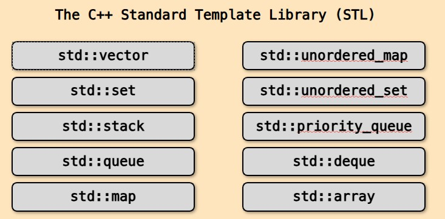
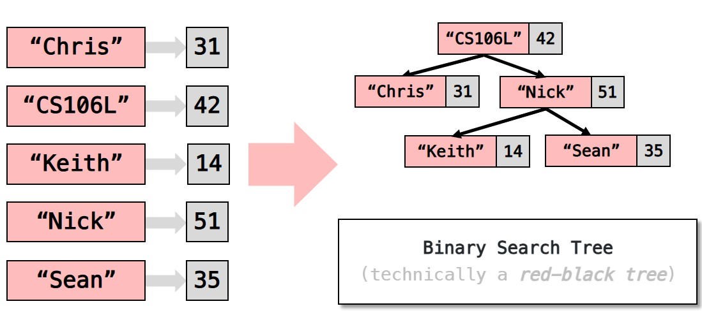
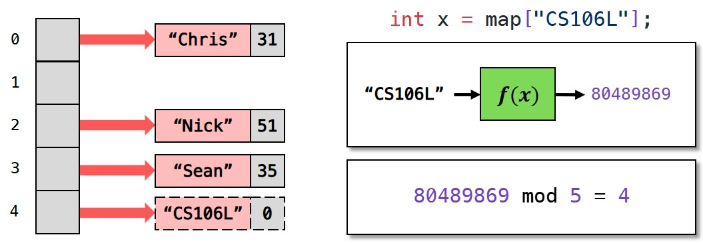
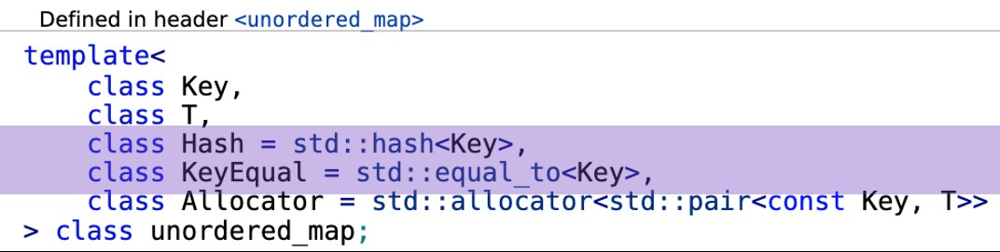
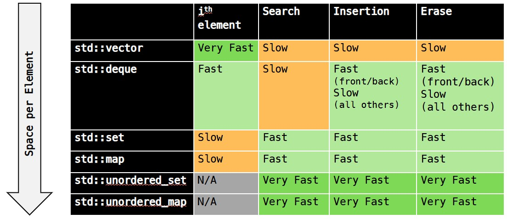

All STL containers are **templates**.

## 有序容器

> 存储连续的元素 

### vector

`std::vector` (在`vector`头文件中)

```c++ linenums="1"
#include <iostream>
#include <vector>
using namespace std;
int main(int argc, char const *argv[])
{
    vector<int> vec { 1, 2, 3, 4 };
    vec.push_back(5);
    vec.push_back(6);
    vec[1] = 20;
    for(int i = 0; i < vec.size(); i ++) cout << vec[i] << " ";
    // 或采取范围进行遍历: for(auto a : vec) cout << a << " ";
    return 0;
}
```

并没办法从头插入元素(不支持`push_front`)

### deque

属于双端队列，在头文件`deque`中，有和`vector`相同的接口，但`deque`独有`push_front/pop_front`

## 关联式容器

> Associative containers organize elements by **unique keys**

### map

`std::map<K, V>` maps **key** to **values**.

```c++ linenums="1"
map<string, int> map {
    {"CS106L", 42},
    {"sean", 35},
};
int sean = map["sean"]; //35
```

map stores a collection of `std::pair<const K, V>`

!!! Note "遍历map"

    采取基于范围的遍历方式

    ```c++ linenums="1"
    std::map<string, int> map;
    for (auto kv : map) {
        // kv是std::pair<const std::string, int>
        string k = kv.first;
        int v = kv.second;
    }
    ```

    也可通过structured bindings **『C++17』**

    ```c++ linenums="1"
    std::map<string, int> map;
    for(const auto& [k, v] : map) {
        //k是 const std::string& 类型， v是const int&类型
    }
    ```

map如何实现的？ --> **BST(红黑树)**



PS: 在使用`std::map<K, V>`时，K必须实现`operator<`，因为会根据K进行排序和查找

- e.g `int` 类型默认就提供了`operator<`
- 另外定义个类，如果要进行比较类的对象，则必须进行实现，如下：

```c++ linenums="1"
class myClass {
    public:
        int val;
        myClass(int val) : val(val) {}
        bool operator<(const myClass& k) const { return val < k.val; }
};
int main() {
    map<myClass, int> m;
    m[myClass(2)] = 100, m[myClass(1)] = 200, m[myClass(3)] = 300;
    for(const auto& pair : m) 
        cout << pair.first.val << " " << pair.second;
}
```

### set 

> set集合，包含在头文件set中，没有重复的元素，是map的特殊形式（即没有Values）

另外: `unordered_map` 和 `unordered_set`

- `unordered_map` 优化的map版本，有和map一样的接口
    * map是`std::pair`的集合
    * 而`unordered_map` stores a collection of n "buckets" of pairs.

*[buckets]: A reserved amount of memory that holds a single item or multiple items of data.

!!! Note "如何实现"

    - 加入k/v，通过对k通过hash函数进行操作
    - 通过取模，还决定映射到哪个bucket号的下面

    

    故`unordered_map<K, V>` 要求K有hash function(即可哈希的)

    

为何用`std::unordered_map`: 

- 通过保持 "load factor" 小，使得快速查找
      * load factor: average number items per bucket.
- 若太大(>1.0)，rehash! (可进行设置load factor， 参考[`max_load_factor`](https://en.cppreference.com/w/cpp/container/unordered_map/max_load_factor) )

PS: `unordered_set` 即是`unordered_map`没有value，仅仅考虑key

!!! question "为何`unordered_map/unordered_set`通常更快?"
    hashing + small load factor.

什么时候使用`unordered_map`和`map`

- `unordered_map`通常更快，并且需要更多的内存
- 如果key并没有要求顺序(`operator<`)，则可以使用`unordered_map`
- (`unordered_map` 通常是更好的选择)



??? Tips "另外的容器"

    1. `std::array`：封装固定大小数组的容器
    2. `std::list`：a doubly linked list
    3. `std::multiset(+unordered)`：A set that can contain duplicates
    4. `std::multimap(+unordered)`: can contain multiple values for the same key.


## 迭代器(Iterators)

Q: 遍历时`for(const auto& elem : container)` 如何工作的？

- container可为`deque/vector/map/set`等

e.g. `for (auto elem : s) std::cout << elem;` (此处s为集合set)。等价如下形式：

```c++ linenums="1"
for(auto it = s.begin(); it != s.end(); ++it) {
    auto elem = *it;
    cout << elem;
}
```

PS: `++it` avoids making an unnecessary copy. [参考](https://isocpp.org/wiki/faq/operator-overloading#increment-pre-post-speed)