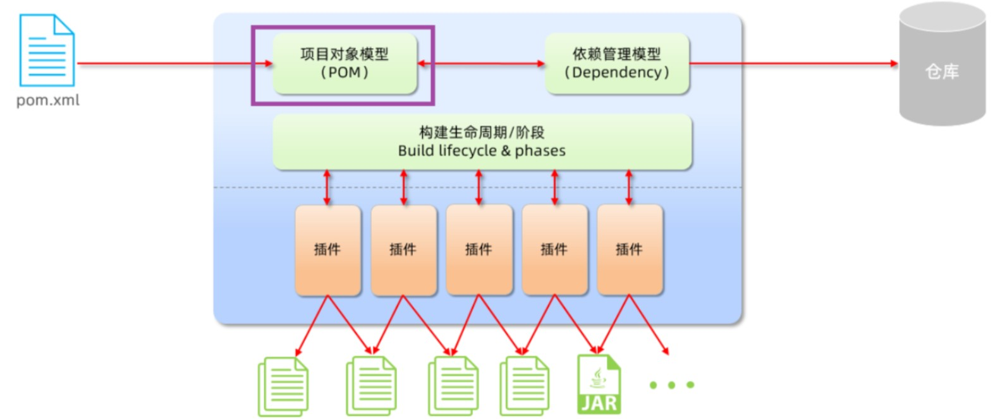

> [Maven](https://maven.apache.org/) 是一款用于 **^^管理和构建Java项目的工具^^**

!!! Note "作用"

    1. **依赖管理**：方便快捷的管理项目依赖的资源(jar包)，避免版本冲突

        - 直接通过`pom.xml`中添加依赖即可

    2. **项目构建**：标准化的跨平台的自动化构建方式
    3. **统一项目结构**

    ```code
    project
    ├── main
    │   ├── java
    │   └── resources
    ├── test
    │   ├── java
    │   └── resources
    └── pom.xml    
    ```

## 概述

> 基于 ^^项目对象模型（POM，*Project Object Model*）^^，通过一小段描述信息来管理项目的构建、报告和文档



POM即将自己的项目抽象成一个对象模型，有自己的专属坐标

- 坐标：资源(jar包)的唯一标识，通过坐标可以定位到所需资源(jar包)位置
    * 组成：groupId(组织名), arfitactId(模块名), Version(版本)

```xml
<dependencies>
    <dependency>
        <groupId>com.mysql</groupId>
        <artifactId>mysql-connector-j</artifactId>
        <version>8.0.33</version>
    </dependency>
</dependencies>
```

### maven仓库

用于存储资源，管理各种jar包；本质即目录(文件夹)

- 本地仓库: 自己计算机上的一个目录 e.g `E:\environment\apache-maven-3.8.4\maven_repo`
- 中央仓库：[mvnrepository](https://mvnrepository.com/)
- 远程仓库(私服)：一般由公司团队搭建的私有仓库

jar包查找顺序：本地 --> 远程(若有搭建)  -->  中央

### 安装

[地址](https://maven.apache.org/download.cgi)

- 解压 --> 配置仓库  --> (可修改`conf/settings.xml`配置文件)配置阿里云私服  --> 环境变量


### 生命周期

> 为了对所有的构建过程进行抽象和统一。描述了一次项目构建，经历哪些阶段。

- clean 
- default: 核心工作。如：编译、测试、打包、安装、部署等
- site：生成报告、发布站点等

**在Maven的设计中，实际任务（如源代码编译）都交由插件(Plugins)来完成**


生命周期的顺序是：clean --> validate --> compile --> test --> package --> verify --> install --> site --> deploy


!!! Question 

    Maven项目中添加的依赖，未正确下载，造成右侧Maven面板中的依赖报红，再次reload重新加载也不会再下载？
  
    由于网络原因，依赖没有下载完整导致的，在maven仓库中生成了`xxx.lastUpdated`文件，该文件不删除，不会再重新下载

    - 批量删除`del.bat`：del /s *.lastUpdated