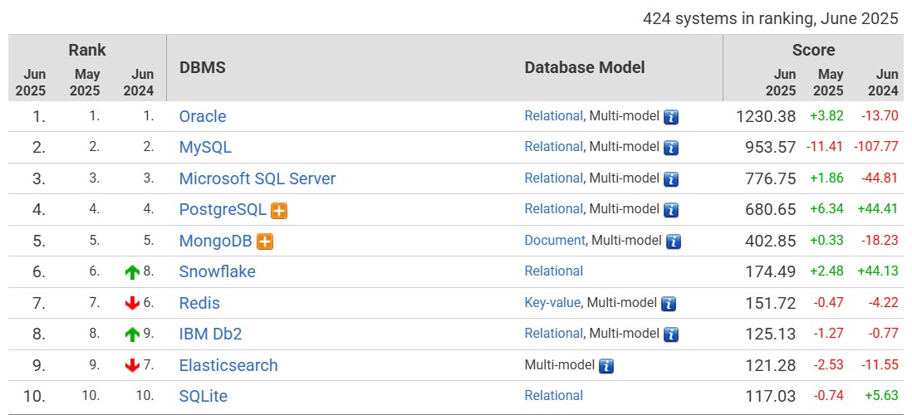
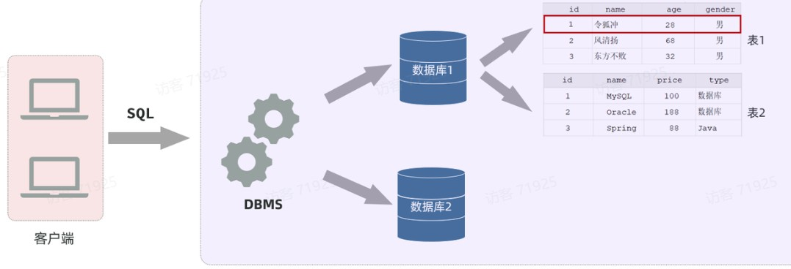
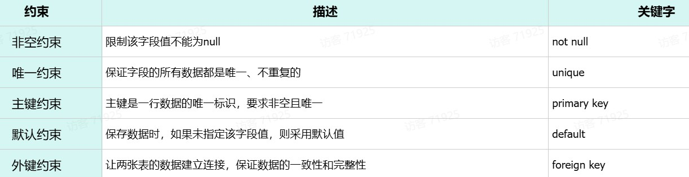
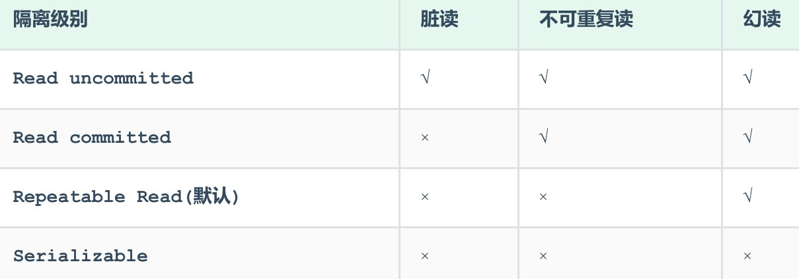

> 数据库（DB）：存储和管理数据的仓库
>
> SQL（Structured Query Language）：结构化查询语言，它是操作关系型数据库的编程语言，定义了一套操作关系型数据库的统一标准




## 概述

[官网](https://dev.mysql.com/)、社区版免费[下载](https://dev.mysql.com/downloads/)

- 连接：`$ mysql [-h数据库服务器的ip地址 -P端口号] -u 用户名 -p` 回车再输入密码
    * 默认ip: 127.0.0.1；默认端口3306 


### 数据模型

建立在关系模型基础上，由多张相互连接的二维表组成的数据（行 + 列）




创建数据库  -->  创建数据表  -->  数据存入表中

表(Table) 是由一行一行的记录组成的 (逻辑上的概念)

- 物理上如何表示记录? 怎么从表中读取数据? 怎么把数据写入具体的物理存储器上?
    * **存储引擎负责的事情**  --> `MyISAM/ InnoDB/Memory...`
    * `SHOW ENGINES;` 查看当前服务器程序支持的存储引擎
            + 表的默认存储引擎为`InnoDB` 

## SQL语句

- DDL：数据定义语言，定义数据库对象(数据库、表、字段)
- DML：数据操作语言，对表中是数据进行增删改
- DQL：数据查询语言，查询表中的记录
- DCL：数据控制语言，创建数据库用户、控制数据库的访问权限

### DDL

- 查询所有数据库：`show databases;`
- 查询当前数据库: `select database();`
- 创建数据库：`create database [if not exists] 数据库名  [default charset utf8mb4];`
- 使用数据库：`use 数据库名;`
- 删除数据库：`drop database [if exists] 数据库名;`

创建表：
```sql
create table  表名(
        字段1  字段1类型 [约束]  [comment 字段1注释],
        字段2  字段2类型 [约束]  [comment 字段2注释],
        ......
        字段n  字段n类型 [约束]  [comment 字段n注释] 
) [comment 表注释];
```

!!! Note "约束"
    
    - 作用在表中字段上的规则，用于限制存储在表中的数据

     

**数据类型：** 数值类型(int/bigint/flout/double...)、字符串类型(char/varchar/text...)、日期时间类型(date/datetime/timestamp...)

- 查询数据库中的表: `show tables;`
- 查看指定的表结构: `desc 表名`
- 查询指定表的建表语句 ：`show create table 表名;`
- 添加字段：`alter table 表名 add 字段名 类型(长度);`
- 修改字段类型： `alter table 表名 modify 字段名 新数据类型(长度);`
- 修改字段名和字段类型：`alter table 表名 change  旧字段名  新字段名  类型(长度);`
- 删除字段：`alter table 表名 drop 字段名;`
- 修改表名：`rename table 表名 to 新表名`
- 删除表：`drop table [if exists] 表名;`

PS: ^^关于表结构的查看、修改、删除操作，工作中一般都是直接基于图形化界面操作^^ 

- (e.g. [Navicat](https://www.navicat.com/en/)或[SQLyog](https://webyog.com/product/sqlyog/))

### DML

**Insert**:

- 向指定字段添加数据: `insert into 表名(字段名1, 字段名2) values(值1, 值2);`
- 全部字段添加数据： `insert into 表名 values(值1, 值2);`
    * 字段顺序要与值顺序一一对应
    * 字符串和日期型数据应 该包含在引号中  

**update:**  `update 表名 set 字段名1 = 值1, 字段名2 = 值2,...[where 条件];`

- 若没有条件，则会修改整张表的所有数据

**delete**：`delete from 表名 [where 条件];`

### DQL

Select 最重要的操作

```sql
SELECT
    字段列表
FROM
    表名列表
WHERE
    条件列表
GROUP  BY
    分组字段列表
HAVING
    分组后条件列表
ORDER BY
    排序字段列表
LIMIT
    分页参数
```

- 去除重复记录: `select distinct 字段列表 from 表名;`

**构造条件查询的运算符**：

- 比较：`<,<=,>,>=,=,<>或!=, between...and..., in(...), like 占位符, is null`
    * 占位符：`_` 匹配单个字符；`%` 匹配任意个字符
- 逻辑：`and或&&, or或||, not或!`

**聚合函数**：会将一列数据作为整体，纵向计算，返回结果 （纵向查询）

- `count, max, min, avg, sum`
- PS: 聚合函数会忽略空值，对NULL值不作为统计

**分组查询：** 按照某一列或者某几列，把相同的数据进行合并输出 （通常会使用聚合函数）

- `select 字段列表 from 表名 [where 条件] group by 分组字段名 [having 分组后过滤条件];`

??? Question "面试题——where与having区别"

    - **执行时机不同**：where是分组之前进行过滤，不满足where条件，不参与分组；而having是分组之后对结果进行过滤
    - **判断条件不同**：where不能对聚合函数进行判断，而having可以

**排序方式：** `desc` 降序，`asc` 升序


**分页查询**：`select 字段列表 from 表名 limit 起始索引, 查询记录数;`

- e.g. `limit 0,5` 从索引0开始，向后取5条记录

### DCL

**管理用户**: 

- 查询用户：`select * from mysql.user;`
    * MySQL中通过 ^^用户名@主机名^^，来唯一标识一个用户
- 创建用户: `CREATE USER '用户名'@'主机名' IDENTIFIED BY '密码';`

**函数**：字符串函数、数值函数、日期函数、流程函数

**约束**：`not null, unique, primary key, default, check, foreign key`

## 事务

!!! Quote 

    事务是一组操作的集合，它是一个不可分割的工作单位，事务会把所有的操作作为一个整体一起向系统提交或撤销操作请求
    
    - **即这些操作要么同时成功，要么同时失败**


开始事务：

1. `SELECT @@autocommit;`  默认是1，若set为0，则执行的DML语句都不会提交，需要手动commit
2. `start transaction` 或 `begin;`

提交事务commit；回滚事务rollback


**四大特性：ACID**

- 原子性（Atomicity）：事务是不可分割的最小操作单元，要么全部成功，要么全部失败
- 一致性（Consistency）：事务完成时，必须使所有的数据都保持一致状态
- 隔离性（Isolation）：数据库系统提供的隔离机制，保证事务在不受外部并发操作影响的独立环境下运行
- 持久性（Durability）：事务一旦提交或回滚，它对数据库中的数据的改变就是永久的

**并发事务问题**：脏读、不可重复读、幻读  --> 引入事务隔离级别



隔离级别越高，数据越安全，性能越低

- 查看事务隔离级别：`SELECT @@TRANSACTION_ISOLATION;`


## JDBC

> 即使用Java语言操作关系型数据库的一套API——Java DataBase Connectivity(JDBC)最为底层、最为基础

- 企业项目开发中，一般都会使用基于JDBC的封装的高级框架，如：Mybatis、MybatisPlus

**JDBC的缺点**：

- url、username、password等相关参数全部硬编码在java代码中
- 查询结果的解析、封装比较繁琐
- 每一次操作数据库之前，先获取连接，操作完毕之后，关闭连接。频繁的获取连接、释放连接造成资源浪费

### Mybatis

> 持久层框架，用于简化JDBC的开发 [官网](https://mybatis.org/mybatis-3/)

- SpringBoot工程，导入mybatis的起步依赖、mysql的驱动包、lombok
- 需要在`application.properties`配置mybatis：url、类名、用户名和密码

Mybatis解决JDBC的缺点：

- 数据库连接四要素(驱动、链接、用户名、密码)，都配置在springboot默认的配置文件`application.properties`或`application.yml`中
    * `application.yml`配置，更加简洁明了、以数据为中心 
- 查询结果的解析及封装，由mybatis自动完成映射封装
- 在mybatis中使用了数据库连接池技术，避免了频繁的创建连接、销毁连接带来的资源浪费
    * 数据库连接池即是个容器，负责分配、管理数据库连接 
        + 常见的数据库连接池：C3P0 、DBCP 、Druid 、Hikari (springboot默认)
        + 现在使用更多的是：Hikari、Druid （性能更优越）

**Mybatis开发的两种方式：注解和XML**

- 注解方式，主要是来完成简单的增删改查。若需要实现复杂的SQL功能，一般使用XML来配置映射语句，即将SQL语句写在XML配置文件中
    * XML映射文件的名称与Mapper接口名称一致，并且将XML映射文件和Mapper接口放置在相同包下（同包同名）
    * XML映射文件的namespace属性为Mapper接口全限定名一致
    * XML映射文件中sql语句的id与Mapper接口中的方法名一致，并保持返回类型一o


## 面试题

