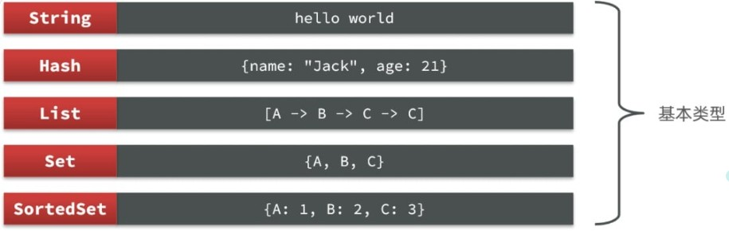

# Redis

> [Redis](https://redis.io/)(REmote DIctionary Server)———an [open-source](https://github.com/redis/redis)「可看出是C语言编写的」, in-memory database that stores data in **memory** for **high-performance** data retrieval and **key-value storage**
>
> 属于非关系数据库(NoSQL = not only SQL)，即并非像Mysql(关系数据库)那样使用table存储
>
> - 不遵循SQL标准 & 不支持ACID & 性能远超SQL
>
> PS: [中文文档](https://redis.com.cn/)


**非关系数据库分类：**

- key-value: **Redis**、memcached
- 列存储型: Hbase
- Graphs based: Neo4j
- 文档型：MongoDB(基于分布式文件存储的数据库) 

## 介绍

Redis可用于 ^^缓存、计数器、排行榜、社交网络、消息队列和分布式锁^^ ，基于内存并支持持久化

[安装](https://redis.io/docs/latest/operate/oss_and_stack/install/install-redis/)，如下操作验证成功否

```shell
$ redis-cli
127.0.0.1:6379> ping
PONG
```

**三大特点：** 

- 持久化：内存数据 --> Disk --> 重启还能从Disk再次加载
- 支持多种数据类型：`string、set、Sorted Set、list、hash....`
- 支持数据备份：即master-slave(主从复制)

!!! Note "对比"

    默认支持16个数据库，而MySQL默认仅仅4种（`information_schema,performance_schema,sys,mysql`）
    
    默认端口号`6379`，而MySQL是`3306`

    - 关系型数据库集群模式一般是主从，**主从数据一致**，起到数据备份的作用，称为 **垂直扩展**
    - 非关系型数据库可以将数据拆分，存储在不同机器上，保存海量数据，解决内存大小有限的问题，称为 **水平扩展**

**优点：**

- 性能极高：读写速率非常之快 (读取的速度是11w次/s，写的速度是8.1w次/s)
- 丰富的数据结构: ^^string，list，hash，set，zset^^
- 原子性：所有操作均是原子性的，^^但Redis里面事务没有原子性^^
- 丰富的特性：支持publish/subscribe『[观察者模式](https://refactoringguru.cn/design-patterns/observer)』、key过期


默认16个数据库，编号`0~15`, 可通过`select index` 进行切换(index  = 0...15) 默认就是0

!!! Note "常见命令"

    - `setnx k v` 若k不存在，才成功添加k-v，若则不执行
    - `keys *, keys ?`  列出所有的key （若空，则展示`(empty list or set)`）
    - `set k val` : 创建/修改k-v  -->  `get k` 查看k对于的v
    - `dbsize` : 当前数据库key的数量
    - `flushdb` 清空当前数据库； `flushall` 清空所有数据库
    - `move key index` 把key对应的从当前数据库移动到index对应的数据库中
    - `exists key` 判断key是否存在
    - `ttl key` 查看key的有效时间，-1代表永不过期，-2代表已过期
    - `expire key seconds` 设置key的过期时间
    - `type key` 查看key的类型

    PS: 根据[官网](https://redis.io/docs/latest/commands/)检索查询即可 或 通过 `help [command]` 来进行查看

### 五大基本数据类型

!!! quote "介绍"

    

**String** : Redis中最基本的类型，字符串类型的值value可以是字符串（简单的字符串、复杂的字符串（如JSON、XML））、数字（整数、浮点数），甚至是二进制（图片、音频、视频），但值最大不能超过512MB

- 典型应用场景：^^缓存、计数、共享Session、限速^^

!!! Note "基本命令"
    
    - `mset k1 val1 [k2 val2 ...]` : 可设置多个给定的key值
    - `mget k1 [k2 ...]` 获取多个给定key的value值
    - `getrange key start end` 返回key对应value从start到end结束的字串 
        * e.g `GETRANGE k1 0 1` 若(k1:hello)则返回`he` 
        * 若end为-1则代表最后一个字符
    - `setrange key offset val` 用val覆盖key对应原本value从offset开始字符串的值
    - `incr key` 或 `incrby key increment` 对key对应的val进行增加，但val必须为数字

!!! Question "没有Table，如何区分不同类型的Key？"

    e.g 存储用户、商品信息到Redis，一个用户的id是1，一个商品的id恰好也是1
    
    如果此时使用id作为key，那么就回冲突，该怎么办？

    - **给key添加前缀加以区分**  --> `项目名:业务名:类型:id`

若Value是一个Java对象，例如`User`，则可以将对象序列化为JSON字符串后存储

| **KEY**         | **VALUE**                                 |
| --------------- | ----------------------------------------- |
| project:user:1    | {"id":1, "name": "Jack", "age": 21}       |
| project:product:1 | {"id":1, "name": "小米11", "price": 4999} |


**Hash**：类似于Java中的HashMap, value为一个无序字典 (应用场景：^^缓存用户信息、缓存对象^^)

- String将对象序列化为JSON字符串后存储，但当需要修改对象某个字段时很不方便
- 而Hash可以将对象中的每个字段独立存储，可以针对单个字段做CRUD


!!! Note "常见命令"

    ```shell
    > hset myhash field1 "Hello" (添加或者修改hash类型key的field的值)
    (integer) 1
    > hset myhash field2 "Hi" field3 "World"
    (integer) 2
    > hset myhash field2 (获取一个hash类型key的field的值)
    "Hi"
    > hget myhash field3
    "World"
    > hgetall myhash (获取一个hash类型的key中的所有的field和value)
    1) "field1"
    2) "Hello"
    3) "field2"
    4) "Hi"
    5) "field3"
    6) "World"
    > hkeys mybash (获取一个hash类型的key中的所有的field)
    7) "field1"
    8) "field2"
    9) "field3" 
    ```

    - `hincrby k val incr` 让一个hash类型k的字段值val自增并指定步长incr


**List**：列表(双向链表)，类似于Java中的LinkedList，最多可存$2^32 - 1$个元素，常用来存储一个有序数据，如：^^朋友圈点赞列表，评论列表等^^

- 有序；元素可以重复；插入和删除快；查询速度一般

!!! Note "常见命令"

    - `lpush/rpush key val1 val2...`: 头插和尾插直key中
    - `lrange key start end` 获取列表指定范围的元素
    - `lpop/rpop` 删除list中的头尾值
    - `lindex key index` 通过下标来获取元素 (**支持下标操作**) 
    - `lset key index val` 将list中下标为index的值更改为val
    - `lrem key count val` 删除list中count个val


**Set**：通过hash来实现，与Java中的HashSet类似，可以看做是一个value为`null`的HashMap

- 无序；元素不可重复；查找快；支持交集、并集、差集等
- 应用场景：^^标签tag、共同关注^^

!!! Note "常见命令"

    - `sadd key member1 member2..` 向集合添加元素
    - `smembers key` 返回集合中的所有元素
    - `srem key val` 删除集合中为val的元素
    - `scard key` 返回set中元素的个数
    - `srandmember key num` 集合中随机选出num个数 （可用于抽奖...）
    - `spop key [num]` 移除并返回集合中一个或num个随机元素
    - `sismember key member` 判断一个元素是否存在于set中
    - `sinter key1 key2` 求key1与key2的交集
    - `sunion key1 key2` 并集
    - `sdiff key1 key2` 差集


**SortedSet**: 可排序的set集合，与Java中的TreeSet类似，但底层数据结构却差别很大

- SortedSet中的每一个元素都带有一个score属性，可以基于score属性对元素排序
    * 底层的实现是跳表（SkipList）+ hash
- 应用场景：^^用户点赞统计、用户排序^^

!!! Note "常见命令"

    - `zadd key score member` 添加若干元素到sorted set，若存在则更新其score值
        * score 定义 member 在Sorted Set中的排序位置 
    - `zrem key member` 删除其中指定的元素
    - `zscore key member` 获取sorted set中的指定元素的score值
    - `zrank key member` 获取sorted set 中的指定元素的排名
    - `zcard key`获取sorted set中的元素个数
    - `zcount key min max` z统计score值在给定范围内的所有元素的个数
    - `zrange key min max` 按score排序后，获取指定 ^^排名范围内^^ 的元素
    - `zrangebysocre key min max` 按score排序后，获取指定 ^^score范围内^^ 的元素
        * 所有的排名默认都是升序，若降序则在命令的Z后面添加REV即可
            +  `zrevrank key memeber`

??? example "例子"

    将班级的下列学生得分存入Redis的SortedSet中

    - `Jack 85, Lucy 89, Rose 82, Tom 95, Jerry 78, Amy 92, Miles 76`

    ```shell
    127.0.0.1:6379> zadd stu 85 Jack 89 Lucy 82 Rose 95 Tom 78 Jerry 92 Amy 76 Miles
    (integer) 7
    127.0.0.1:6379> zrem stu Tom
    (integer) 1
    127.0.0.1:6379> zscore stu Amy
    "92"
    127.0.0.1:6379> zrank stu Rose
    (integer) 2
    127.0.0.1:6379> zcount stu 0 80
    (integer) 2
    127.0.0.1:6379> zincrby stu 2 Amy  (给Amy同学加2分)
    "94"
    127.0.0.1:6379> zrange stu 0 2 (查出成绩前3名的同学)
    1) "Miles"
    2) "Jerry"
    3) "Rose"
    127.0.0.1:6379> zrangebyscore stu 0 80
    4) "Miles"
    5) "Jerry"
    ```


### Redis的Java客户端

- Jedis和Lettuce: 主要提供Redis命令对应的API；SpringDataRedis对其进行了抽象和封装
- Redisson：在Redis基础上实现了分布式的可伸缩的java数据结构 e.g. `Map, Queue`； 支持跨进程同步机制：`Lock、Semaphore`


??? Example "Jedis示例"

    - `pom.xml`中导入依赖`jedis`  --> `import redis.clients.jedis.Jedis;`
    
    ```java linenums="1"
    public class RedisTest {
        private Jedis jedis;
        @BeforeEach
        void setup() {
            jedis = new Jedis("127.0.0.1", 5379);
            //jedis.auth("");  若设置密码了需要加上
            jedis.select(0); // 选择库
        }
        @Test
        void testString() {
            jedis.set("name", "yh");
            String name = jedis.get("name");
            System.out.println("name = " + name);
        }
        @AfterEach
        void tearDown() {
            if(jedis != null) jedis.close();
        }
    }    
    ```

Jedis本身是线程不安全的  --> **Jedis连接池代替Jedis的直连方式**

```java linenums="1"
public class JedisConnectionFactory {
    private static JedisPool jedisPool;
    static {
        // 配置连接池
        JedisPoolConfig poolConfig = new JedisPoolConfig();
        poolConfig.setMaxTotal(8);
        poolConfig.setMaxIdle(8);
        poolConfig.setMinIdle(0);
        poolConfig.setMaxWaitMillis(1000);
        // 创建连接池对象，参数：连接池配置、服务端ip、服务端端口、超时时间、密码
        jedisPool = new JedisPool(poolConfig, "127.0.0.1", 5379, 1000);
    }
    public static Jedis getJedis(){
        return jedisPool.getResource();
    }
}
```


> SpringData是Spring中数据操作的模块，包含对各种数据库的集成，其中对Redis的集成模块就叫做[SpringDataRedis](https://spring.io/projects/spring-data-redis/)

SpringDataRedis中提供了RedisTemplate工具类，封装了各种对Redis的操作

- 将不同数据类型的操作API封装到了不同的类型中
- 引入`spring-boot-starter-data-redis`依赖  --> 在application.yml配置Redis信息  --> 注入RedisTemplate

??? example "示例"

    **配置文件**：

    ```yml
    spring:
    redis:
        host: 127.0.0.1
        port: 5379
        # password: 123 本redis中并未设置密码
        lettuce:
        pool:
            max-active: 8  #最大连接
            max-idle: 8   #最大空闲连接
            min-idle: 0   #最小空闲连接
            max-wait: 100ms #连接等待时间
    ```

    **测试代码**：

    ```java
    @SpringBootTest
    class RedisDemoApplicationTests {
        @Autowired
        private RedisTemplate<String, Object> redisTemplate;

        @Test
        void testString() {
            redisTemplate.opsForValue().set("name", "黄");// 写入一条String数据
            Object name = redisTemplate.opsForValue().get("name");// 获取数据
            System.out.println("name = " + name);
        }
    }
    ```

**缺点**：可读性差；内存占用较大


SpringDataRedis提供了RedisTemplate的子类：`StringRedisTemplate`

- 它的key和value的序列化方式默认就是String方式

??? example "示例"

    ```java
    @SpringBootTest
    class RedisStringTests {
        @Autowired
        private StringRedisTemplate stringRedisTemplate;

        @Test
        void testString() {
            // 写入一条String数据
            stringRedisTemplate.opsForValue().set("verify:phone:13600527634", "124143");
            // 获取string数据
            Object name = stringRedisTemplate.opsForValue().get("name");
            System.out.println("name = " + name);
        }

        private static final ObjectMapper mapper = new ObjectMapper();

        @Test
        void testSaveUser() throws JsonProcessingException {
            // 创建对象
            User user = new User("虎哥", 21);
            // 手动序列化
            String json = mapper.writeValueAsString(user);
            // 写入数据
            stringRedisTemplate.opsForValue().set("user:200", json);
            // 获取数据
            String jsonUser = stringRedisTemplate.opsForValue().get("user:200");
            // 手动反序列化
            User user1 = mapper.readValue(jsonUser, User.class);
            System.out.println("user1 = " + user1);
        }
    }
    ```

## 面试题

??? Question "Redis为何如此快？"

    1. 完全基于内存操作
    2. 使用单线程，避免了线程切换和竞态产生的消耗
    3. 基于非阻塞的IO多路复用机制
    4. 通过C语言实现，基于几种基础数据结构，redis做了大量的优化，性能极高

??? Question "IO多路复用是什么?"

    [参考回答](https://www.zhihu.com/question/28594409/answer/52835876)

    > IO 多路复用技术是一种允许单个线程管理多个网络连接的技术，它使得服务器能够高效地处理大量的并发连接而不需要为每个连接创建一个独立的线程或进程