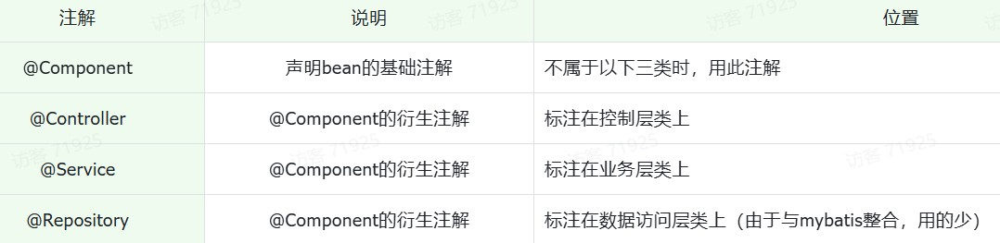

## 简介

> [Spring](https://spring.io/) makes Java simple

最基础、最核心的是 SpringFramework

- 提供了很多实用功能，e.g. ^^依赖注入、事务管理、web开发支持、数据访问、消息服务等^^
- 但直接基于此开发，会配置复杂，入门难  --> **SpringBoot**(快速开发、简化配置)
    * 直接基于SpringBoot进行项目构建和开发，官方推荐的方式，也是现在企业开发的主流 


!!! Question

    Q: 为什么一个main方法就可以将Web应用启动了？

    A: 在创建springboot项目的时候，选择了web开发的起步依赖:`spring-boot-starter-web`。而`spring-boot-starter-web`依赖，又依赖了`spring-boot-starter-tomcat`，**由于maven的依赖传递特性**，创建的springboot项目中也有了tomcat的依赖，**即springboot中内嵌tomcat**

    - 所开发的项目，会自动的部署在该tomcat服务器中，并占用8080端口号

Web服务器（Tomcat）对 ^^HTTP协议的请求数据^^ 进行解析，并进行了 **封装(`HttpServletRequest`)**，并在调用Controller方法的时候传递给了该方法，使得不必直接对协议进行操作，让Web开发更加便捷

- 也同理，会对HTTP协议的响应数据进行封装(`HttpServletRequest`)

??? Example "示例"

    ```java linenums="1"
    @RestController
    public class RequestController {
        //请求路径 http://localhost:8080/request?name=Tom&age=18
        @RequestMapping("request")
        public String request(HttpServletRequest request){
            //1.获取请求参数 name, age
            String name = request.getParameter("name");
            String age = request.getParameter("age");
            System.out.println("name = " + name + ", age = " + age);
            //2.获取请求路径
            String uri = request.getRequestURI();
            String url = request.getRequestURL().toString();
            System.out.println("uri = " + uri);
            System.out.println("url = " + url);
            //3.获取请求方式
            String method = request.getMethod();
            System.out.println("method = " + method);
            //4.获取请求头
            String header = request.getHeader("User-Agent");
            System.out.println("header = " + header);
            return "request success";
        }
    }
    ```


!!! Question

    Q: controller方法中的return的结果，怎么就可以响应给浏览器呢？

    A: @ResponseBody注解 --> 将方法返回值直接响应给浏览器，如果返回值类型是实体对象/集合，将会转换为JSON格式后在响应给浏览器

    - 但一般是在类上加了@RestController注解，why？
        * 注解由：`@Controller,@ResponseBody`组成。即意味该类所有的方法中都已经添加了@ResponseBody注解

    PS: ^^前后端分离项目，一般直接在请求处理类上加@RestController注解^^


### 分层

> 单一职责原则：一个类或一个方法，就只做一件事情，只管一块功能
>
> - 可读性更强，扩展性更好，也更利于后期的维护

**分层三部分**：

- 数据访问Dao(Data Access Object)即持久层：负责数据访问操作，包括数据的增、删、改、查
- 逻辑处理Service：负责业务逻辑处理的代码。
- 请求/响应数据Controller：接收前端发送的请求，对请求进行处理，并响应数据

!!! Note

    **软件设计原则：高内聚低耦合**

    - 高内聚：指的是一个模块中各个元素之间的联系的紧密程度，各个元素(语句、程序段)之间的联系程度越高越好
    - 低耦合：指的是软件中各个层、模块之间的依赖关联程序越低越好


若编写代码时，需要什么对象，直接new一个。 这种层与层之间代码就耦合了，当service层的实现变了之后，还需要修改controller层的代码

**解耦思路：**

- 将要用到的对象交给一个容器管理，用到这个对象时，直接从容器中获取
    * **==控制反转(IOC,Inversion Of Control) 和 依赖注入(DI,Dependency Injection)==** 
        + IOC: 对象的创建控制权由程序自身转移到外部（容器即IOC容器或Spring容器）
        + DI: 容器为应用程序提供运行时，所依赖的资源
    * P.S. IOC容器中创建、管理的对象，称为：**bean对象**
    * 在实现类加上`@Component`注解，即代表把当前类产生的对象交给IOC容器管理



!!! Question
    
    Q: 使用前面四个注解声明的bean，一定会生效吗？
    
    A：不一定。（bean想要生效，还需要被组件扫描注解`@ComponentScan`扫描）

    - 但实际上已经包含在了启动类声明注解`@SpringBootApplication`中，默认扫描的范围是启动类所在包及其子包


**DI** : IOC容器要为应用程序去提供运行时所依赖的资源，^^资源指的就是对象^^

- `@Autowired`注解(自动装配)：默认是按照类型进行自动装配的（去IOC容器中找某个类型的对象，然后完成注入）
    * 属性注入、构造函数注入、setter注入 （一般均会采用第一种，简洁高效）

```java
@RestController
public class UserController {

    //方式一: 属性注入
    @Autowired
    private UserService userService;

    //方式二: 构造器注入
    private final UserService userService;
    @Autowired //如果当前类中只存在一个构造函数, @Autowired可以省略
    public UserController(UserService userService) {
        this.userService = userService;
    }

    //方式三: setter注入
    private UserService userService;
    @Autowired
    public void setUserService(UserService userService) {
        this.userService = userService;
    }
}
```

!!! Question
    
    存在多个相同类型的bean对象，怎么办？

    1. 使用`@Primary`注解，来确定默认的实现
    2. 在`@Qualifier`的value属性中，指定注入的bean的名称，必须配合@Autowired使用
        - e.g.  `@Qualifier("userServiceImpl")` 
    3. 利用`@Resource`，通过name属性指定要注入的bean的名称

??? Question "面试题—— `@Autowird` 与 `@Resource`的区别"
    
    - @Autowired 是Spring框架提供的注解，而@Resource是JDK提供的注解
    - @Autowired 默认是按照类型注入，而@Resource是按照名称注入