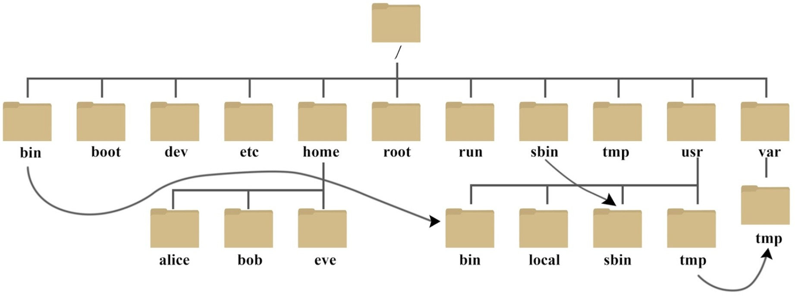

# Linux基础

!!! Abstract
    重点是在于熟练掌握常见的命令，在Shell中进行各种操作!

Why Linux? 

- 内核稳定，社区维护: Android OS & [torvalds/linux](https://github.com/torvalds/linux)
- free & 轻量级 & 稳定性 & 兼容性

## Shell 简介

黑黑的窗口？输入奇怪命令的地方？ --> No! 这其实是 **Terminal**

!!! Quote
    " **sense of "device for communicating with a computer" is first recorded 1954.** ————[Online Etymology Dictionary](https://www.etymonline.com/word/terminal)

Terminal：一个应用程序，提供了一个窗口和输入输出交互的功能

- 内部运行的才是Shell，即Shell执行输入的命令得到输出的东西

常见的Terminal:

- Windows: [Windows Terminal](https://apps.microsoft.com/detail/9N0DX20HK701?hl=en-US&gl=US)（推荐）
- Linux: Gnome Terminal、Konsole、LXTerminal等
- MacOS：Terminal.app、[iTerm2](https://iterm2.com/)（推荐）
- 跨平台: [Alacritty](https://alacritty.org/)（基于Rust），[Warp](https://www.warp.dev/) （基于Rust）

那么什么是Shell？

> 它也是一个程序，是用户与系统内核交互的界面。负责接受并解析输入，交给更底层的OS来执行，并返回输出

常见的shell:

- Windows: cmd.exe、PowerShell
- *nix下
    - sh: Bourne Shell，最早、最经典的 shell
    - bash: Bourne Again Shell，最常用的 shell（Linux默认）
    - zsh：Z Shell，功能强大、可高度自定义的 shell
    - fish：Friendly Interactive Shell，开箱即用、全平台的 shell
    - ...

**总结来说**：Terminal获取输入，然后传递给Shell，等待Shell处理完后，将结果再传递回用户（显示在屏幕上），Shell 从 Terminal拿到输入，解析后交给OS执行，然后将结果返回给 Terminal

^^命令行也是操作计算机的方式，理论上可以做任何事情^^。

若没有显示器，只能通过命令行进行操作(e.g.SSH) 

- P.S.[谈谈如何让自己看上去、闻上去都像一个CS人](https://zhuanlan.zhihu.com/p/539692975)

## Shell 基础命令

一定要关注自己在哪执行的命令  -->  `pwd` 获取当前路径，而`~`代表当前用户的"home"目录

而要关注当前的用户，是普通用户还是root? 有的信息和权限有关

在*nix中没有分盘的概念，所有文件都挂载到唯一的根目录 `/` 下

`cd path` 切换路径

- path: 可以是相对路径，也可以是绝对路径
- path中`~` 代表home, `.`代表当前路径，`..`代表上一级路径，`-`上一次目录

### 用户配置

两种用户: root 和 普通用户

- root的命令提示符为`#`，而普通用户为`$`
- 切换到root用户：`su root` 
- 更改root密码 `sudo passwd root`

`whoami` 显示自身用户名称
`who am i` 显示登录用户的用户名以及登陆时间

`useradd bob` 添加用户bob(只能root或者sudo才可以执行)  --> 配密码`sudo passwd bob`

怎么知道添加成功了？  --> `cat /etc/passwd` 将显示添加的用户名

`userdel bob` 删除用户bob

^^Tips: Shell中，Ctrl + A 光标回到开头，Ctrl + E回到结尾^^

### 文件/目录操作

`ls` 列出当前路径下的文件和目录

- `-a`：列出所有文件和目录，包含隐蔽文件
- `-l`：列出详细信息(权限，大小，修改时间...)

`touch file` 创建一个文件

`mkdir file` 创建一个目录

`cp src dst` 复制文件或目录，`-r` 递归复制目录

`mv src dst` 移动文件或目录(也可重命名)

`rm files` 删除文件，`-r` 递归删除目录; `-f` 强制删除；谨慎.[`rm -rf ./*`](https://www.zhihu.com/question/456544289)

`chmod` 改变目录或文件的权限,e.g. `chmod +x file` 给file加上可执行权限
{ align=center }

**文件查找: `find 起始目录 查找条件 操作`**  e.g. `find /usr/include/ -name stdio.h`

- 根据名称和文件属性来查找
    - `type x` 查找类型为x的文件，x可为b(块设备),c,d,p(管道),f,l,s(socket)
    - `empty`  查找大小为 0 的目录或文件
    - `-name file` 查找文件名为file的所有文件，可用通配符`*、?、[]`
- 按照时间查找
    - `-amin n` ：查找n分钟以前 **被访问** 过的所有文件
        - （+表示n分钟之前，-表示n分钟之内，都不能省**）
    - `-cmin n` 查找n分钟以前文件状态 **被修改** 过的所有文件
    - `-mmin n` 查找n分钟以前文件内容被修改过的所有文件

### 文件查看及处理操作

`cat file` 查看file文件的内容

- `-b` 对非空输出行编号
- `-n` 对输出的所有行编号

`head/tail -n number file` 显示文件file内容的前number行/后number行

`less / more` 单页浏览文件

`sort file` 对文件内容进行排序（字母表）

`file 文件名` 查看文件内容的类型

`uniq 文件名` 删除文件中重复的行（必须连续着）

- 若重复行之间不并不连续 -->  `sort file | uniq`

`wc file` 统计文件的行数、字数和字节数

`grep [options] pattern [files]` 用于查找文件里符合条件的字符串或正则表达式

- pattern 表示要查找的字符串或正则表达式
- e.g. `grep hello file.txt` 在file.txt中查找字符串 "hello"，并打印对应的行

### 其他一些命令

!!! Abstract

    Linux命令众多，仅仅记录常用的。若又有新的了解，随时补充!

`|` : 管道，将一个程序或命令的输出作为另一个程序或命令的输入

#### 磁盘管理

`df -h` 显示文件系统的整体磁盘空间使用情况

`du [选项] [文件名]` 显示每个文件或目录的磁盘使用情况

- `-s` 只显示总和； `-h` 以易读的方式显示

#### 远程copy

**`scp filename username@ip:path` scp远程复制文件**，e.g. `scp file yh@192.168.10.129:~`

- filename要复制的文件名称，若是目录加上`-r`
- username目标主机名
- path: 要复制到的目标主机路径

#### 网络管理

`ifconfig` 查看和配置网络设备

- 若报错，可能需要安装`sudo apt install net-tools`

`route` 查看与设置路由

#### 进程管理

`ps aux | grep xxx` 查看系统中所以进程（一般都会加上grep，查看某些相关进程）
`ps -ef | grep xxx` 查看父子进程直接的关系

- a	列出带有终端的所有用户的进程
- x 列出当前用户的所有进程，包括没有终端的进程
- u 面向用户友好的显示风格
- e	列出所有进程
- u	列出某个用户关联的所有进程
- f 显示完整格式的进程列表

`kill [option] PID` 杀死进程

`pstree [option]` 查看进程树，`-p` 显示PID，`-u`显示进程所属用户

`top`  实时监控系统进程状态

`netstat` 显示网络状态和端口占用信息

- `netstat -anp | grep 进程号` （查看该进程网络信息）
- `netstat –nlp | grep 端口号` （查看网络端口号占用情况）