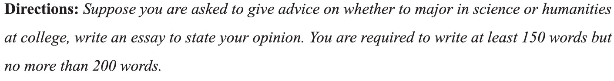

## CET6

!!! Note "作文形式"

    主要文字式为主，也可能名言或漫画图表(相对较少)

### 第一段

**一. 描述类( ...是很重要，...很必要 )**

- xxx plays an extremely important role.
- xxx is of utmost importance. 
- Nothing is more important than xxx

!!! Tips "important 替换"
    significant 意义深远的, essential 关键的, indispensable 不可替代的, pivotal 中枢作用的, key 关键的 

PS: **增加时间、地点、人物** 让句子更丰富

- in this era
- in modern society / in our daily life
- for us students / for the young generation 
- 加分词： ^^broadening our horizons and enriching our lives^^

**经典开头**: 

- It is of great necessity to xxx
- There is no double that ...
- It is generally accepted that ...
- It has been widely noted that ...
- It goes without saying that...

!!! example "例子"
    **It is generally accepted that** ^^the spirit of innovation^^ is of utmost significant **for us college students in modern society** where science and technology is flourishing. 

**二. 重视类**

  * pay attention to...
  * attach importance to...
  * lay emphasis/stress on... 

!!! example "例子"
    Currently, China is facing a serious environmental issue. As university students, we should **attach importance to** protecting our planet.

**三. 议论类**：...产生了争议

- xxx has caused quite a stir among the general public.
- e.g. 对于学习有没有捷径这个问题，同学们各执一词
      - **There is much controversy over** whether there is a shortcut to learning.

**四. 结果类：** ...对于...产生了影响

- exert a positive / negative / great impact on...
- It has been widely noted that ^^environment pollution^^ can **exert a negative influence on our daily life.**

**五. 见证类：** （在某时某地发生了什么...  -->  ... 见证了...）

- Old: ~~China has experienced a rapid economic development in recent years.~~
- New: During the past several years, China has **witnessed** a rapid economic development.

**六. 使动类：** ...使得...

- enable / allow / render sb. to do sth
- offer sb. sth. / offer sth. to sb.
- provide sb. with. sth. / provide sth. for sb.
- bring sb. sth.

!!! example "例子"
    Material world could **offer** us the illusion of happiness, while spiritual world could **provide** us with real pleasure for life. 

**七. 引出类：** ... 成为... 重要的社会问题

- The issue of ^^environmental problem^^ **has emerged into our vision in recent years.**
- The issue of ^^information security^^ has recently arisen as one of the heated topics. 

**八. 趋势类：** 越来越...

- More and more people...
- An increasing / A growing number of people...
- e.g. 越来越多的人开始重视...(如何有效处理信息)
      * **People in mounting numbers** are paying attention to ^^how to process information effectively.^^

**图片类：**

- The picture displays a very special scene: xxx. Simple as it is, what the picture conveys to us is thought-provoking: xxx
- *As is vividly / ironically depicted in the cartoon, doing / done sth. XXX is doing.. (, while B is doing / done ..). The symbolic meaning behind the picture is rather explicit: the virtue/awareness/issue of XXX deserves our due attention.*

**图表类:**

- It goes without saying that the chart reflects xxx (图表内容)
- *As is illustrated in the statistics(among sb about sth.), the number/percentage of sth/those who xx is xx/increased/decreased from 数字1 to 数字2 in the xx years between 年份1 and 年份2, and the number/percentage of sth/those who xx is xx/increased/decreased from 数字1 to 数字2. From my perspective, the above figures reveal a currently pervailing tendency among contemporary society.* 

**名言类：**

Just as saying goes, xxx（重述引言）. Simple as the remark may sound, it intends to tell us that xxx（解释含义）

**文字类：**

!!! example "例子"

    === "2017-6"

        

    === "示例"

        **It goes without saying that** higher education **has captured a great deal of attention from the general public**. Opinions vary greatly when it comes to whether one should choose science or humanities at college. If I were you, I would like to take science as my major.
    
    === "2016-12"
        For this part, you are allowed 30 minutes to write a short essay on **innovation**. Your essay should include the importance of innovation and measures to be taken to encourage innovation.

    === "示例"
        **It goes without saying that** innovation **plays a key role in developing national economy**. **The past several years have witnessed** a sharp increase in the number of scientists who are making new breakthroughs in their fields. **This will definitely exert a huge impact on our society**.

### 第二段

> 引出 --> 之后万能背景

**举例：**

- There are mainly several factors contributing to this social phenomenon.
- Personally, among all the factors that account for this trend, the following are worth mentioning.
- When it comes to the significance of this phenomenon, I feel it necessary to discuss the matter further. (万能)

**一. 经济类：**

- **经济发展**： Owing to the steady and rapid economic development of our country, people's living standard is simultaneously improving at a fast rate. 
- **社会压力**：With the quickening pace of urban life and ever-increasing pressure, people in growing numbers are suffering from either the physical or mental problems.
- **就业困难**： As Chinese universities keep expanding their scale of students' enrollment and competition is becoming fierce, it is increasingly difficult for college undergraduates to find a decent jobs.
- **积极向上**：Traditional way of thinking has changed dramatically, and people are exhibiting greater open-mindedness and a burning desire to determine their own destiny.

**二. 人口类：**

- **人口膨胀**：China has vast population and its substantial growth rate. However, fast increasing population has potentially negative results, such as ^^intense competition.^^

**三. 技术类：**

- **技术普及：** The xxx(e.g.Internet) has penetrated every aspect of daily life, greatly affecting our ways of xxx(e.g.communication)
- **技术好处：** It is fair to assert that it is science and technology that should given most of the credit in fabricating our modern life.
- **技术坏处：** The youngsters are more likely to be overly dependent on technology, even getting addicted to it.

**四. 教育类：**

- **好处：** Higher education plays a key role in aiding students' growth and development, so that they can get the opportunity to increase their knowledge and learn to independent.
- **坏处：** School nowadays tend to pay special attention to the students' academic scores rather than their xxx(e.g. morality)

**五. 娱乐类：**

- xxx(e.g. Travelling) can enlarge our experience, relax our mind and widen our circle of friends.

**六. 环境类：**

- we are suffering greatly from the environmental destruction. Environmental protection is caring about ourselves and ensuring environmental sustainability for future generation.

**七. 精神类：**

- **精神品质：** Simple put, the spirit of xxx(e.g. collaboration) makes a person, an organization, and even a country, distinctively unique. Only those who are of qualitative uniqueness have opportunities to succeed. 
- **人生哲理：** It is well-known that we exist in a dynamic world with various difficulties. We can do nothing but face them. ^^Attitude（态度）^^ is the key point to take the first step.

### 第三段-结尾

Given the factors I have just outlined, _____(总结). Time is right for us to take actions, and it needs the joint efforts of the whole community. We should do our utmost to promote/curb this social phenomenon. Only in this way can our society become a better place for us to live in.

### 整体框架

&nbsp; &nbsp; &nbsp; &nbsp; As xxx(e.g. economy and technology) advance by leaps and bounds, there is a notion that xxx ^^(题目中的话e.g.people should try to reach agreement through friendly discussion and reasonable argument when faced with differing opinions)^^ in our daily life（可加上地点时间人物，也可不加）Obviously, it is definitely rather important for us to do this.

&nbsp; &nbsp; &nbsp; &nbsp; To examine the significance of xx(this phenomenon), there are several factors that, in my mind, might contribute to this tendency. **First and foremost**, ①xx can help individuals continuously improve ^^skills and knowledge level^^ (the awareness of xx e.g.establishing our beautiful homeland.), enabling us to adapt to the ever-changing world. ② it is truth widely acknowledged that all other factors being equal, xx could be the decisive difference between academic/professional/social success or not. **In addition**,① since young people always play a vanguard role in promoting social progress, and xxx exerts remarkable influence on the development of their characters, it will inevitably shape multiple aspects of China in the foreseeable future. ② we are living in a world with common interest, and since xxx exerts remarkable influence on our shared community, its impact will inevitably extend to each and every single one of us. **Consequently**, ①I tend to agree that only if we xx with the greatest zeal can we explore our academic interests and make our life colorful ② the lack of xxx wil hinder us from making substantial progress and eventually cost us dearly.

&nbsp; &nbsp; &nbsp; &nbsp; **Talking into account what has been discussed above**, we can come to the conclusion that ① ^^xxx is an essential skill(thing) in today's fast-paced modern society.^^ ② ^^xxx can exert a profound impact on modern society with xxx.^^ ①By doing this, we can continue to grow in our life no matter how many difficulties and drawbacks we will face.（The more rapidly concrete efforts are made, the more effectively this virtue/awareness will benefit us in the upcoming future.）② Time is right for us to take actions, and it needs the joint efforts of the whole community. we should do our utmost to promote/curb this social phenomenon. Only in this way can our society become a better place for us to live in.
