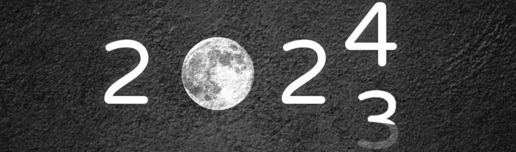
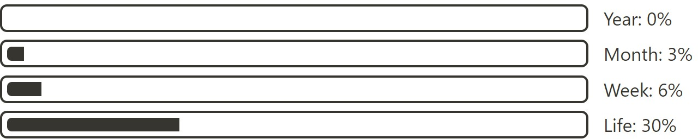

# 2023年终总结

### 23回顾
~~PS: 或许都是流水账~~

&nbsp; &nbsp; &nbsp; &nbsp; 时间好快，转眼间2023年结束了，同样这学期也马上过去了。真的不得不感慨时间真的太快了，还没缓过神这年就过去了 ，独自坐在宿舍静下来回忆回忆这一年发生的种种。去年22年12月，折磨三年多的疫情终于彻底结束，满是心酸，不少情景仿佛历历在目，甚至不幸的11月左右到12月初父亲不舒服，住了医院，疫情的原因导致看望都成了一种奢望，最后得知是头号杀手——[心血管疾病](https://www.who.int/zh/news-room/fact-sheets/detail/cardiovascular-diseases-(cvds))(血管狭窄)导致，甚至都不知道何诱因导致的发生，最主要是都不吸烟不喝酒睡眠规律都能导致，真的是纳闷？！难不成真就是Gene？做了心脏支架，才顺利出院，真的是不敢想象，十分之意外。再之后12月底二战考研结束，瞬间就来到了23年初，记得考完印象深刻的第一件事就是[chatGPT](https://chat.openai.com/chat)的出现，偶尔发现的AI工具，已诞生了一周年，至今仍影响深远，当时注册了账号，同时真的感慨AI的强大。

&nbsp; &nbsp; &nbsp; &nbsp; 一月，二月现在回忆起来印象已不深刻，就记得考完研觉得数学还行，408做的感觉并不好，也没对答案的习惯，就先放松了一阵子，在B站上看了田总直播的[摩登家庭](https://www.bilibili.com/video/BV1Gf4y1q7Pn/?spm_id_from=333.337.search-card.all.click)，还做了[笔记](https://www.bilibili.com/read/cv21052616/?spm_id_from=333.999.0.0&jump_opus=1)，现在回想起来虽整理了笔记，但没能好好回顾反复看，好多东西都已忘却。之后又穿插着看了看[三体](https://movie.douban.com/subject/26647087/)和[shameless](https://movie.douban.com/subject/34948243/?from=subject-page)，关于三体，不得不说作为非小说党三体给我带来了不少的震撼，拍的真棒，同样也荣获了23年年度国产剧第二名(详见[榜单](https://movie.douban.com/annual/2023/?fullscreen=1&source=movie_navigation))。而美剧shameless同样也带给我了很多不一样的感受(PS: 真的很凸显主旨—— **无耻**)，有机会再回顾回顾，有些台词仍很值得回味。
> we have only two jobs on this earth. The first, to learn. The second, to cope.

再之后时间来到了2月21日，等来了出成绩。看到成绩的那一刻，比起去年自命题的[目标院校](https://www.ccnu.edu.cn/)有进步，但没进步太多，同时408分数考的挺差，当时其实感觉还是有机会的。之后期间就准备起来了笔试C语言 + 面试，3.18出了院校，得知能进复试了，后来知道自己初试排28，而且附近的分数都特别密集，也意味着很容易逆袭，也不敢大意。时间来到了3.31资格审查 --> 笔试 + 面试，排在4.2号第三个，想想当时还挺紧张的，进去后看到五六个老师坐着，然后抽问题，就坐下开始回答了。记得开始让我英语自我介绍，然后英文介绍你最喜欢的编程语言，接着问了专业相关的问题，其实都没有难度太大，偏基础（但印象中自我介绍卡壳了，专业问题没回答太完善），还问了: ^^[24节气](https://www.hko.gov.hk/sc/gts/astronomy/Solar_Term.htm)相关的?^^，坦白讲真不会，但也没太为难。仍清晰记得最后一个问题: "你能说说chatGPT吗?"，当时听到这个问题就内心窃喜，就等着这个问题呢！之前了解了很多，虽感觉没回答太完美，但说到了[Attention all you need](https://arxiv.org/abs/1706.03762)，说到了transformer，还用变形金刚梗逗笑了老师，还算比较完美了。第二天也出了成绩239.2分 = 93(专业) + 27.2(英语) + 119(笔试)，静候了几天，4.5出了名单，学硕面试第二，从28名逆袭到了17名，我内心告诉自己，考上了！但很可惜的是和一起报的朋友没能复试逆袭😔，记得当时报[NCEPU](https://www.ncepu.edu.cn/)还是一起报的，真的好可惜没能一起上岸，或许没有这个朋友我也不想着报这个学校，想想真的是非常可惜！

&nbsp; &nbsp; &nbsp; &nbsp; 现在回想回想或许上岸含有挺大的运气成分，但终究也做到了！之后的几个月感觉也没学太多，断断续续。学了学[CS61B](https://sp21.datastructur.es/)，说学了但lab也没完全做完；偶尔看了看英语，但也没做到每天坚持并多次回顾不会的单词。再之后父亲想办病退相关的(不得不说真难办理)，就又去医院查了一下，陪着住了几天院，最后出院了。开学前为保险又去济南的[医院](https://baike.baidu.com/item/%E4%B8%AD%E5%9B%BD%E4%BA%BA%E6%B0%91%E8%A7%A3%E6%94%BE%E5%86%9B%E8%81%94%E5%8B%A4%E4%BF%9D%E9%9A%9C%E9%83%A8%E9%98%9F%E7%AC%AC%E4%B9%9D%E5%85%AD%E3%80%87%E5%8C%BB%E9%99%A2/59930940?fromtitle=%E6%B5%8E%E5%8D%97%E5%86%9B%E5%8C%BA%E6%80%BB%E5%8C%BB%E9%99%A2&fromid=3269086)，查了查，通过造影发现有根血管堵塞比较严重，建议支架处理，又进行了微创手术，陪的这几次真感觉医院氛围是很压抑，经常会睡不好，正常的人经常在这个环境，我怀疑都可能会导致不良反应。最后也是顺利，出了院。再往后就马上要开学了，不过开学前还能凑巧认识同系的老乡，真的是缘分！甚至还能认识保研的优秀同学，说实话认识她们真内心非常开心！

&nbsp; &nbsp; &nbsp; &nbsp; 9.7终于开学了，满怀憧憬的又迎来了校园，宿舍分配到了单身楼(~~疯狂吐糟~~),但好在舍友都是非常之棒！**斯是陋室，谓305德馨(23333...)** , 同时也认识了很多性格非常好的同学，每个人都绽放着不同的光彩！不禁内心感慨:"终于又来了期待已久的校园"。导师随机分配到了[张少敏老师](https://www.x-mol.com/university/faculty/89124)手下，研究电网信息security_etc的，坦白的讲这个方向是一点不了解，甚至周围同学其实都是AI相关。 ~~虽然导比较佛系放养~~ ，但相处起来还是十分棒的。虽没有进入主动联系的&据说很严格的[DT组](https://www.dreamtech.team/)，或许有点可惜，但能分到张老师门下是另一种幸运吧！意味着你有更多的时间可自己支配，或许更应该学习想学习的东西，或许专业厌烦了更应该静下来看几本书，或许都烦了那就应该操场多锻炼锻炼，保持身体和精神的健康，为以后而长久打算！

&nbsp; &nbsp; &nbsp; &nbsp;  **本学期的回顾:**  从9月至今也四个月了，^^你有什么收获吗？研究生期间对比本科区别在哪？你有什么不同的感受吗？^^ 坦白的讲这学期并没感觉太大的收获，甚至随着时间的流逝，过去的时光已在脑海中渐去，想尽量回忆出来，却无可奈何。开学没过久，时间到了9月25日爷爷身体不适就离开了人世，甚至也没能看到他最后一面，但爷爷的微笑一直都在都在....婚礼参加过好多次，但参加亲人的葬礼还是第一次，婚礼充满着欢快，葬礼充满着悲伤。或许真正的送别是没有长亭古道，没有劝君更尽一杯酒，就是一个平常的一个早晨，而有些人却永远留在昨天RIP，一切都显得突如其来，那么意外。返回校园，【开学侥幸面试上了研究生管理中心(服务部) -->  又报名了图书馆勤工助学 --> 12月初又开启了图书馆志愿者】，
前面10周大部分时间(从开学到11月)基本都被上课所支配着，其实很多课水得很而且感觉并没什么用，12周考试完(到11月中旬)，课程少了很多，基本都是自己可支配的时间，后来又因CET6还没过，上午时间就分配给了听力，但12月考完感觉又考的稀碎😩 甚至即便练了听力考试仍听得费劲，英语之路仍差好远！虽时常看似忙碌着，但在学业上但并没有收获很多，甚至还没能正式把论文看一看 ~~（虽然师兄说的他研一没看过一篇hhhh）~~，还十几天这学期就彻底结束了，回顾这学期，回顾这一年，有不少感受，但仍有太多的不足需要改正！仍有太多的东西需要学习！ ==朝前看，别回头==

&nbsp; &nbsp; &nbsp; &nbsp; 后续：貌似还是第一次能把年度总结静下来写一写，虽说一年时间看似很长，但这样一总结，一年之中哪有收获太多有趣的东西，但换个角度来说每天的时光都是自己独特的宝藏，甚至每天都会有不少有趣的事情发生着，只是不记录慢慢淡忘了，就如多年未联系的同学，虽有些印象，但或许会慢慢淡忘，但只要保持着联系，你们之间就会有独特的记忆存在。既然总结回顾了，那对新一年的憧憬就少不了，新一年的开始，更要加油！
### 24计划

- [ ] 英语CET6过过过！！！(研究生过不去这辈子别想过了)  
更重要的提升英语的能力，希望能 ==坚持学英语==，能对听力能有大幅度的提高，早日听懂[Andrew Huberman](https://www.youtube.com/@hubermanlab)的podcast (PS: 作为一个教授真的是身材又好又自律又博学) 以及更多的英文！同样对于阅读也能读的更加顺畅

- [ ] 学业方面: 一定要多看论文了，尽早有思绪把论文发出来

- [ ] 多记录总结，希望能 **每个月** 都能回顾一番，简单写写，为了下年的年度总结！

- [ ] 尽量多读读书，养成读书的习惯。  少看视频, 上年b站刷了831h，~~虽然感觉做不到少看，但可以看高质量的呢（doge~~

- [ ] 多锻炼多运动，每周锻炼四五次，保持充沛的精神

- [ ] 改变自己不好的习惯，比如早醒看手机导致睡不好。 **养成好习惯，你还年轻一定做得到！**

- [ ] 充实网站内容，把学习相关的，想记的想说的都可以充实，只要你想。

- [ ] 或许能和朋友同学们多多交流沟通，甚至是老师 （我管服部门就是负责这个的呀！

- [ ] 家人朋友以及自己健康！！！一切都平平安安！！！

- [ ] 放最后:~~SOLO那么多年，虽说也没很急，家人到是急的不行。先立在这个，万一有了呢~~

==2023再见！ 2024你好！==
