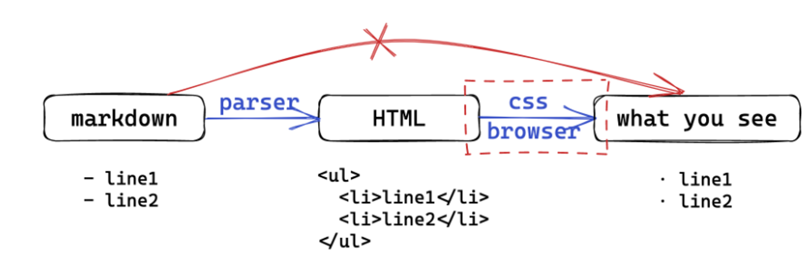

# Markdown

[参考视频](https://www.bilibili.com/video/BV1pu4y1j7kA/?spm_id_from=333.999.0.0)

## 1. 介绍

[Markdown CommonMark 标准文档](https://spec.commonmark.org/)
**什么是Markdown？**

- 是一种轻量级文本标记语言（markup language）
- 可以通过纯文本来表示带有格式的文档，同时保证易读性
- 语法简单，易于学习，易于使用
- 可以轻松转换为 HTML（映射到 HTML 的子集）

> Markdown 本质是一种标记语言，是对HTML的一种简化
>
> - 所有的最终视觉上的效果都由HTML + CSS 决定的



## 2. 语法概述

### 标题

!!! note
    `#` + 空格(开头)，后跟内容
    Ps:  # 和标题间至少一个空格

- 使用 # 的称为 ATX 样式
- 只有 1～6 级标题，7级以上不会变成标题格式
- 可以跨过某一级，但不推荐
    + 明确好层级关系

### 段落

!!! note
    - 直接编写文本即为普通段落
    - 段落间通过空行来分割（有空行就有新的段落）
    - 段落内换行需要在行尾加两个空格（`<br>`）

__关于空格:__

- 多个连续的空格会被解析为一个空格
- 但是在代码块中，空格会被保留
- 使用多个空格可以使用`&nbsp; &emsp;`等 HTML语法
  
### 引言
!!! note 

    一个 `>` 加一个空格后面跟内容

- 内部可任意嵌套并使用MD语法
- 连续的`>`属于同一引言， 使用Enter来进行退出
### 列表
#### 无序列表
!!! note 

    `- + * ` 后加空格再跟内容

```markdown
- node 1
- node 2

  content in node 2
- node 3
* 第一层
    + 第二层
        * 第三层
    + 第二层
* 第一层
```
#### 有序列表
!!! note 

    数字加点(.) 后接空格 再接内容
### 分割线 & 代码块
!!! note 
    
    使用`* - _` 中任意一个字符重复至少三次

会被转换为html 中的`<hr>`  
PS : 分割线上下最好都加空行

!!! note 

    使用三个或以上 ` 或 ~ 围起来构成代码块
    
    - \ ' 或~ 后面可以加语言名称，可进行高亮
### 行内标记
```markdown
*斜体*         _也是斜体_  
**粗体**      __也是粗体__
***粗斜体***   ___也是粗斜体___
`行内代码`
~~删除线~~
<u>下划线</u>
```
若要显示原本用于格式化 Markdown 文档的字符，在字符前面添加反斜杠字符 \\ 。
### 插入图片和链接

!!!note

    ``

常规 MD 语法插入图片无法调大小，使用 html 中img 的 style 可以调节

``

!!! note
    插入链接: 方括号[] 和 圆括号()组合
    =>  `[文字描述](链接URL)`

PS: markdown 中一般可以直接使用 html 语法和 css 样式

e.g 图片居中: 也可`right, left`
```html linenums="1"
<div align=center>
	
</div>
```

## 3.  扩展语法
### 表格
```markdown
| Syntax      | Description | Test Text     |
| :---        |    :----:   |          ---: |
| Header      | Title       | Here's this   |
| Paragraph   | Text        | And more      |
```
输出如下:

| Syntax      | Description | Test Text     |
| :---        |    :----:   |          ---: |
| Header      | Title       | Here's this   |
| Paragraph   | Text        | And more      |

在标题行中的连字符左侧，右侧或两侧添加冒号`:` 将列中的文本对齐到左，右或居中

仅可处理简单的表格，[关于复杂的表格](https://www.tablesgenerator.com/)
### 脚注
!!! note

    使用[^脚注名]插入脚注

在文中任意位置添加`[^脚注名]:脚注内容` 来定义脚注内容

- 脚注名只是标记、匹配使用的，可以是任何字符串
- 最终的编号一般由在**文中出现的顺序**决定

PS: [详见PY&MD](#jump)

### 任务列表
!!! note 

    使用`- [  ]` 插入未完成任务 ; 使用`- [x]`  插入未完成任务
    
    - 可以和其它列表混合使用
如:
```markdown
- [ ] to do list
- [x] finished
```
生成如下: 

- [ ] to do list
- [x] finished

### 公式
!!! note 

    一般使用一对\$作为行内公式标记，一对$$作为块级公式标记

关于公式处理的一切都不在 markdown->HTML 的过程中,如图所示:


- HTML 保留公式文本，交给[MathJax](https://www.mathjax.org/)或[KaTex](https://katex.org/)等 js库来处理

    * 内部均使用[LaTeX](https://www.latex-project.org/) 公式语法
- [LaTeX公式手册](https://www.cnblogs.com/1024th/p/11623258.html)


Ps: 关于流程图 / 时序图 / 甘特图.. 
-> 参考[mermaid.js](https://mermaid.js.org/intro/)

## 4.markdown编辑器
- [Typora](https://typora.io/) （收费$ 14.99）
- [VsCode](https://code.visualstudio.com/) + [Markdown Preview Enhanced](https://marketplace.visualstudio.com/items?itemName=shd101wyy.markdown-preview-enhanced) （推荐🌹）
- [Obsidian](https://obsidian.md/) （据说很强大，还没详细用过）

## 5. 关于mkdocs
> 基于 python 的静态网站生成器，适合笔记本 / 文档类网站

PS: 真的好看！！(✧∀✧)

- [官网](https://www.mkdocs.org)
- 推荐主题：[mkdocs-material](https://squidfunk.github.io/mkdocs-material/)

**实现逻辑**: 所有都在 `mkdocs.yml` 中进行配置，通过 nav 规定网站导航，从中读取 md 源文件，解析后嵌入主题的 HTML 框架中

常用命令:
```shell
$ pip install mkdocs # 安装
$ mkdocs new <name>  # 新建
$ mkdocs serve       # 实时预览
$ mkdocs build       # 构建
$ mkdocs gh-deploy   # 部署
```

### [Python Markdown](https://squidfunk.github.io/mkdocs-material/setup/extensions/python-markdown/?h=abbr#abbreviations:~:text=CodeHilite-,Python%20Markdown,%C2%B6,-Material%20for%20MkDocs)

关于MD在mkdocs里面的一些特殊用法，即支持的Extensions
!!! note 
    
    均需要在`mkdocs.yml`内的`markdown_extensions`项内进行添加配置，然后进行使用。

1. `abbr`  缩写或名词。用作对一些专有名词(缩写)进行额外的解释，可用`*[]`来定义
```markdown
The HTML specification is maintained by the W3C.
*[HTML]: Hyper Text Markup Language
*[W3C]: World Wide Web Consortium
```
显示为 :
The HTML specification is maintained by the W3C.
*[HTML]: Hyper Text Markup Language
*[W3C]: World Wide Web Consortium

    （PS: 示例来自官网）

2. `admonition` 警告或标注, 用于提供辅助内容

    **如何使用?**

    - 以 `!!!` 开头，后跟一个用作类型限定的关键字。<u>内容在下一行，需要缩进四个空格</u>
         * 若以`???`开头，则内容是可以折叠的

    **常见关键词:** note, abstract, tip, success, question, warning, failure, danger, bug, quote
    
    默认情况下，标题 = 类型限定关键字，但可以通过在关键字后面添加带引号的关键字来修改,并且引号里面支持Markdown

    E.g. `!!! note "Hello World!"`, 显示如下: 
    !!! note "Hello World!" 

    **内联块(即侧边栏)**，使用`inline + end`修饰符

    e.g. ` !!! inline note `  为左对齐，而` !!! inline end note ` 为右对齐

    若想要添加自定义警告的类型，只需要颜色和`*.svg`图标 --> [参考](https://squidfunk.github.io/mkdocs-material/reference/admonitions/?h=pied+piper#custom-admonitions:~:text=%7D-,Custom%20admonitions,%C2%B6,-If%20you%20want)

3. attr_list 属性列表, 允许为所有内联和块级元素添加属性，将任何链接变成按钮,使用花括号对其进行后缀并将`.md-button`类选择器添加到其中

    e.g.`[百度](https://www.baidu.com){.md-button}`-->  [百度](https://www.baidu.com){ .md-button }

    若要显示一个填充的主按钮，同时添加`.md-button--primary`

    - e.g. `[百度](https://www.baidu.com){.md-button .md-button--primary}`


4. def_list 定义列表，可用枚举任意键值对的列表，例如函数或模块的参数

    !!! example 
        
        === "语法规则"
            ```markdown
            `param1`
            : xxxx

            `param2`
            : yyyy
            ```
        === "显示结果"
            `param1`
            : xxx

            `param2`
            : yyyy        

5. <span id = "jump">footnotes 行内脚注, 用方括号括起来，开头必须插入符号`^`,具体内容再另起一行进行定义</span>
    
    !!! example

        ```markdown
        Lorem ipsum[^1] dolor sit amet, consectetur adipiscing elit.[^2]

        [^1]: Lorem ipsum dolor sit amet, consectetur adipiscing elit.
        [^2]:
        Lorem ipsum dolor sit amet, consectetur adipiscing elit. Nulla et euismod
        nulla. Curabitur feugiat, tortor non consequat finibus, justo purus auctor
        massa, nec semper lorem quam in massa.
        ``` 
    
    显示结果 : 
    Lorem ipsum[^1] dolor sit amet, consectetur adipiscing elit.[^2]

    [^1]: Lorem ipsum dolor sit amet, consectetur adipiscing elit.
    [^2]:
    Lorem ipsum dolor sit amet, consectetur adipiscing elit. Nulla et euismod
    nulla. Curabitur feugiat, tortor non consequat finibus, justo purus auctor
    massa, nec semper lorem quam in massa.

6. md_in_html  

    默认，Markdown 会忽略原始 HTML 块级元素中的任何内容，启用扩展后，原始 HTML 块级元素的内容可以解析为 Markdown

    在 HTML 扩展中使用带有文字 figure 和 figcaption 标签的 Markdown，可做图片标题或者说明。

    
    === "示例"
        ```
        <figure markdown>
            { width="300" }
            <figcaption>Image caption</figcaption>
        </figure>
        ```
    
    === "结果"
        
        <figure markdown>
            { width="300" }
            <figcaption>Image caption</figcaption>
        </figure>
    


7. 格式化
    
    - `pymdownx.caret` 插入角标符号`^`, 此时下划线可用`^^HELLO^^`
        * ^^HELLO^^ 
    - `pymdownx.mark`  插入双等号`==`, 可进行高亮
        * ==HELLO==
    - `pymdownx.keys`  插入键盘键以及组合
        * `++enter++` --> ++enter++
        * `++ctrl+alt+del++` --> ++ctrl+alt+del++

8. 代码高亮 `pymdownx.highlight`
    
    !!! example 

        === "带有行号的代码块用法"

            ```markdown
                ``` py linenums="1"
                def bubble_sort(items):
                    for i in range(len(items)):
                        for j in range(len(items) - 1 - i):
                            if items[j] > items[j + 1]:
                                items[j], items[j + 1] = items[j + 1], items[j]
                ```
            ```
        === "显示结果"

            ``` py linenums="1"
            def bubble_sort(items):
                for i in range(len(items)):
                    for j in range(len(items) - 1 - i):
                        if items[j] > items[j + 1]:
                            items[j], items[j + 1] = items[j + 1], items[j]
            ```
        
        === "带标题的"

            ```markdown
                ``` py title="bubble_sort.py"
                def bubble_sort(items):
                    for i in range(len(items)):
                        for j in range(len(items) - 1 - i):
                            if items[j] > items[j + 1]:
                                items[j], items[j + 1] = items[j + 1], items[j]
                ```
            ```
        === "显示结果"

            ``` py title="bubble_sort.py"
            def bubble_sort(items):
                for i in range(len(items)):
                    for j in range(len(items) - 1 - i):
                        if items[j] > items[j + 1]:
                            items[j], items[j + 1] = items[j + 1], items[j]
            ```
        === "强调某几行"

            ```markdown
                ``` py hl_lines="2 3"
                def bubble_sort(items):
                    for i in range(len(items)):
                        for j in range(len(items) - 1 - i):
                            if items[j] > items[j + 1]:
                                items[j], items[j + 1] = items[j + 1], items[j]
                ```
            ```
        === "结果"

            ``` py hl_lines="2 3"
            def bubble_sort(items):
                for i in range(len(items)):
                    for j in range(len(items) - 1 - i):
                        if items[j] > items[j + 1]:
                            items[j], items[j + 1] = items[j + 1], items[j]
            ```

9. pymdownx.tabbed 内容选项卡
```
=== "C"

    ``` c
    #include <stdio.h>

    int main(void) {
      printf("Hello world!\n");
      return 0;
    }
    ```

=== "C++"

    ``` c++
    #include <iostream>

    int main(void) {
      std::cout << "Hello world!" << std::endl;
      return 0;
    }
    ```
```

    如下所示:
    === "C"

        ``` c
        #include <stdio.h>

        int main(void) {
        printf("Hello world!\n");
        return 0;
        }
        ```

    === "C++"

        ``` c++
        #include <iostream>

        int main(void) {
        std::cout << "Hello world!" << std::endl;
        return 0;
        }
        ```
    当然也可以用别的类型的，比如note,example 等等
    !!! example
        
        === "规则语法"

            ```
            !!! example

                === "Unordered List"

                    ``` markdown title="List, unordered"
                    * Sed sagittis eleifend rutrum
                    * Donec vitae suscipit est
                    * Nulla tempor lobortis orci
                    ```

                === "Ordered List"

                    ``` markdown title="List, ordered"
                    1. Sed sagittis eleifend rutrum
                    2. Donec vitae suscipit est
                    3. Nulla tempor lobortis orci
                    ```
            ```

        === "Unordered List"

            ``` markdown title="List, unordered"
            * Sed sagittis eleifend rutrum
            * Donec vitae suscipit est
            * Nulla tempor lobortis orci
            ```

        === "Ordered List"

            ``` markdown title="List, ordered"
            1. Sed sagittis eleifend rutrum
            2. Donec vitae suscipit est
            3. Nulla tempor lobortis orci
            ```

10.  图表 mermaid

    
    !!! example 
        
        === "语法规则"

            ```markdown
               
                ``` mermaid
                    graph LR
                    A[Start] --> B{Error?};
                    B -->|Yes| C[Hmm...];
                    C --> D[Debug];
                    D --> B;
                    B ---->|No| E[Yay!];
                ```
            
            ```
        
        === "结果"

            ``` mermaid
                graph LR
                A[Start] --> B{Error?};
                B -->|Yes| C[Hmm...];
                C --> D[Debug];
                D --> B;
                B ---->|No| E[Yay!];
            ```

11. emoji

    - [配置](https://squidfunk.github.io/mkdocs-material/reference/icons-emojis/?h=em#with-animations-docsstylesheetsextracss:~:text=to%20your%20clipboard.-,Configuration,-%C2%B6)
    
    - [表情库](https://emojipedia.org/) 🥰  


