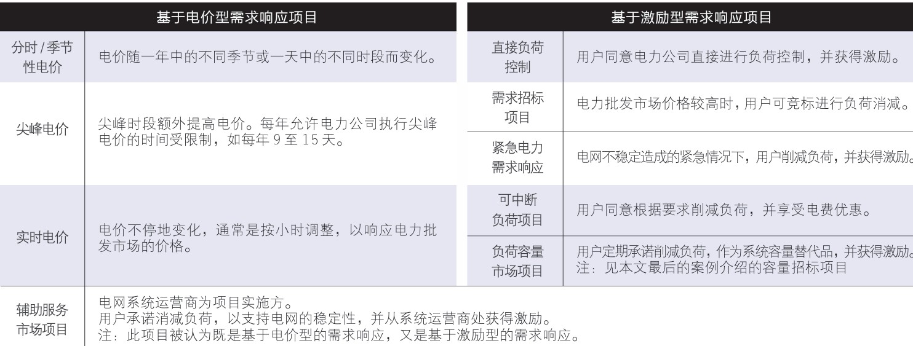

!!! Abstract
    这个概念导师开会的时候提到过，师兄师姐也有搞类似方向的，e.g. ^^A Multidimensional Data Aggregation Scheme of Smart Home in Microgrid With Fault Tolerance and Billing for Demand Response^^（SCI二区）

    并且上这个课也反复提到这个概念，甚至更细化了。

## 介绍

导师那次提到的概念，如下再重复一遍

!!! Note "需求响应（Demand Response）"
    ^^当电力批发市场价升高或系统可靠性受威胁时^^，**电力用户** 接收到供电方发出的诱导性减少负荷的直接补偿通知或电力价格上升信号后，改变其固有的习惯用电模式，达到减少或推移某时段的用电负荷而响应电力供应，从而保障电网稳定，并抑制电价上升的 **短期行为**

&nbsp;&nbsp;&nbsp;&nbsp; 由于新能源的不断使用与发展，但其具有 **波动性和间接性** 等特点，会对电网进行冲击，就有可能出现某时段负载很高，而某时段则很小，即峰谷差很大。  
&nbsp;&nbsp;&nbsp;&nbsp; 但仍要保持电力系统的平稳运行，就要通过 **需求响应策略** 进行干预 ==『基于价格或激励（PBDR和IBDR）』== ，让用户主动参与，控制可以灵活变动的电器，则需要采集各种电器的用电量来进行 **多维数据聚合** ,最终来达到 **削峰填谷** 的效果。『如下图』

- **供需两端的实时平衡一直是电力系统的核心**，在之前火电为主的传统电力系统中，发电机组调整的难度小、成本低，所以都是供给跟着需求走，即我们需要多少电，电厂就发多少电
- 如今新能源占比增高，电力系统平衡的难度加大。风光发电几乎是“靠天吃饭”，我们创造不了风光资源，故供给没办法跟着需求走了，那就只能在 **需求侧** 想办法!

最上面那条线，即没有参与DR过程的，叫做 **BaseLine（基线）**

- 需求侧响应有个根本问题还没解决即 **基线估计**；关于此方面研究，比如[此篇](https://ieeexplore.ieee.org/document/9656952)
    - 此文章作者把用户的用电行为建模成为马尔科夫决策过程（MDP）

## 分类

### PBDR

**Price-Based Demand Response（基于价格的需求响应）** ：包括分时电价（峰谷电价机制）、实时电价等（电价每一小时或者更短就会变化一次）通过零售电价的变化，让用户主动改变电力消费行为『属于事先调节』

!!! Example
    如果把洗衣机、烘干机、洗碗机等等电器的工作时间从白天高电价的时段挪到晚上低电价的时段，或者在给电动汽车充电的时候试过根据电价进行预约和定时充电的功能，那就是参与了广义上价格型的需求响应
    --> **此时我们就能少花钱**

### IBDR

另外一种 **Incentive-Based Demand Response(基于激励的需求响应)** ：直接采用激励政策和补偿方式，诱导用户参与系统需要的负荷削减项目。我们在签订相关合同之后，只需要等待需求响应指令的发布，通过APP、电话等渠道获得通知后确认参与，再根据指定方式执行就好了（有“削峰”和“填谷”两类）

- 削峰: 是在电不够用的时候鼓励大家少用，少用不仅不用花电费，而且能获得更多补贴
- 填谷: 是在新能源大发的时候，为减少弃风弃光，鼓励多用电.若参与不就是电用了,钱也赚了

对比：

!!! Question
    关于激励是来自于哪里,谁给的资金？

在一篇来自自然资源保护协会，关于需求响应的[论文](http://www.nrdc.cn/Public/uploads/2016-12-03/5842d3f1a9e4d.pdf)中，提到：

> 用户可直接向 **电力公司** 申请参与需求响应项目或选择通过 **第三方——负荷集成商**——参与需求响应项目

在自动化需求响应(ADR)中还提到：^^" **电力公司** 为用户不仅提供技术支持，还提供激励。因多数用户愿意自己控制系统，通常不愿意参与自动化需求响应项目，电力公司提供的激励往往较高"^^

并且之后讲到面临的挑战那部分，关于经济利益方面的挑战："其一是针对激励型需求响应项目，**电力公司或负荷集成商(聚合商)提供的激励有限**，不能够吸引用户参与需求响应项目"

!!! Question
    电力公司和负荷集成商(聚合商) 是什么？

关于电力公司： 五家电力公司(中国国电/华电/华能/大唐/电力投资集团公司)

在来自山东省发改委、能源局印发的《2020年全省需求响应工作方案》，其明确 **电力需求响应的市场参与主体为电力用户和负荷聚合商(LA=Load aggregator)**

> **负荷集成商** 就是以整合用户需求侧响应并提供给市场购买者的组织，为中小负荷提供参与需求侧电力市场的机会——来自[西交论文库](http://www.ir.xjtu.edu.cn/item/360186)

LA作为其他电力系统参与者和需求响应资源之间的中介，不仅要整合需求响应资源并提供市场入口，同时还要和其他电力系统参与者交易或参加组织市场，收集需求并响应市场

- LA和用户之间的业务: ^^用户需求响应潜力分析; 安装负荷控制和通信设备; **向用户提供响应后的经济激励**^^
- LA和市场之间的业务：（1）双边交易；（2）参与市场竞标