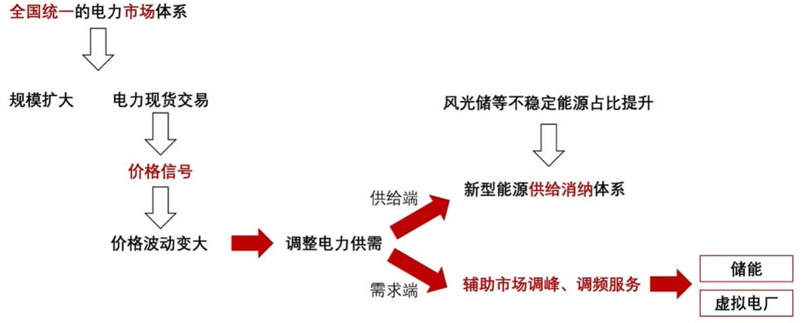

## 介绍

> **虚拟电厂(virtual power plant，VPP)** :  是一种通过先进信息通信技术和软件系统，实现 ^^分布式电源、储能系统、可控负荷、微网、电动汽车^^ 等分布式能源资源的 **聚合和协调协同优化**，以作为一个特殊电厂参与电力市场和电网运行的电源协调管理系统。

- 虚拟电厂具有与电厂类似的功能，但没有传统意义上的厂房，故称"虚拟电厂"

Q: **为何推出虚拟电厂?**  --> 电力供需两端的结构变化，使当下电力系统调峰能力备受挑战

- 供给端: 新能源占比不断提升, ^^风光发电随机性、间歇性和波动性的特点^^ 对电力系统灵活调节能力提出更高要求
- 需求侧: 产业结构持续调整, 用电侧日内负荷的最高值与峰谷差都在不断增大,电力系统调峰能力迎来挑战

- [视频参考](https://www.bilibili.com/list/watchlater?oid=941728135&bvid=BV1CW4y1a7Uz&spm_id_from=333.1007.top_right_bar_window_view_later.content.click)

中国将虚拟电厂中所涉及的主体及运转原理总结成: 

虚拟电厂通过链接 ^^聚合商、微电网，以及它们所辖的各类负荷、储能、微电网、电动汽车、分布式电源^^ 等参与电力市场交易已获利，同时帮助电力市场平和调节。**既可作为"正电厂"向系统供电或控制可调负荷调峰;又可作为"负电厂"加大负荷消纳,配合系统填谷**

虚拟电厂能发展起来是以三类资源的发展为前提的: 

- **一是可调（可中断）负荷，二是分布式能源，三是储能**

## 摘自论文—[虚拟发电厂研究综述](https://www.researchgate.net/profile/Mingyang-Li-49/publication/286044094_Review_on_virtual_power_plants/links/5b8ce90a92851c1e1243f96b/Review-on-virtual-power-plants.pdf)(刘吉臻)

**狭义来说** ：VPP是一组电源的聚合体（可以是火电机组，也可以是风电、太阳能发电等新能源机组，还可以是电力的储能装置），这些机组/装置不直接受电网运行调度中心的控制，而是听于VPP控制中心。**通过该中心以一个整体的形式参与到电网的运行和调度中**

**广义来说**：VPP不仅限于发电侧各发电单元的聚合，还能与用电侧的可控负荷和DR(需求响应)结合起来，将发电和用电两端的一些个体或单元组成一个虚拟的整体参与到电网的运行于调度当中

虚拟发电厂结构区别于传统电厂的典型特征在于地域分布上的分散性与运行调度上的协同性

**功能特征：**

- 网络通信及管理功能
- 发电管理功能
- 新能源发电功率预测功能
- 用电负荷预测及管理功能
- 数据管理及分析功能
- 电力市场中的经营能力

VPP的运行控制整体结构可以分为 ^^集中控制、集中–分散控制和完全分散控制^^ 三种

## [虚拟电厂 & 微电网](https://www.bilibili.com/video/BV1NG411Z7bB/?spm_id_from=trigger_reload&vd_source=41a19477b1cd284eb33c00c0aae3f725)

> 微电网(Micro-Grid)又称微网，本质上是一个 **微小发配用电网络** ，由 ^^分布式发电(DG)、储能装置、能量转换装置、相关负荷和监控、保护装置^^ 汇集而成的小型发电系统，是一个能够实现自我控制、保护和管理的自治系统，既可以于外部电网并网运行，也可以孤立运行[^1]

[^1]: 王成山,李鹏.[分布式发电、微网与智能配电网的发展与挑战](https://wenku.baidu.com/view/21b90f19cc17552707220867.html?fr=xueshu_top&_wkts_=1712632089522)[J].电力系统自动化,2010,34(02):10-14+23

**旨在解决DG(Distributed Generation)b并网运行时的主要问题**，同时由于它具备一定的能量管理功能，并尽可能维持功率的局部优化和平衡，可有效降低运行人员的调度难度

微电网更侧重能量管理和优化，而虚拟电网更侧重交易和价值实现

- 虚拟电网可以帮助多个微网实现能源聚合，破解盈利难题     

