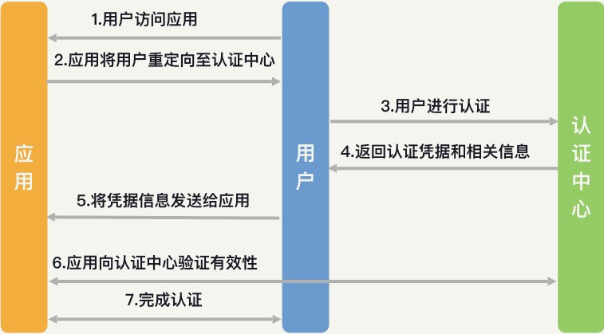
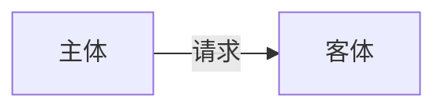

```
1. 基础概念：安全本质、原则、密码学
2. 模型框架：身份认证、访问控制
3. 开发运维：
- 前后端：XSS/SQL注入/CSRF/SSRF/反序列化漏洞
- 服务运维: 信息泄露、插件泄露、权限提升、持久化
- 网络: 办公网安全、内网、公网
- 数据库：MySql、Redis
- 分布式: Hadoop/Spark/ELK
- OS: Linux
- 容器: Docker
4. 产品策略: 安全体系、安全防御攻击、安全产品流程
5. 管理运营：安全标准、落地方案、运营平台、安全开发流程和

```

## 安全本质

> 任何应用最本质的东西其实都是数据 => 安全的本质就是保护数据被合法地使用

怎么算合法化使用? 三个方面考虑即 **安全原则(CIA)**：

- ^^**机密性(Confidentiality)、完整性(Integrity)、可用性(Availability)**^^
    * C: 授权主体才能看访问data，没授权访问不了（不可见）
        + 保护技术：加密、隔离、混淆、隐藏
    * I: 确保数据只被授权的主体进行授权的修改（不可改）
        + 保护技术：加密、签名等技术，使数据的完整性变得可验证 
    * A: 保数据能够被授权的主体访问到 (可读)

安全解决方案(AAA)：^^**认证(Authentication)、授权(Authorization)、审计(Audit)**^^，或者五部分(IAAAA)，此基础上加上了问责(Accounting)和身份识别(Identification)

- **登录 --> 操作 --> 留下记录**
- 认证：你是谁？确保身份可用性
    * 两部分：身份识别和身份认证 e.g. username识别作用，pwd身份认证作用 
- 授权：你能做什么？确保行为可信 => 策略：自主访问控制、强制访问控制
- 审计: 做了什么？再次核验身份和行为的可信性
    * 通过 **日志记录和分析** 还原操作历史，进行问责(不可否认性)

> 认证：事前防御；授权：事中防御；审计：事后防御

## 密码学

> 密码学是上述AAA的基础技术支撑
> 
> 密码学算法：**对称加密、非对称加密和散列算法**

对称加密：加密和解密使用的是同一个密钥

- 常见对称加密算法：**DES、IDEA、AES、国密SM1和SM4**
- DES(Data Encryption Standard): 密钥长度56bit，已过时
- IDEA(International Data Encryption Algorithm)：密钥128bit
- AES(Advanced Encryption Standard): **国际上最认可的密码学算法**

非对称加密: 发送方使用公钥对信息进行加密，接收方收到密文后，使用私钥进行解密

- 若私钥加密即签名(私钥加密,公钥解密): 接收方通过公钥成功解密，就能够证明发送方拥有对应的私钥，即能证实发送方的身份
- 常见非对称加密算法：**RSA、ECC和国密SM2**
    * ECC是目前国际上加密强度最高的非对称加密算法

散列算法：利用它可以对任意长度的输入，计算出一个定长的id

- 不可逆、鲁棒性(同样的消息生成同样的摘要)、唯一性
- 常见散列算法：**MD5、SHA、国密SM3**
    * SHA-256普遍被认为是相对安全的散列算法 
    * PS: 使用散列算法，一般会加salt value(盐值)即一串随机的字符，再进行Hash

## 身份认证

> 将身份识别和认证统称为认证
>
> 两部分：对外认证和对内认证

- 对外认证：即登录注册模块，通常一个应用只有一个登录入口
- 对内认证：应用的内部系统也需要认证 e.g. git登录、服务器/数据库登录
    * 对外认证是单一场景下的认证，对内认证是多场景下的认证

^^身份认证面临的威胁: 无认证、弱密码、认证信息泄漏^^

身份认证的最大的问题在于身份管理  => **单点登录SSO(Single Sign On)**

- 用户只需进行一次认证，即可以访问所有的网页、应用和其他产品

**SSO方式：CAS流程、JWT、OAuth和OpenID**

**CAS**：集中式认证服务(Central Authentication Service)，app转发至认证中心进行集中认证



**JWT(Json Web Token)**：会在客户端保存一个凭证信息，之后每次登录的请求中都带上这个凭证，将其作为登录状态的依据。好处：不需要应用服务端去额外维护Cookie或Session

**OAuth(Open Authorization)**: 主要特点是授权，e.g. 微信/GitHub授权登录

**OpenID**: 与OAuth类似，但不提供授权的功能。e.g. 在应用中使用微信支付的时候，应用只需要收集支付相关的信息，并不需要获取用户头像

## 访问控制

> 确定好用户身份后，对用户的操作和访问行为的把控，就是授权和审计的任务
>
> 授权 = 访问控制：允许或者禁止某个用户做某件事情



- **常见访问控制机制：DAC、role-BAC、rule-BAC、MAC**

!!! Note "区别"

    - DAC 是所有者对客体制定的访问控制策略
    - role-BAC 是管理员对主体制定的访问控制策略
    - rule-BAC 可以说是针对请求本身制定的访问控制策略

**DAC(自主访问控制)**：让客体的所有者来定义访问控制规则，将安全交到了用户手中

- 适合面向用户使用（Linux中即采用此方式，用户可以控制自己的文件能够被谁访问）
- PS: Linux也利用了role-BAC定义了用户组（group）的概念

**role-BAC(基于角色的访问控制)**：将主体划分为不同的角色，对每个角色的权限进行定义

- 是防止权限泛滥，实现最小特权原则的经典解决方案，适合在管理员集中管理的时候使用

**rule-BAC(基于规则的访问控制)**：制定某种规则，将主体、请求和客体的信息结合起来进行判定

- 适合在复杂场景下提供访问控制保护。e.g. **防火墙**：通过将请求的源IP和端口、目标IP和端口、协议等特征获取到后，根据定义好的规则，来判定是否允许主体访问

**MAC(强制访问控制)**：基于安全级别标签的访问控制策略

- 在互联网中，主体和客体被划分为“秘密、私人、敏感、公开”这四个级别
- MAC是安全性最高的访问控制策略（仅出现在政府系统中）

**威胁评估** ：目的是明确目前有哪些威胁

- 主要思路：识别数据、识别攻击、识别漏洞