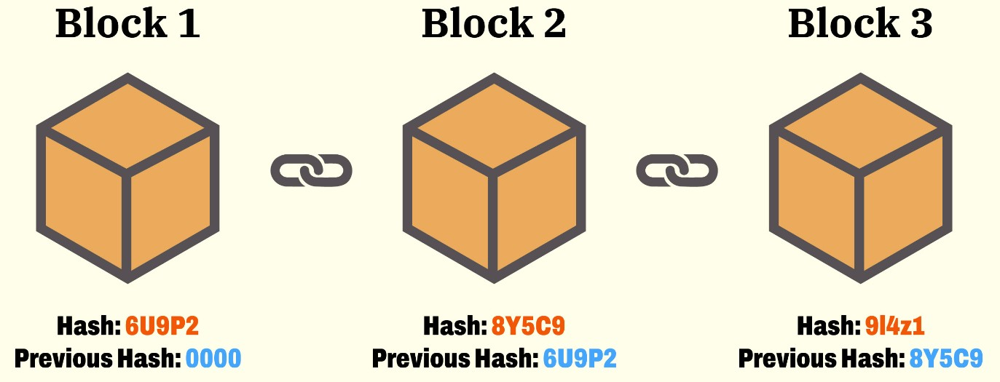
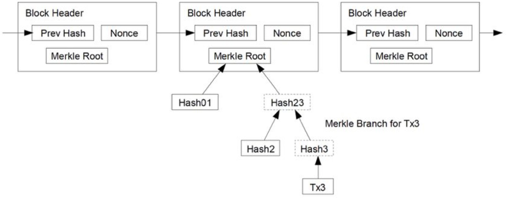

## 概述

> **区块链(BlockChain)**: 有一个一个的Block，每个Block中包括着一组交易信息，然后，每一个Block都会有一个ID（或是一个地址），这些Block通过记录前一个Block的ID来形成一条链

其实就类似于单向链表，包含三个信息：

- 真正的数据
- 自己的ID(或地址)：地址的编码使用了 **Secure Hash**
- 前一个Block的地址

PS: 每个Block的ID都是由内容来定的，只要内容变了，ID则完全不一样。因还包括上一个Block的ID，故产生连锁反应，即一个Block变化，后续的Block全要变化，修改成本大大提升。因此越旧的Block，越安全不容易被篡改，而新的Block则会越不安全

但仅仅是难以篡改，**工作量证明的共识机制** 使得无法篡改

## 哈希算法简介

**Hash功能：**

1. 用来生成唯一标识一个数据块的ID，几乎不能重复
2. 用来做数据的特征码。只要数据中有一个bit出现修改，那么整个hash值就完全不一样

!!! Note
    很多公司在互联网上发布信息或软件的时候，都会带上一个Checksum（校验码）
    
    只要把整个文件的数据传入到那个特定的hash算法中，就会得到一串很长的字符串
    
    如果和官方发布的Checksum字符串不一样，那么就说明信息或文件内容被人更改或是信息残缺了。
    因此，也被应用在[数字签名](https://www.google.com/search?q=%E6%95%B0%E5%AD%97%E7%AD%BE%E5%90%8D&oq=%E6%95%B0%E5%AD%97%E7%AD%BE%E5%90%8D&gs_lcrp=EgZjaHJvbWUyBggAEEUYOTIGCAEQABgeMgYIAhAAGB4yBggDEAAYHjIGCAQQABgeMgYIBRAAGB4yBggGEAAYHjIGCAcQRRg90gEINTQ2M2oxajSoAgCwAgA&sourceid=chrome&ie=UTF-8#:~:text=%E5%8F%AA%E6%9C%89%E4%BF%A1%E6%81%AF%E7%9A%84%E5%8F%91%E9%80%81%E8%80%85%E6%89%8D%E8%83%BD%E4%BA%A7%E7%94%9F%E7%9A%84%E5%88%AB%E4%BA%BA%E6%97%A0%E6%B3%95%E4%BC%AA%E9%80%A0%E7%9A%84%E4%B8%80%E6%AE%B5%E6%95%B0%E5%AD%97%E4%B8%B2%EF%BC%8C%E8%BF%99%E6%AE%B5%E6%95%B0%E5%AD%97%E4%B8%B2%E5%90%8C%E6%97%B6%E4%B9%9F%E6%98%AF%E5%AF%B9%E4%BF%A1%E6%81%AF%E7%9A%84%E5%8F%91%E9%80%81%E8%80%85%E5%8F%91%E9%80%81%E4%BF%A1%E6%81%AF%E7%9C%9F%E5%AE%9E%E6%80%A7%E7%9A%84%E4%B8%80%E4%B8%AA%E6%9C%89%E6%95%88%E8%AF%81%E6%98%8E)中

两个著名的Hash算法： [MD5](https://en.wikipedia.org/wiki/MD5)和[SHA-2](https://en.wikipedia.org/wiki/SHA-2)，而区块链用的是[SHA-256](https://en.wikipedia.org/wiki/SHA-2)

## 比特币的哈希算法

**区块链的协议格式：**

- **区块数据协议头:**
    - Version：当前区块链协议的版本号(4字节)
    - Previous Block Hash：前面那个区块的hash地址(32字节)
    - Merkle Root：后面交易信息的hash值(32字节)
    - Timestamp：区块生成的时间(4字节)
    - Difficulty Target(Bits)：表明了当前的hash生成的难度(4字节)
    - Nonce：一个随机值，用于找到满足某个条件的hash值(4字节)

^^对这六个字段进行hash计算，就可以得到本区块的hash值，即其ID或是地址^^

然而比特币对hash值是有要求的，要求是由Bits字段控制的，可以调整Nonce这个32位整型的值来找到符合条件的hash值。把这个事情叫做 **挖矿**

- **后面的部分为交易数据：**
    - 本块中的交易笔数H
    - 交易列表

Q: Merkle Root如何计算？

**因比特币的交易有三个字段：转出方 & 转入方 & 金额**，则会对每个交易的这三个字段求hash，然后把交易的hash做两两合并，再求其hash，直到算出最后一个hash值，即是要求的值

^^Why？ 这样合并有什么好处？^^ --> 把交易数据分成了若干个组，如上面二叉树所表示的一样，可以不断地把树分成左边和右边的分支，因为它们都被计算过hash值，所以可以很快地校验其内容有无被修改过

- 大量的交易数据分成小的，有利于整合和校验数据并可以提高网络的传输速度

## 比特币的交易模型

**比特币区块里面的交易数据，其实也是一个链**。两个术语:

- input: 即交易的支出方
- output： 即交易的收入方

一个交易可以有多个output，即我们可以把一笔钱汇给多个人，但一个output只能对应一个源的input，并且output和input的总数要吻合

!!! Example
    假设，Tom给Alice2个比特币，Bob给Alice3个比特币，此时Alice有5个比特币
    
    然而，**比特币的世界里是没有余额的**
    
    所以对Alice来说，她只有两个没有花出去的交易，一个是2个比特币，一个是3个比特币
    
    这叫 **UTXO（Unspent Transaction Output）**

若此时Alice想要转给Jack4个比特币，但她自己的两个交易中都不够，因为不能拆开之前的那两个比特币交易，那么她只能把交易2和交易3当成input，然后把自己和Bob当成output，Jack分得4个，自己分1个，这样的交易才平衡

因此一笔交易可能会包含大量的Input和Output，并且可能需要通过多个input来凑，然后output这边还需要给自己找零（如上），这样在比特币交易中，你把钱给了我，我又给了张三，张三给了李四……就这样传递下去，形成了一个交易链。因为还没有花出去，所以就成了UTXO，而 **系统计算你有没有钱可以汇出去时，只需要查看一下你的UTXO就可以**