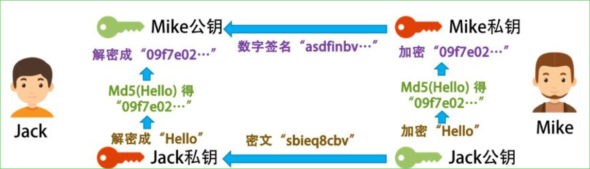
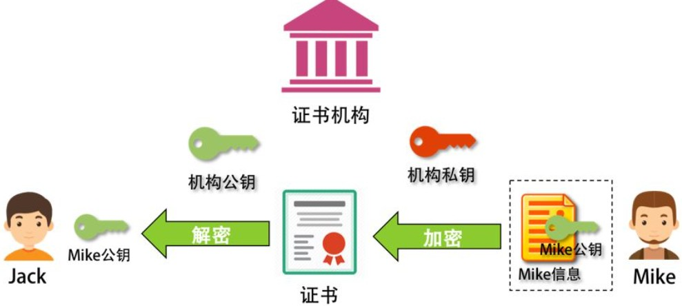
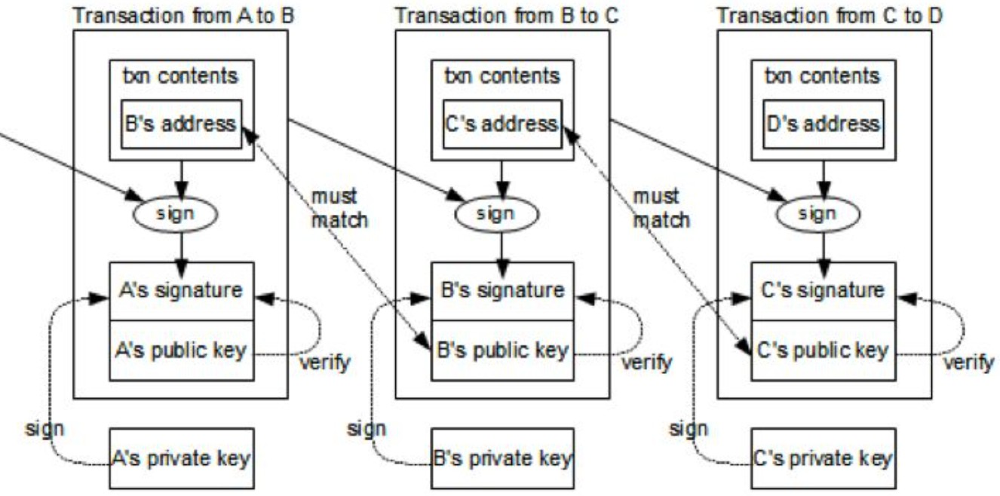

## 比特币的加密方法

**密钥对：**  一种非对称加密技术，加密和解密使用不同的密钥。^^把一个密钥公布出去的称为公钥，另一个自己保存好，称为私钥^^。现实中可以使用公钥加密，私钥解密，也可以反过来。

- 比特币使用ECDSA(椭圆曲线数字签名算法)密钥对比技术

比如：我把加密的密钥发布给所有人，大家都用这个公钥加密信息，但别人没有私钥，所以解不了密文，只有我能解，也只有我看得懂别人用我的公钥加密后发给我的密文。但因为所有人都有公钥，可能存在被拦截并且伪装成那个人给我发消息，故需要对身份进行验证，即 **数字签名**

一步步来看...

假设Mike要发信息给我，她也有密钥对，公钥给了我，私钥自己保存。Mike先将自己想发送的信息做个SHA或MD5的Hash，得到一个Hash串，又称为 **Digest**，然后Mike用自己的私钥把Digest加密，得到一段Digest的密文，**这个过程叫做数字签名(Signature)**，再然后Mike把要发送的信息用我的公钥加密后，连同数字签名一同发给我。

我收到之后，用我的私钥解密Mike发给我的密文，然后再用Mike的公钥解密其数字签名得到Digest。再然后，我用SHA或MD5对解开的密文做Hash。如果结果和Digest一致，则信息是Mike发给我的，即没有人更改



但现在有个黑客偷偷地把Jack电脑上的Mike公钥换成自己的，然后截获Mike发出来的信息，用自己的密钥加密一段自己的信息，以及自己的数字签名。于是，对于Jack来说，因为他用了黑客的公钥，而不是Mike的，所以他就以为信息来自Mike，于是黑客可以 **用自己的私钥伪装成Mike给Jack通信**。于是黑客就可以在中间伪装成Jack或Mike来通信，这就是 **中间人攻击(MITM)**

怎么办？ --> Mike看到有人在伪造他的公钥，他就和Jack找了个大家都相信的永不作恶的权威的可信机构来认证他的公钥。^^这个权威机构，用自己的私钥把Mike的公钥和其相关信息一起加密，生成一个证书。此时，Jack就可以放心地使用这个权威机构的证书了^^。Mike只需要在发布其信息的时候放上这个权威机构发的数字证书，然后Jack用这个权威机构的公钥解密这个证书，得到Mike的公钥，再用Mike的公钥来验证Mike的数字签名



## 比特币的加密

在比特币世界中，每一笔交易的From和To都是每个用户的公钥。即用用户的公钥来做交易的账户

- 交易的发起方只能是支付方，支付方需要用自己的私钥来加密交易信息并制作相关的交易签名
- 网络上其他人会用你的公钥（也就是交易的支出方）来做解密来验证

!!! Note

    **为什么不需要那个证书机构呢？不怕中间人攻击吗？**
    
    答: 若黑客想伪造别人的交易，他需要换掉半数以上结点上的被攻击者的公钥，太不现实



- **发起交易：** A用自己的私钥为交易信息和自己的地址生成了交易的签名，然后把交易信息、自己的地址、交易签名和自己的公钥放出去，这样方便别人来验证的确是A发起的。
- **验证交易：** 使用A的公钥解密交易签名，得到交易的hash值。把交易信息和自己的地址做hash，看看是不是和签名解密后的hash值一致

PS: 比特币的地址是由我们的公钥生成的，生成规则比较复杂

## 比特币的挖坑

在hash算法中要保证: `SHA-256( SHA-256( Block Header) ) < Target `

^^在区块头中，可以完全自由修改的只有一个字段，就是Nonce^^

目标：要找到某个数字，让整个hash值 < Target

- Target是一个数，其决定了计算出来的hash值的字符串最前面有几个零

!!! Tips
    因为hash值本身就是一串相对随机的字符串。
    
    但想让这个随机的字符串有规律，除了使用 **暴力破解**，别无他法

    这个称为 **哈希碰撞(hash collision)**，碰撞前几个位都是0的哈希值

比如我想找个数，和"yh"加起来被hash后前面有3个零，暴力算法如下：

``` python linenums="1"
import hashlib
data = "yh"
n = 1
while n < 2 ** 32:
    s = data + 'n'
    hash = hashlib.sha256(str(s).encode('utf-8')).hexdigest()
    hash = hashlib.sha256(str(hash).encode('utf-8')).hexdigest()
    if hash.startswith('000'):
        print(str, hash)
        break 
    n = n + 1
```
PS: Win10好几分钟跑不出来结果...

控制前面有多个0的那个Target又是怎么来的呢？

- 由Bits这个字段控制的，即 **难度系数**，前面需要的0越多，难度也就越大

**总结来说，挖矿流程：**

1. 从网络上取得之前的区块信息
2. 从"待记账区"中获取一组交易数据（有优先级，比如成长时间、矿工小费等）
3. 形成区块头（计算Merkle Root并设计记账时间Timestamp等）
4. 开始穷举Nonce，来计算区块头的hash值
    - 如果前面有18个零（ < Target ），则记账成功。否则从第一步重新开始
5. 一旦某矿工成功打包一个区块，他就会告诉其他矿工。收到消息的矿工会停下手上的工作，开始验证，验证通过后，广播给其他矿工。**故满足条件的这个难度系数成为了挖矿的关键**

    - 设置这个难度系数就是为了让全网产生的区域名平均在10min一块

PS: 设置18个零，一般的电脑和服务器就不用想了，必须要算力非常非常高的机器才能搞定