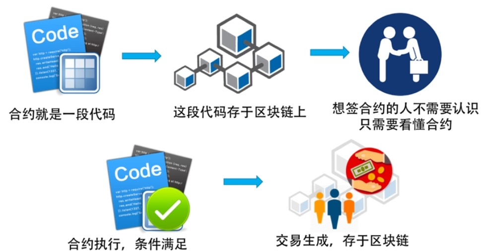

> 智能合约只是存储在区块链上的程序，在满足预先确定的条件时会运行这些程序

## 以太坊的智能合约

&nbsp; &nbsp; &nbsp; &nbsp; 对于以太坊来说，**智能合约是一段可执行的程序片段，由发布人用一种类似于JavaScript或是Python的语言来编写**。把合约代码在本地编译成功后发布到区块链上，可以理解为一个特殊的交易（包括可执行代码），然后会被矿工打包记录在某一个区块中。当需要调用这个智能合约的方法时，只需要向这个智能合约的地址发送一笔交易即可  
以太坊提供了一个EVM（Ethereum Virtual Machine）虚拟机来执行智能合约的字节码 

最常用的开发智能合约的语言是以太坊专门为其定制的[Solidity](https://docs.soliditylang.org/)语言

## 金融的本质

!!! Quote

    金融行业最大的本质就是——**促进交易完成，实现价值提升**

为了保进交易完成，金融行业需要解决:

- 交易中的信用问题 --> 银行会来做中间人来担保
- 交易中的资金不足的问题 --> 通过借贷来让交易完成
- 交易中的大额的问题 --> 把一个大额的金融事件以股份的方式拆碎进行大众投资

