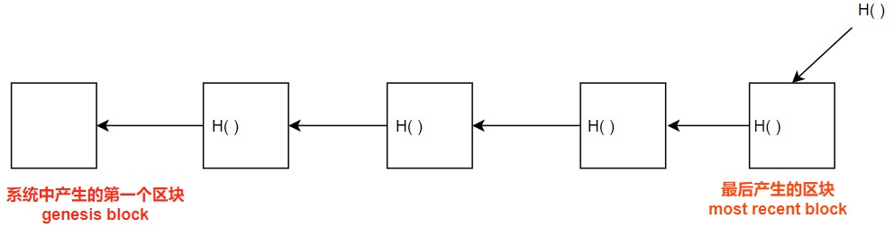

**重要的概念：哈希指针（hash pointers）**

- 除了保存地址，还需要保存hash值
    - 既能找到位置，还能判断是否被纂改

## 区块链

**BTC中最基本的数据结构即区块链**

- 比起普通链表，区块链用hash pointers代替了普通指针 

$H()$是对前一个区块的全部内容进行hash，包含前一个hash值

**通过此结构可以实现tamper-evident log （防纂改）**

- 无论哪个改动，都会导致最终保存的$H()$发生变化
- 对比普通链表：区块链会牵一发动全身！

## Merkle tree 

> BTC中的另外一种数据结构

对比binary tree: 用hash pointers代替了普通指针 （下图所示）

**好处：只要记住root hash，就能检测出对任何部分的修改**

实际上每一个区块(data blocks)就是一个交易，记TX

root hash存在block header中，但header没有具体交易内容，block body中存放交易的列表

- 全节点(full node)：包含真正交易数据的节点
- 轻节点(light node)：只包含hash header的节点 （只有root hash）

Merkle tree可以提供 **Merkle proof** (如下图)

> **A membership proof, also known as a Merkle Proof**, is a set of hashes that can be used to prove a given leaf's membership in the tree
> 
> (即利用Merkle proof可证明Merkle tree中包含某交易 --> 时间复杂度$O(log n)$)

若某个轻节点想知道 ==黄色的TX== 是否包含在Merkle Tree中？如何得知？

- 算hash值（即图中两种颜色的$H()$）,拼接起来继续向上算，从下到上验证，算到最后与block header中的值进行比较即可

若proof of no membership，则需要遍历全部区块，时间复杂度$O(n)$

- 如果所有的区块是按照hash值排序的话，可用$O(log n)$的时间来验证某个交易是否在merkle tree中，又称Sorted Merkle Tree