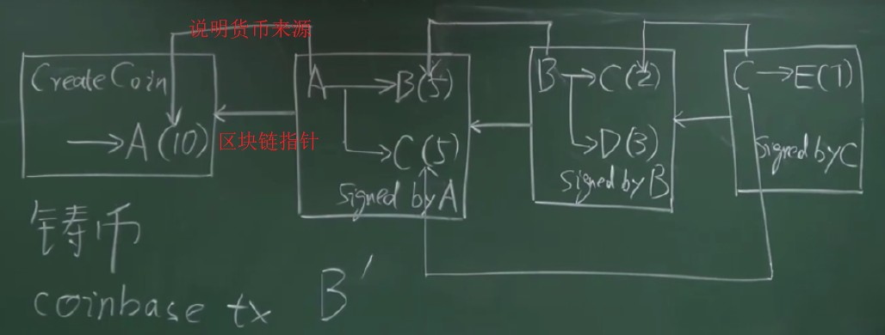
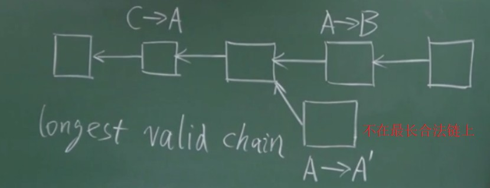

若考虑中心化，货币若有央行BC发行

- 数字货币面临的主要问题是如何避免 **double spending attack(双花攻击)**，即可能存在货币被复制继续使用的情况  --> 可给其编号，并BC维护一个数据库，看看对应货币在谁手中
  
**若去中心化，变为由广大用户承担，如何实现？**

- Q: 数字货币的发行问题，怎么发行，应该发行多少？谁决定
    - 挖矿决定！
- Q: 如何验证交易的合法性，防止double spending attack？
    - 所有用户维护一个数据结构，即区块链

若A转给B：A需要知道B的地址(通过公钥推算出来，公钥取hash)，B要知道A的公钥

- 如何得知A的公钥？
    - 交易分为输入和输出两部分：
        - 输入：要说明B的来源以及A的公钥
        - 输出：给出收款人公钥的hash
    - 验证过程是通过执行 **脚本(BTC Script)** 来实现的（输入和输出均是）

> **A coinbase transaction(coinbase TX)or generation transaction** is always created by a miner and is the first transaction in a block.

实际上会有很多很多交易，会组织成Merkle Tree

区块链分为两部分Block Header和Black body 【具体内容[详见](../../../../security_etc/blockchain/2-intro.md/#_3)】

> 区块链是一个分布式账本，账本内容要达到 **分布式的共识(distributed consensus)**

## 分布式共识

**关于分布式系统的研究** ： 

分布式哈希表：一个系统很多服务器，共同维护一个哈希表，**取得共识即获取哈希表内容**

!!! Example "1. FLP impossibility result"

    In a fully asynchronous message-passing distributed system, in which **at least one process may have a crash failure**, it has been proven in the famous 1985 FLP impossibility result by Fischer, Lynch and Paterson that a deterministic algorithm for achieving consensus is impossible

!!! Example "2. CAP Theorem"

    C=Consistency, A=Availability, P=Partition tolerance

    任何分布式系统，上述三者只能满足两个

一个著名的协议——**Paxos**，可保证上述的C 『涉及分布式理论知识😨』

## BTC中的共识协议

BTC中节点大部分是好的，小部分是恶意，如何设计共识协议？

- 根据账户数进行投票，超过一半则ok。**更大的问题：谁可以投票即membership问题**
- e.g 联盟链，只有符合某些条件的大公司才可以加入 （[hyperledger](https://www.hyperledger.org/)）

sybil attack(女巫攻击)：某个超级计算机产生的账户个数超过了总数的一半

- **故比特币的投票机制并不是利用账户的数目来投票，而是按照计算力来投票**

接受的区块应该是在 **最长合法链** 上，上图中不会接受，称为 **分叉攻击(forking attack)**

> Forking attacks involve intentionally causing a split in the blockchain network to gain control or manipulate the consensus mechanism

若两个机器同时挖到矿了，则可能同时产生两个区块都连接在合法链的最后（属于正常分叉）

- 其他区块最先收到哪个区块的广播，就会链接到这个区块后面
    - 另外的那个被丢弃(称orphan block)

**回到第一个问题：谁来发行货币？**

- **coinbase transaction是发行新BTC的唯一方法**，其余仅仅是转账
- 初始block reward为50BTC，21万区块以后，区块奖励减半25BTC....以此类推
    - 如今是12.5BTC，价钱为6k$左右，约八万美元
    - 故发布区块可得到八万美元奖励，故争先恐后抢记帐权

**BTC达到共识即获取账本的内容**，只有获得记帐权的节点才能向里面写东西

- 争夺记帐权的过程即挖矿mining (算力决定)
- 争夺记帐权的节点称为旷工miner

Q: 此方法如何就避免了女巫攻击？

- 因为即便你创建更多账户，hash rate并没有增加，每秒尝试的nonce并不会增加

> Hash rate is a measure of the computational power of a blockchain network, group, or individual.
> Hash rate is determined by how many guesses are made per second.