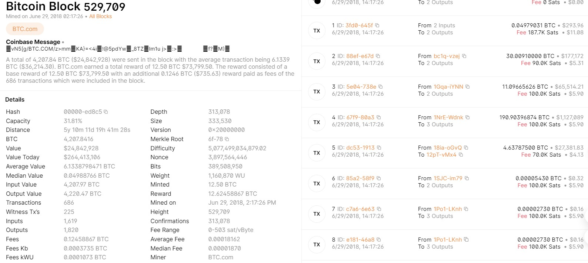

> BTC采用基于交易的账本模式（transaction-based ledger）

BTC中的全节点需要维护一个数据结构——**UTXO(Unspent Transaction Output)**

- 为了检测新发布的交易是否合法（防止double spending attack）
- 所有输入金额 = 输出金额（total inputs = total outputs）
      - 但对于某交易两者之间的差值称为transaction fee

> **A Bitcoin network fee, also known as a transaction fee**, is a small amount of bitcoin paid to incentivize miners to include the transaction in the next block of the blockchain.

另一种模式——基于账户（account-based ledger）e.g. 以太坊

- 显式记录每个账户有多少个BTC，不需要显式说明BTC的来源

## Block Example



- 来自[BlockChain](https://www.blockchain.com/explorer/blocks/btc/529709)

??? Note "Block Header 结构"

    ```c++
    // header
    int32_t nVersion;
    uint256 hashPrevBlock;
    uint256 hashMerkleRoot;
    uint32_t nTime;
    uint32_t nBits;
    uint32_t nNonce;
    ```

    ——来自[Github](https://github.com/bitcoin/bitcoin/blob/master/src/primitives/block.h)

## 挖矿概率分析

每次随机尝试找到Nonce记作Bernoulli trial 

- 做很多Bernoulli trial且都随机，构成了Bernoulli process
      * 具有无记忆性（memoryless） 
- 需要进行大量尝试，可用Poisson process进行近似
      * 将来还需要挖多久和已经挖了多久没关系 （progress free）
          + 否则算力强的矿工将有不成比例的优势  
          + 挖矿公平性的保证

### BTC的总量

出块奖励（Block Reward）是系统中产生BTC的唯一途径，而每四年(即21万块区块)会减半，则构成了Geometric series即$21 \times 50 + 21 + 25 + 21 + 12.5... = 21 \times 50 \times( 1 + 1/2 + 1/4...) = 21 \times 100 = 2100$

**故系统中BTC所有总量为2100万** 

> Bitcoin is secured by mining.

**Selfish mining** is an attempt by a single or group of miners to alter the blockchain by forking it, mining it, and then reintroducing it to the network

- 前提：有恶意的节点占据很大一部分算力，才可能成功