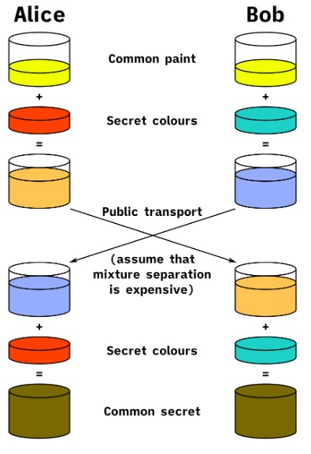
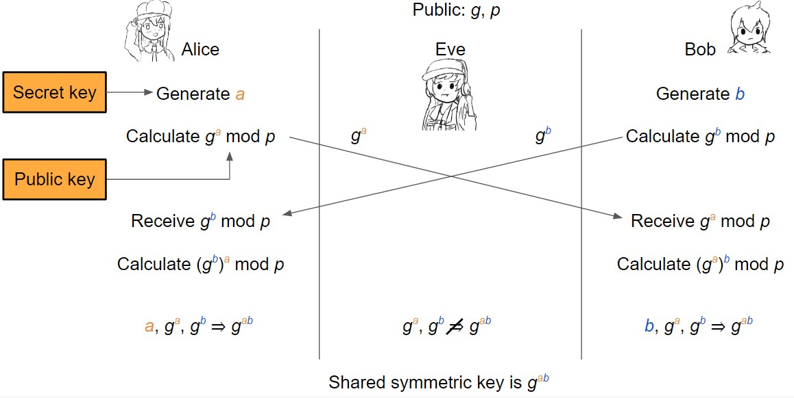
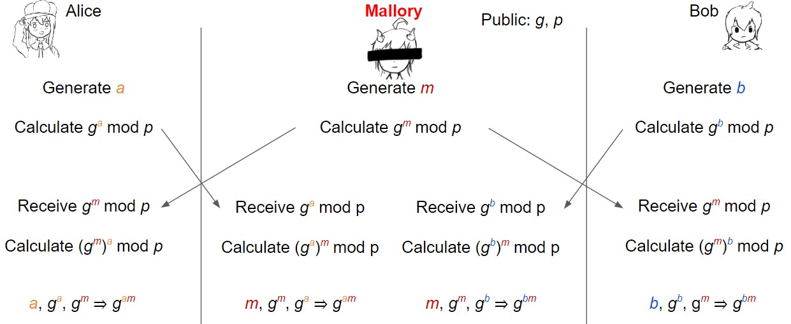

---
comments: true
--- 

# Diffie-Hellman算法

[之前的疑问](7-MACs.md#aead:~:text=%E5%AE%8C%E6%95%B4%E6%80%A7/%E8%BA%AB%E4%BB%BD%E9%AA%8C%E8%AF%81-,Question,-%E5%AF%B9%E7%A7%B0%E5%AF%86%E9%92%A5)：Alice和Bob如何在不security_etc的通道上共享对称密钥？

==^^Public key exchange (e.g. Diffie-Hellman)^^==，Diffie-Hellman算法解决了 **在双方不直接传递密钥的情况下完成密钥交换**，这个神奇的交换原理完全由数学来进行支撑

**Diffie-Hellman的目标通常是创建一个临时密钥**，临时密钥用于一系列加密和解密，一旦不再需要它就会被丢弃。因此，Diffie-Hellman算法是一种有效的方法，可以让双方在面对窃听者时就随机值达成一致

## 类比—Secure Color Sharing

{ align=right }
假设Alice和Bob想要共享一个秘密的油漆颜色(是什么颜色都可以，只要Alice和Bob知道就行)，但Eve可看到她们直接交换的任何油漆。

- Alice生成秘密的颜色amber(黄褐色) A, Bob生产秘密的颜色blue B
- Alice和Bob约定使用公共的颜色——green G
- 他们都将自己的秘密颜色与G混合, 所以Alice有green-amber GA, Bob有green-blue GB
- Alice发送GA给Bob, Bob发送GB给Alice（Eve知道GA和GB，但无法进行分离开）
- Alice知道GB，所以她可以把混合A成为GAB。Bob知道GA，所以他也可以混合B成为GAB
    - Eve只知道G, GA和GB，所以只能组成GAGB!
  

## 离散对数问题

上面的类比，有一个关键假设：分离油漆混合物是困难的，甚至不可能!

- 这有数学上的解释吗? YES!

假设每个人都知道一个大素数p(e.g2048位长)和一个生成器g

> 离散对数问题: 给定$g,p,g^a \bmod p$，(对于随机的a)，计算上来说很难找到a

**Diffie-Hellman假设**: 给出$g, p, g^a \bmod p, g^b \bmod a$对于随机的a和b, 多项式时间内攻击者不可能区分出一个随机值R和$g^{ab} \bmod p$

- 最著名的算法是先计算a，然后计算$(g^b)^a \bmod p$，但需要解决离散对数问题

## Diffie-Hellman 密钥交换

Alice和Bob首先分别确定公共参数$p$和$g$，$p$是个大素数，$g$是个在生成器，范围在$1 < g < p - 1$

- 如今$p$和$g$是被硬编码或者被定义在标准中，所以不需要每次都被选中，它们不是秘密

接着Alice从集合$\{0,1,...,p-2\}$中随机地选择一个秘密值$a$，计算 $A = g^a \bmod p$,与此同时Bob随机选择秘密值$b$,并且计算$B = g^b \bmod p$，再之后分别向对方发送$g^a$和$g^b$

此时Alice可计算$S = B^a = (g^b)^a = g^{ba} \bmod p$, 同样Bob可计算$S = A^b = (g^a)^b = g^{ab} \bmod p$

- 因$g^{ba} = g^{ab} (\bmod p)$，Alice和Bob最终得到相同的结果S

**最终Alice和Bob能使用S作为对称加密的共享密钥**(实际中，会对S用hash，结果作为共享密钥)

最惊奇的是，Alice和Bob的对话完全是公开的，在此期间，他们都知道了这个秘密值S，然而攻击者完全知道这个对话，也无法得知S。实际中已知解决此问题最快的算法花费$2^{{\large cn^{1/3(log n)^{2/3}}}}$时间，如果p为n-bit的素数，若n = 2048算法则太慢，无法进行合理的攻击

## Diffie-Hellman的短暂性

> Diffie-Hellman can be used ephemerally (called Diffie-Hellman ephemeral, or DHE)

- Ephemeral: 短期的，暂时的，不是永久的
- Alice和Bob在结束时丢弃$a, b, K = g^{ab} \bmod p$
- 有时K被称为会话密钥，因为它只用于临时会话

DHE的好处: 向前保密(Forward secrecy)

- Eve记录了所有通过不security_etc信道发送的信息
- Alice和Bob使用DHE对密钥$K = g^{ab} \bmod p$达成一致
- Alice和Bob使用K作为对称密钥
- 做完之后，将会丢弃a、b和K
- Eve无法解密记录的任何消息：没有保存a、b或K，记录只有$g^a \bmod p$和$g^b \bmod p$

## Diffie-Hellman 问题

Diffie-Hellman在面对 ^^MITM(Man-in-the-middle attack)^^ 时并不security_etc

DHE是一种主动协议：Alice和Bob需要 **同时在线** 才能交换密钥

- Q: 若Bob想加密一些东西并将其发送给Alice供她稍后阅读，怎么办?
- Q: 当Alice和Bob不共享密钥且不同时在线时，如何使用公钥加密来发送加密消息?

**Diffie-Hellman不提供认证(authentication)**，你与某人交换了密钥，但Diffie-Hellman不能保证你和谁交换了钥匙，可能是Mallory，如下图

## ECDH

> Elliptic-Curve Diffie-Hellman: Diffie-Hellman的一种变体，它使用椭圆曲线代替模算法

Note：离散对数问题似乎很难，因为在模运算中对整数求幂“绕”了一圈

- Diffie-Hellman可以推广到任何具有这种循环性质的数学群

椭圆曲线(Elliptic curves)：数学曲线的一种  --> [图片示例](https://i.ytimg.com/vi/F3zzNa42-tQ/hqdefault.jpg)

- 重要思想：在曲线上重复添加一个点是另一个循环群
- 基于椭圆曲线离散对数问题，模拟了离散对数问题
- ECDH的好处：可用更小的密钥(3072位DHE和384位ECDHE一样security_etc)

