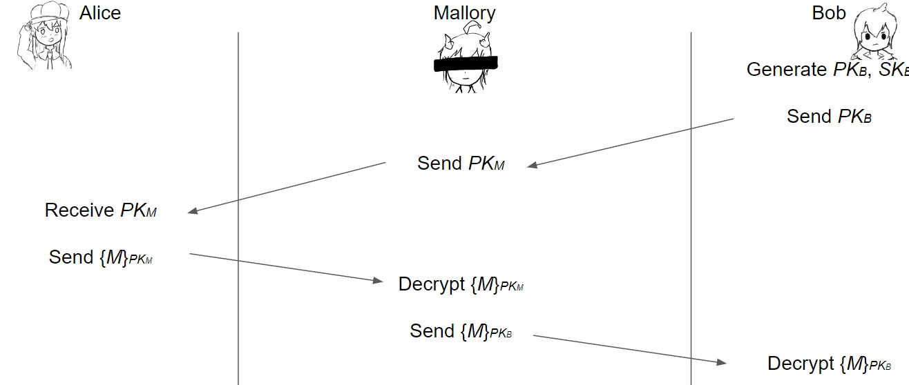

## 前言

**证书：如何安全地分发公钥？**

公钥密码非常棒！ 可以安全地通信，无需共享秘密

- 公钥加密：每个人都用公钥加密，但只有私钥的所有者才能解密
- 数字签名：只有私钥的所有者才能签名，但每个人都可以用公钥进行验证

Q: 还有什么问题吗？ 在于分发公钥

- 单独的公钥加密并不能抵御中间人攻击, 如下场景: 
      - Alice想给Bob发送消息
      - Alice向Bob询问他的公钥
      - Bob将他的公钥发送给Alice
      - Alice 使用 Bob 的公钥加密她的消息并将其发送给 Bob
- Mallory会如何做?
      - 将 Bob 的公钥替换为 Mallory 的公钥
      - 现在Alice已经用Mallory的公钥加密了消息，Mallory此时就可以读取！

想法: 对 Bob 的公钥进行签名以防止篡改, 但问题

- 如果Bob签署了他的公钥，则需要他的公钥来验证签名
- 但Bob的公钥正是首先要验证的！
- 出现了循环问题：Alice永远不能相信她收到的任何公钥

**如果你什么都不相信，你就无法获得信任**。 你需要一个信任的root！

- ^^trust anchor：我们绝对信任的人^^; 从我们的trust anchor开始，然后可以开始信任他人

**Trust-on-first-use**：第一次通信时，信任所使用的公钥，并在将来发生变化时警告用户

- 被用于 SSH 和其他几个协议
- 想法：攻击并不频繁，因此假设第一次通信时没有受到攻击(也被称为"Leap of Faith")

## 介绍

> 证书：某人公钥的签名认可(A signed endorsement of someone's public key) 
> 
> - 证书至少包含两件事：人员的 **身份和密钥**

!!! Note "符号缩写"
    公钥 PK 下的加密：$\{Message\}_{PK}$  
    使用私钥SK签名：$\{Message\}_{SK^{-1}}$

    PS: **签名消息必须包含消息和签名；不能单独发送签名**

场景：Alice想要Bob的公钥. Alice信任EvanBot($PK_E, SK_E$)

- EvanBot 是我们的trust anchor
- 如果我们信任$PK_E$，则我们信任的证书为$\{Bob's\ public\ key\ is\ PK_B\}_{SK_E^{-1}}$

**The Trusted Directory(TD)**

- 想法：创建一个中央,可信目录(TD), 可以从中获取任何人的公钥
    - TD 有一个公钥/私钥对$PK_{TD}, SK_{TD}$
    - 该目录发布$PK_{TD}$，以便每个人都知道它（集成到计算机、手机、操作系统等里面）
    - 当你请求 Bob 的公钥时，目录会发送 Bob 公钥的证书
        - $\{Bob's\ public\ key\ is\ PK_B\}_{SK_{TD^{-1}}}$
    - 如果你信任该目录，那么现在你就信任该目录中的每个公钥
- 我们必须相信什么？
    - 我们已正确收到TD的密钥
    - TD不会在未验证所有者身份的情况下签署密钥

!!! Quote "假设"
    Michael Drake(MD,President of UC)负责TD
    
    - 我们想要Nick Weaver的公钥：询问 MD  
    - 我们想要David Wagner的公钥：询问 MD  
    - 想要Raluca Ada Popa的公钥：询问 MD  
    - 而MD 有更好的事情要做（比如确保他的私钥不被盗）

问题：

  - 可扩展性 (一个目录没有足够的计算能力来服务整个世界)
  - 单点故障
    - 若目录失败，加密将停止工作
    - 若目录被泄露，就无法信任任何人
    - 若目录被破坏，则很难恢复

### 证书颁发机构(CA)

**解决可扩展性：分层信任**

- 信任的根源可以将信任和签名权委托给其他权威机构
    - $\{Carol\ Christ的公钥是PK_{CC}，我相信她能够签署 UCB\}_{SK_{MD^{-1}}}$
    - $\{Dave\ Wagner的公钥是PK_{DW}，我相信他会为CS部门签名\}SK_{CC^{-1}}$
    - $\{Nick\ Weaver的公钥是PK_{NW}, 但我不相信他能代表其他人签名\}_{SK_{DW^{-1}}}$
- MD 仍然是信任root（根证书颁发机构，或root CA）
- CC和DW接收委托信任（中间CA）
- NW的身份值得信赖

**解决可扩展性：多个信任锚**

- 大多数设备隐式信任大约 150 个root CA
- 公钥被硬编码到操作系统和设备中
- 每个委托步骤都可以限制证书的有效性范围
- 创建证书是一项离线任务：证书提前创建一次，然后根据请求提供给用户

Q: 如果证书颁发机构搞砸并颁发了错误的证书，会发生什么情况？

- e.g. $\{Bob的公钥是PK_M\}_{SK_{CA^{-1}}}$
- e.g.证书颁发机构意外颁发了一个证书，表明普通互联网用户的公钥属于 Microsoft

**方法1：每个证书都有一个到期日期**

- 证书过期后，向证书颁发机构申请新证书; 不良证书一旦过期最终将失效
- 好处: 减轻损害, 最终，不良证书将变得无害
- 缺点:
    - 增加管理负担：每个人都必须经常更新证书
    - 如果有人忘记更新证书，他们的网站可能会停止工作
- tradeoff：证书应该多久更新一次？
    - 频繁更新：更安全，但可用性较差
    - 不频繁更新：安全性较低，可用性更高
- e.g. LetsEncrypt（证书颁发机构）选择非常频繁的续订
    - 事实证明，频繁更新更有用
    - 它强制自动更新，而不是每 3 年一次就会被遗忘的任务！

**方法2：定期发布无效证书列表**

^^用户必须定期下载证书撤销列表 (CRL)^^

Q: 我们如何验证该列表？

- 证书颁发机构签署名单！
    - $\{序列号为0xdeadbeef的证书现已吊销\}SK_{CA^{-1}}$
- 缺点: 
    - 列表可能会变得很大
        - 通过较短的有效期来缓解（一旦过期就不必列出它们）
    - 在用户下载列表之前，他们不会知道哪些证书被吊销

Q: 如果证书颁发机构不可用，会发生什么情况？

- 自动防故障默认设置：假设所有证书都无效？ 现在则不能相信任何人
    - 可能的攻击：攻击者强制 CA 不可用（拒绝服务攻击DoS）
- 使用旧列表：如果旧列表缺少新撤销的证书，则可能存在危险

!!! warning 
    证书协议可能会变得非常复杂

    e.g：[X.509](https://en.wikipedia.org/wiki/X.509)非常复杂（236页标准），因为它尝试做所有事情

## 密码哈希