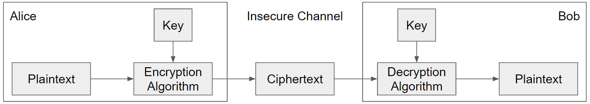

# 对称加密(Symmetric-Key Encryption)

## 1. 简介

首先所有的消息都是 **位(bits)序列** (e.g.`110111001101`)，包括文字，图像以及大多数其他形式的通信都会在加密前转为比特序列  -->  非常有用的抽象

> 加密方案的目的是提供保密性，而不是完整性或者身份认证

对称加密意味着Alice和Bob ==**共享相同的密钥**==，但攻击者不知道

- ^^Thinking: Alice和Bob如何进行共享？^^

## 2. 定义
对称加密方案有三个算法:

- KeyGen() -->  K: 产生密钥K
- Enc(K, M) --> C: 使用密钥K加密明文M以生成密文C
- Dec(K, C) --> M: 使用密钥K解密密文C得到明文(消息)M

Q: 我们想从对称加密方案中得到什么属性？

1. 正确性：解密密文应该得到最初加密的消息
    - Dec(K, Enc(K, M)) = M，对于明文M和所有用KeyGen()产生的K
2. 高效: 加密/解密算法应该很快，在标准计算机上应> 1 Gbps 
3. 安全: 保密性

### 再定义: 保密性
之前我们介绍的保密性是指敌人无法 **读** 我们的信息, 太不具体

- 如果攻击者可以读到我们信息的前半部分，但不能读到后半部分，这是机密吗?
- 如果攻击者推断出我们的信息开头为"Dear Bob?", 即攻击者一开始就掌握了部分消息

更好的定义:
> 密文C不应该给攻击者提供任何关于明文M的额外信息

**举个例子:**
比如Eve选择了相同长度的 $M_0$ 和$M_1$, Alice随机选择一个进行加密发送密文，Eve不知道$M_0$还是$M_1$被发送。所以Eve读密文并猜测哪个被发送? 这时正确猜中的概率只有$1/2$，故加密方案是保密的。^^即这与Eve根本没有截获密文，而是随机猜测的概率是一样的^^

因为我们探讨的threat models为选择明文攻击(Chosen-Plaintext)，故更精确的定义为:
> 即使Eve能够欺骗Alice加密信息，他仍不能区分$M_0$和$M_1$哪个被发送

这种定义被称为选择明文攻击下的不可区分性即IND-CPA  
密码学属性通常被定义为对手可以“赢”或“输”的“游戏”。

### 定义: IND-CPA

CPA VS. IND-CPA :

- CPA (Chosen Plaintext Attack) : 选择明文攻击
- IND-CPA (Indistinguishability under Chosen Plaintext Attack)：

!!! quote 
    CPA security is often called "IND-CPA" security, meaning "indistinguishability of ciphertexts under chosen-plaintext attack." （选择明文攻击下的密文不可区分性）

1. Eve选择两个不同的信息$M_0$和$M_1$（长度必须是相同的），都发送给Alice
2. Alice随机选择一个$M_b, 其中b \in \{0, 1\}$,进行加密，发送加密的消息给Eve
3. 现在，Eve可以要求Alice对他选择的消息进行加密，Alice总会用密钥进行加密并返回，Eve可以重复数次。这一步允许Eve执行选择明文攻击，试图了解发送的消息
4. 完成之后，Eve将猜测在第二步中到底是$M_0$还是$M_1$

若Eve猜测哪个被发送的概率$>1/2$，则Eve赢得游戏，这意味着Eve已经了解了发送的消息的一些信息，此时的方案不是IND-CPA安全的。反之则Alice赢，此时为IND-CPA安全的

#### 边界情况: 长度
*在几乎所有实际的密码系统中，通常允许密文泄漏明文的长度*，为什么？

- 若隐藏长度，那么我们就需要每个密文的长度相同
    * 若密文总是nbits，那么就不能加密任何超过n比特的信息，这使得系统非常不实用
        + 如:16bytes消息，将不能加密更大的(e.g.图、视频)
        + 如:1GB消息，若发送小的信息(e.g文本)则需要1GB带宽
- 要隐藏长度的应用程序必须在加密之前选择将自己的消息填充到最大可能的长度

#### 边界情况: 运行时间
有些方案理论上是脆弱的，但在任何现实环境中都是安全的。因为在计算上是不可行的

- 比如: Eve尝试用暴力算法破解128bits的密钥，将花费$2^{128}$的计算，若每次计算花费一毫秒，则需要$10^{28}$年

在IND-CPA中，Eve受限于实际运行时间

- 一个常见的实际限制: Eve仅限于多项式运行时算法(而非指数时间算法)

#### 边界情况：可忽略不计的优势
> Eve只有在拥有 **不可忽视的优势** 时才能获胜

比如: 对于Eve以概率$1/2 + 1/2^{128}$获胜，Eve的优势是$1/2^{128}$，即便这个数字如此之小

此时称Eve有可忽略不计的优势，因优势如此小，以至于Eve无法利用它发动任何实际攻击

若Eve要赢，只有在能够猜出发送的消息的概率 > $1/2 + n$, n为不可忽略的概率

- E.g. $1/2 + 1/2^{128}$ : 可忽略的优势
- E.g. $2/3$: 不可忽略的优势

!!! Note

    在 **数学上** 可忽略性的定义: 基于算法的安全参数，攻击者的优势应该是指数级的小
    
    - 对于k bits的密钥，可忽略的优势应该为$O(1/2^k)$

    在 **实际上** 可忽略性的定义: 
    
    - $1/2^{128}$的概率是完全不可思议的，而$1/2^{20}$的概率用完全可能的

    Takeaway： 目前，$2^{80}$是一个合理的门槛，但也将随着时间的推移而改变!
    *[Takeaway]: a key fact, point, or idea to be remembered, typically one emerging from a discussion or meeting.

**边缘情况：** IND-CPA安全方案可能泄漏长度；Eve仅限于多项式时间算法，并且必须具有不可忽略的优势才能获胜