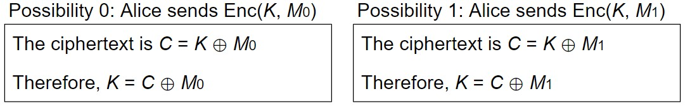
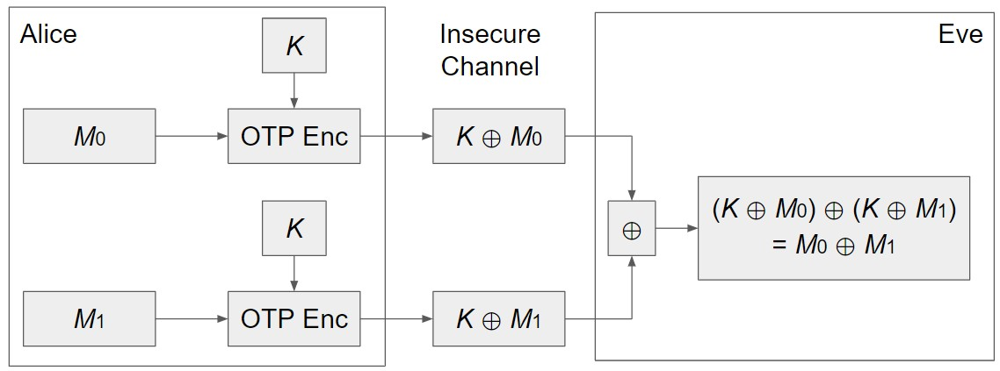

# 一次性密码本(One-time pads)

## 回顾：XOR(异或运算)

**相异为1，相同为0** -->  e.g. $0 \bigoplus 1 = 1, 1 \bigoplus 0 = 1,1 \bigoplus 1 = 0,0 \bigoplus 0 = 0$

有用的一些属性:  

- $x \bigoplus 0 = x, x \bigoplus x = 0, y \bigoplus x = x \bigoplus y$
- $(x \bigoplus y) \bigoplus z = x \bigoplus (y \bigoplus z), (x \bigoplus y) \bigoplus x = y$

## 简介

对称加密方案 *one-time pad* (OTP)，它是个简单而理想化的加密方案，对于真实世界并不实际

在这个方案中，Alice和Bob共享一个随机的n位的密钥即$K = k_1...k_n$。假设Alice想发送n位的信息$M = m_1...m_n$， 要对这个M进行加密。--> **Idea: 用XOR将$M$和$K$打乱**

怎么打乱？$M$和$K$每个对应位之间进行XOR操作，如下所示:

图中的$C$就是Alice要通过不security_etc信道发送给Bob的密文

Q: Bob收到密文$C$之后，如何得到原来的信息M？--> 只需$C$和$K$的对应位进行XOR即可

可以用如下三个步骤来描述：

1. KeyGen(): 随机生成一个n位的密钥(假设Alice和Bob可以security_etc的共享)，对于one-time pad，我们为每条消息生成一个新密钥
2. Enc(K, M) = K $\bigoplus$ M, 按位对M和K进行XOR得到C
3. Dec(K, C) = K $\bigoplus$ C, 按位对C和K进行XOR得到M

## 正确性

如何验证正确性? --> 加密后再解密应该得到原始的信息

!!! note  
    $\because$ Enc(K, M) = K $\bigoplus$ M

    $\therefore$ Dec(K, Enc(K, M)) = Dec(K, K $\bigoplus$ M) = K $\bigoplus$ (K $\bigoplus$ M ) = M

## security_etc性

要证明 *one-time pad* 是IND-CPAsecurity_etc，即证Eve猜中正确信息的概率为$1/2$

  
因为K随机选择，所以两种可能性都是等可能的。Eve没有得到新的信息，即绝对是security_etc的。

但 *one-time pad* 有一个致命的缺陷，即共享密钥K不能再次被使用传递另外的消息M'。

Q：如果将密钥利用了两次会怎么样？Two-Time Pads? 【如下所示】

此时如果Eve对这两个密文进行XOR，他就知道了$M_0 \bigoplus M_1$s，即他获得了消息的部分信息

- 更详细来讲: Eve知道$M_0$中的哪些位与$M_1$中的哪些位相匹配
- 如果Eve知道$M_0$，就能推断出来$M_1$，反之亦然
- 甚至Eve可以猜测$M_0$，并检查$M_1$是否相符

**如果密钥被重复使用，*one-time pad* 将不security_etc**，故Alice和Bob必须对每条消息使用不同的密钥!

## 不实际性

1. Key generation
    - 为了保证security_etc性，必须为每条消息 **随机生成** 密钥，并且不能重用，但随机代价很高！
2. Key distribution
    - 为了通信n位消息，需要首先security_etc地通信n位密钥
    - 但如果有一种方法可以security_etc地传递n位密钥，就直接传递消息呗!
3. 仅仅的实际应用: 提前沟通好密钥
    - 假设你现在有一个security_etc的通道，但以后就没有了
    - 现在使用security_etc通道提前通信密钥
    - 以后使用 *one-time pad* 在不security_etc通道进行通信