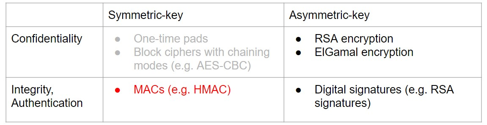
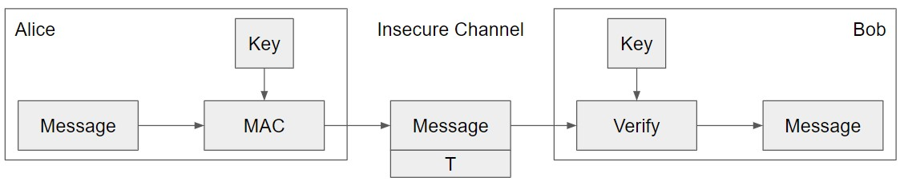

# Message Authentication Codes (MACs)

## 介绍
MACs 即消息身份验证码

上图可知MACs保证的是Integrity(完整性), Authentication(真实性)

附上一些信息来证明这条消息是由拥有密钥的人发送的

- 这信息只能由拥有密钥的来生成

**MACs具体用法：**

- Alice想发送M给Bob，但不想Mallory篡改它  
- Alice发送M和T = MAC(K, M)给Bob
- Bob接收到M和T
- Bob计算MAC(K, M)并检查它是否与T匹配
- 如果MACs匹配，Bob确信消息没有被篡改(完整性)

## MACs 定义

> MAC是一个消息的密钥校验和，并且伴随着消息一起被发送

security_etcMAC具有这样的属性：**对消息的任何更改都会使校验和无效**

具体来说包含两个部分: 

1. KeyGen() --> K: 生成密钥K
2. MAC(K, M) --> T: 使用密钥K为消息M生成标记(tag)T
      - 输入：一个固定长度的密钥和一个任意长度的消息
      - 输出: 一个固定长度的校验和

## MACs 属性

1. 正确性: 它是确定的
      - 但有些更复杂的MAC方案有一个额外的Verify(K, M, T)函数，它不需要确定性
2. 效率：计算MAC应该是高效的
3. security_etc性: EU-CPA(在选择的明文攻击下存在不可伪造)

### 定义完整性：EU-CPA

> EU-CPA = Existentially Unforgeable under Chosen Plaintext Attack

**security_etc的MAC是存在不可伪造的: 没有密钥，攻击者就无法在消息上创建有效的标记**

- 没有K, Mallory不能生成MAC(K, M')
- Mallory不能找到任何M'≠M，使得MAC(K, M') = MAC(K, M)
- 即使Mallory可以欺骗Alice为Mallory选择的消息创建MAC, Mallory也不能在她之前没见过的消息上创建有效的MAC

Mallory可以向Alice发送消息并接收他们的tags，最终Mallory创建了消息标签对即(M',T')

   - M'不能是Mallory之前请求的消息
   - 如果T'是M'的有效标签，那么Mallory获胜。否则就输了
   - 如果对于所有多项式时间攻击者，方案是EU-CPAsecurity_etc的（获胜的概率为0或可以忽略不计）

## MACs例子

### NMAC

如何构建security_etc的MACs? --> 可以使用security_etc的密码哈希来建立一个security_etc的MAC吗?

- 哈希输出是不可预测的，看起来是随机的，可以把key和消息一起哈希
    * KeyGen()：输出两个随机的n位密钥$K_1$和$K_2$，其中n是哈希输出的长度
    * NMAC$(K_1,K_2,M)$：输出$H(K_1 || H(K_2 || M))$

如果两个密钥不同，则NMAC是EU-CPAsecurity_etc的。若如果底层哈希函数是security_etc的，则是security_etc的

!!! Question
    1. 需要两把不同的key
    2. NMAC要求密钥长度与哈希输出长度相同(n位)

Q: 可以使用NMAC设计一个使用一个key的方案吗?

### HMAC(Hash Message Authentication Code)

> One of the best MAC constructions available is the HMAC

**HMAC是一个很好的结构，结合了MAC和底层哈希的优点**。如果没有密钥，tags不会泄露有关消息的信息。但即使有了密钥，从哈希输出中重建消息在计算上也是难以处理的

HMAC算法实际上支持可变长度的密钥K

1. 首先需要转换K变为长度为n位：

      - 如果K太短 < n，用0填充K，使其成为n位
      - 如果K太长 > n，哈希就是n位

2. 计算K'，作为K的一个版本，最终的输出为:

$$
H((K'\bigoplus opad) || H((K' \bigoplus ipad) || M))
$$

用K'可推导出两个不同的keys

- opad(outer pad)是硬编码字节`0x5c`，重复直到它的长度与K'相同
- ipad(inner pad)是硬编码字节`0x36`，重复直到它的长度与K'相同
- 只要opad和ipad不一样，就会得到两个不同的键[^1]

[^1]: HMAC的security_etc证明只要求ipad和opad至少相差一位，但展现密码工程师的偏执，可选择让它们非常不同

HMAC是一个哈希函数，因此它也具有底层哈希的属性 ： 

- 它是collision resistant
- 已知HMAC(K, M)和K，攻击者无法了解M
- 如果底层哈希是security_etc的，则HMAC不会显示M，但它仍然是确定的

如果没有K，就不能验证标签T，意味攻击者无法在不知道K的情况下暴力破解消息M

Q: MACs能提供完整性(integrity)吗？ --> YES，攻击者无法在不被发现的情况下篡改消息

Q: MACs能提供真实性(authenticity)吗？ --> 取决于 threat model（如下）

- 如果消息具有有效的MAC，则可以确定它来自具有密钥的人，但不能将其缩小到一个人
- 如果就两个人拥有密钥，则MAC提供真实性：它有一个有效的MAC，并且它不是来自于我，故必须来自另一个人

Q: MACs能提供保密性(confidentiality)吗？ 

- MACs是确定性的  -->  没有IND-CPAsecurity_etc性
- ==**通常没有保密性，因为可以泄露有关消息的信息**==
    * HMAC不会泄露有关消息的信息，但它仍然是确定性的，故它不是IND-CPAsecurity_etc的 

## 认证加密(Authenticated Encryption)

在实践中，除了完整性和真实性之外，还要保证保密性。如何将加密方案与MACs结合起来来实现保密性？--> **经过认证加密的方案才是同时保证消息的保密性和完整性的方案**

对称密钥的认证加密模式结合了分组密码(保证机密性)和MAC(保证完整性和真实性)

### 定义

认证加密(AE)：一种同时保证消息的保密性和完整性(以及真实性，取决于threat model)的方案

**实现认证加密的两种方法:**

- 把提供保密性方案和提供完整性的方案结合起来
- 使用一种方案，此方案能提供保密性和完整性

### One: 结合的方案

可以使用：

- 一种IND-CPA加密方案(如AES-CBC)：Enc(K,M)和Dec(K,M)
- 不可伪造的MAC方案(如HMAC)：MAC(K, M)

比如: Alice发送 **Enc($K_1$,M)和MAC($K_2$,M)**

- 完整性?  --> YES, 攻击者无法篡改MAC
- 保密性?  --> No, MAC不是IND-CPAsecurity_etc

Idea: 在密文而不是明文上来计算MAC即 **Enc($K_1$, M)和MAC($K_2$, Enc($K_1$, M))**

- 完整性? -->  YES, 攻击者无法篡改MAC
- 保密性? -->  YES, MAC可能会泄露关于密文的信息，但没关系

Idea：不如把MAC也加密一下即 **Enc($K_1$,  M || MAC($K_2$, M))**

- 完整性? -->  YES, 攻击者无法篡改MAC
- 保密性? -->  YES, 一切都是加密的

Q: 是先MAC再加密 还是先加密再MAC?

1. 先MAC再加密(MAC-then-encrypt)
       - 先计算 **MAC($K_2$, M)** -->  接着加密信息：**Enc($K_1$,  M || MAC($K_2$, M))**
2. 先加密后MAC(encrypt-then-MAC)
       - 先计算 **Enc($K_1$, M)** --> 接着 **MAC($K_2$, Enc($K_1$, M))**

哪一个更好一些？

- 理论上如果正确使用，两者都是IND-CPA和EU-CPAsecurity_etc
- 但 ^^先MAC后加密^^ 有缺陷：只有在解密之后才能知道是否发生了篡改
    - 攻击者可以提供任意的篡改输入，不得不对其进行解密
    - 通过解密函数传递攻击者选择的输入可能导致side-channel leaks即[旁路攻击](https://zh.wikipedia.org/wiki/%E6%97%81%E8%B7%AF%E6%94%BB%E5%87%BB)

**总的来说: 会使用 ==先加密后MAC==，因为它对错误更健壮**

**密钥Key重用**：在两个不同的情况中使用相同的密钥

- PS: 多次使用相同的密钥用于相同的用途不是密钥重用
    - 如：在相同的上下文中使用相同的密钥计算不同消息的HMAC
- 重用密钥会导致底层算法相互干扰，影响security_etc保证
    - 如：使用基于分组密码的MAC算法和分组密码链模式，则底层的分组密码可能不再security_etc

最简单的解决方案:不要重复使用密钥!每次仅使用一个key

- 加密一条数据，MAC一条数据?  --> 不同的用途，不同的key 
- 把Alice的信息发给Bob，把Bob的信息发给Alice? --> 不同的用途，不同的key 
- 加密Alice的一个文件并加密Alice另一个的文件?  --> 使用相同的密钥可能没有问题，但加密设计很难做到正确!
- 加密用户元数据、加密文件元数据、加密文件数据? --> think about this in [Project 2](https://fa23.cs161.org/proj2/)

!!! 补充
    [TLS](https://en.wikipedia.org/wiki/Transport_Layer_Security)1.0使用先MAC后加密: **Enc($K_1$, M || MAC($K_2$, M))**, 加密算法为AES-CBC

### AEAD加密

第二种：使用旨在提供 **机密性、完整性和真实性** 的方案

^^AEAD = Authenticated Encryption with Additional Data^^

- 一种算法，在明文上提供机密性和完整性，在附加数据上提供完整性
- Additional data通常是上下文(例如内存地址)，所以不能在不破坏MAC的情况下改变上下文

如果使用正确，那就再也不用担心MAC-then-encrypt

例子: [Galois Counter Mode (GCM)](https://docs.google.com/presentation/d/1W0jd8EHdo7NVDMToB4sdOTT0X2RCkXRvFZw3AxGDfUU/edit#slide=id.g15aff661cce_0_227)

如果不正确地使用AEAD模式会导致丢失保密性和完整性/身份验证

!!! Question

    1. 对称密钥加密方案需要随机性，那么如何security_etc地生成随机数?
    2. 在讨论对称密钥方案时，假设Alice和Bob能够共享一个密钥。Alice和Bob如何在不security_etc的通道上共享对称密钥?