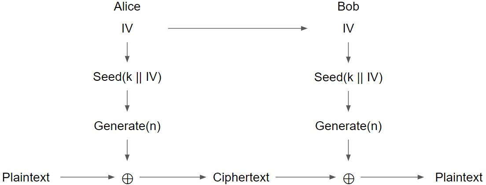

# Stream Ciphers(流密码)

## 介绍

另一种构造对称密钥加密方案的方法

通过[PRNG](8-PRNGs.md)知道：

- 一个security_etc的PRNG产生的输出看起来与随机没有区别
- 无法看到内部PRNG状态的攻击者无法了解到任何输出
- **如果使用PRNG的输出作为one-time pad的key呢?**

> 流密码:一种对称加密算法，使用伪随机比特作为one-time pad的密钥
> 
> 加密和解密双方使用相同伪随机加密数据流(pseudo-random stream)作为密钥，明文数据每次与密钥数据流顺次对应加密，得到密文数据流。实践中数据通常是一个位(bit)并用异或(xor)操作加密

当key被重用时，one-time pad是不security_etc的。如何在不重用的情况下加密多条消息?

- 对于每个消息，将key和随机IV连接在一起作为PRNG的seed。**发送带有密文的IV**

## security_etc性 

假设伪随机输出是security_etc的，流密码则是IND-CPAsecurity_etc

在一些流密码中，若太多明文被加密，security_etc性就会受到损害

- e.g. 在AES-CTR中，如果加密了太多的块以至于计数器环绕，将开始重用密钥
- 在实践中，如果密钥是n位长，通常在输出$2^{n/2}$位后停止

## 效率

流密码可以在新元素到达时不断地处理它们

- 只需要维护PRNG的内部状态
- 随着输入的增加，不断生成更多的PRNG输出

**与分组密码相比**：需要操作模式来处理较长的消息，而像AES-CBC这样的模式需要填充才能起作用，因此在Stream上不能很好地工作

某些流密码的好处:可以在不解密整个密文的情况下解密密文的一部分

- e.g.AES-CTR, 如果只解密第`i`块，则计算$E_K(nonce || i)$并和第`i`个密文块进行XOR
- e.g. [ChaCha20](https://datatracker.ietf.org/doc/html/rfc7539#:~:text=The%20ChaCha20%20Encryption%20Algorithm%20ChaCha20,successively%20increasing%20block%20counter%20parameters.)(另一种流密码)允许解密密文的任意部分