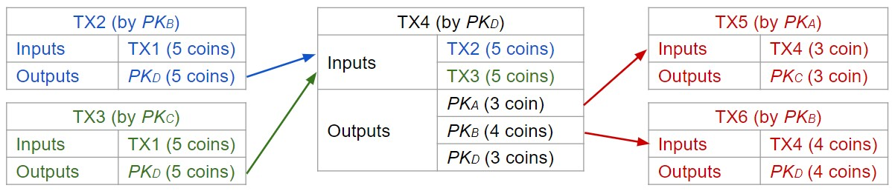
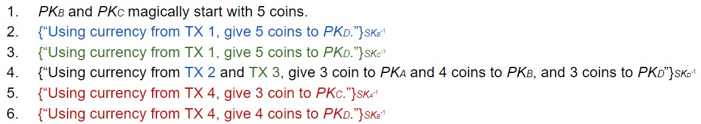

> 比特币:在不信任中央机构的情况下发送和接收money

比特币是如何运作的?

- 如何管理分类账簿(ledger)上的身份、交易和余额?
- 如何构建一个去中心化、可信的分类账簿?

## 身份和交易(Identity and Transactions)

!!! Question
    去中心化的银行; Alice, Bob, Carol, Dave每人有一笔钱

    - 任何人都可以把钱汇给其他人
    - 任何一方都不能比他们现在拥有更多的钱
    - 没有任何一方信任其他任何一方，也没有中央权威机构(Central Authority)

        - 通常，中央机构(例如银行)跟踪余额并执行支出规则『传统的实际货币』
        - 若没有，必须使用加密技术来强制执行正确性!

**身份管理**:  
&nbsp; &nbsp; &nbsp; &nbsp;**Idea:** 使用证书(certificates)来验证真实世界的身份? 但是需要中间的CAs, **反而，只需将每个人的身份定义为一个公钥**, 这样就可以规避身份的问题(即完全忽略了真实世界的身份), 在公钥之间进行交易,而非"人"之间, E.g.四个人分别对应为$PK_A,PK_B,PK_C,PK_D$

**交易(Transcations):**  

>Transaction (TX) - 是指用户在区块链上交换加密货币的过程

&nbsp; &nbsp; &nbsp; &nbsp; 现在，假设存在一个可信的公共分类账簿; ^^1.所有人都可以访问(每个人都可以查看分类账簿); 2.仅追加(每个人都可以向分类账簿中添加数据); 3.不可变(没有人可以更改或删除现有数据)^^

Q: 如何以每个人都能看到的方式记录交易?

- IDEA: 在分类账簿上写上"$PK_A$ 付了 10coins 给$PK_D$", 但是Mallory可以伪造交易
- Solution: 使用数字签名,在分类账簿上写上$\{PK_D付了10coins给PK_D\}_{SK_{D^{-1}}}$
    - 问题: 如何检查Dave($PK_D$)花了多少货币?

每一方的余额在分类账簿上仅以 ^^收到的总额减去花费的总额^^ 的形式存在, 实时余额不直接列在分类账簿上, **这需要花多久?**

- 必须扫描整个分类账簿来确定某人的余额(太长了)
- 随着越来越多的交易发生，分类账簿会无限增长

**The Ledge V1:** (假设$PK_A, PK_B, PK_C, PK_D$ 开始10 coins)

- $\{PK_A付了4coins给PK_C\}_{SK_{A^{-1}}}$
- $\{PK_B付了6coins给PK_D\}_{SK_{B^{-1}}}$
- $\{PK_B付了2coins给PK_A\}_{SK_{B^{-1}}}$ $PK_A$现在有多少coins? --> $10-4+2 = 8$ 

构造: 每个交易都有inputs(来源，钱从哪里来)和outputs(目的地，货币流向谁)

- 现在，每一方只需要跟踪他们收到钱的交易(它们是output)

!!! example
    使用来自TX2和TX4的货币,分别把3coin给$PK_A$和4coins给$PK_B$

    - TX2和TX4现在已经被“花费”(用作input)，所以不需要再跟踪它了
    - Alice和Bob现在有额外的未花费交易

**The Ledger V2:**

## 公共账本

- Hash Chains: 一个链表，其中每个节点包含前一个节点的哈希值

之前的方案需要一个公开的、可信的分类账簿

- 只添加, 不可变 & 对各方都可访问 & 不能信任任何个人来维护账本

> **共识(Consensus)**: 在不信任任何个人的情况下，作为一个群体就某件事达成一致的方式

**Forking attacks** (攻击者创建自己的链分支): 哈希链是否允许一组个人达成共识?

- No.若Mallory创建了一个她没有花费100,000个coins的替代历史，这仍是一个有效的哈希链
- 需要一种方法来商定区块链的负责人  --> PoW
    - 区块链只接受哈希以n个0开头的区块
    - 找到有效的块需要尝试$2^n$个哈希, 奖励是用来激励挖矿区块的
    - 最长的哈希链被接受为真正的区块链
    - 攻击者必须控制全球51%的计算能力才能创建自己的哈希链

## 问题

**一.权力集中化**

在实践中往往不是去中心化的, 少数小团体对比特币系统有很大的控制权

挖矿池(mining pools): 一组用户一起挖矿

- 当一个用户获得挖矿奖励时，团队中的每个人都会一起分享奖励
- 单独挖矿的用户必须足够幸运才能获得奖励
- 挖矿池为用户提供稳定、较小的奖励 (几个大型挖矿池控制着比特币的大部分计算能力)

**二. Bitcoin is pseudonymous**

> Pseudonymity: 多个操作可以链接到一个单一的身份，这不是你的真实身份，而是假名;  其实这个假名就是你的公钥, 交易可以链接到公钥上

比特币交易不一定是匿名的(anonymous)

- Anonymity: 行为不能与你的真实身份联系在一起

**三. 低效(运行时间和存储空间) & 功耗大 & 不可逆的**

- PoW需要大量的hash计算 & 每个用户必须存储整个区块链
- 比特币每秒只能处理几笔交易
- 一旦比特币被发送出去，交易就无法撤销(除非发送者想把钱还给你)
    - 如果你的比特币被盗了，就没有办法找回来了
