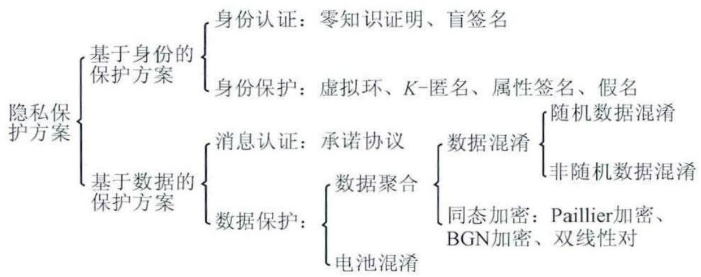

# 介绍

!!! Abstract
    **电气工程期刊找问题，计算机期刊找方法**

    记录读的方向论文 & 论文里面涉及的技术知识 --> 隐私保护，加密，电力交易为主
    
    一个人能走多远，取决于TA知道的起点(经典方案)以及技巧(可探索的范围)

## 背景方向
- V2G & V2V
    - 充放电隐私(charge and discharge)
    - 隐私保护数据发布(Privacy-preserving data publication)
- [车路云](https://www.tsinghua.edu.cn/info/1182/109825.htm)(导师群里分享——"场景描述清楚，容易创新") PS: [视频介绍](https://www.bilibili.com/video/BV1V1421y7n3/?spm_id_from=333.337.search-card.all.click&vd_source=41a19477b1cd284eb33c00c0aae3f725)， [白皮书](https://13115299.s21i.faiusr.com/61/1/ABUIABA9GAAgzKiYngYo_oOy7AY.pdf)
- ~~能源互联网EI~~
    - P2P能源交易: energy transaction matching（能源交易匹配）
        - 将买方和卖方的交易需求进行匹配的过程
- **车联网** --> internet of vehicles(VANET)
      -  charging 、bidding、auction
- ~~Intelligent vehicle(IV)~~、electric vehicle(EV)
- ~~**smart grid**~~: privacy protection、identity authentication、secure data aggregation、grid billing 

> 基于xxx和 xxx的xx研究 （三个创新点）

**智能网联电动汽车能源交易隐私保护的研究**  -->  车联网环境下V2V电力交易的隐私保护研究

- 车辆连接IoEV进行身份认证 --> 安全认证方案（Schnorr）
- 安全存储IoEV数据避免未经授权的访问和修改
- 如何交易？ 以及支付来保证隐私安全
    * 基于博弈论和联盟链的能源交易方案
        + 引入区块链，实验怎么做？（MATLAB等仿真软件）
    * V2G/V2V下能源交易及安全支付隐私保护方案

~~到底是否需要和电扯上关系？纯研究车联网行？！（要怎么扯上关系？）~~

身份隐私保护：身份认证（假名+数字签名）、位置隐私(location privacy)

1.	基于雾计算的轻量级数据聚合隐私保护方案 （Paillier + BLS + batch verification）
2.	具有匿名身份隐私保护的V2V matching方案 
3.	V2V电力交易中高效可撤销匿名身份认证方案

V2G使EVs能够集成到SG中（V2G可在需要时提供给电网能量，减少电网的潜在过载）

- （V2V侧重电动汽车交互，车主可将剩余的能源出售给其他车辆，以帮助缓解能源需求）

## 可能所需知识

!!! Note

    - 加密(encryption)保证消息的机密性
    - 数字签名([digital signature](https://hackmd.io/@PIncentivus/r1xkfbGO3))保证消息的完整性、身份的不可伪造性和操作的不可否认性
    - **数字签密可同时实现两者** （计算和通信效率更高）

- **区块链** + SG --> 联盟链
    - 共识算法：~~PoW、PoS~~、**PoR**、PoA、PBFT
    - DR
    - EVs
    - SC(智能合约)
- ~~群签名和环签名~~(管理成员，开销大) --> 基于ID(存在密钥托管) --> **无证书(CL-PKC)**
    - 聚合签名 --> **无证书聚合签名**(CLAS) --> 无配对无证书聚合签名(PCAS)
          - Pairing-free certificateless aggregate signature 
    - Conditional Privacy-Preserving Certificateless Signature(CPP-CLS)
    - 盲签名(用于认证)：允许请求者获得隐藏消息内容的签名者的消息签名
- Paillier同态加密（部分同态加密）：用于V2G网络数据聚合
- Anonymization(匿名化)： 
- ~~双线性映射~~（计算开销大） --> pairing-free
- **ECC** --> ECDLP
    - ECDSA --> **Schnorr signature**
- 从single到Multiple: 
    - 多个相同对象
        * Multi-Signatures：为了提高存储和通讯效率 --> aggregate signature
        * Signatures with Batch Verification: 为了减少签名验证时间
        * certificateless signatures: 通过捆绑基于ID签名和传统数字签名
    - 多个不同对象：
        * Signcryption(签密)：将加密和签名结合，在一个逻辑步骤内进行实现
        * 异构签密:  允许双方在不改变各自现有安全基础设施的前提下实现安全通信
    - Batch Verification  
- The pseudonym mechanism(假名) + ZKP
- ~~差分隐私(DP)、联邦学习(federated learning)~~
- online/offline Computing
    * offline: 某部分输入未知时，完成 **大部分** 计算
    * online：在输入全弄清后，只需 **轻量** 计算

!!! Quote "来自——[郭福春.致我公钥密码研究生的一封信](https://documents.uow.edu.au/~fuchun/jow/001-revisited.pdf)"
    目前从事科研，不代表毕业了你这辈子就一定要跟科研打交道。这一段时间的认真学习，让你学到的是思考的方法(自己发现问题、解决问题)和态度习惯(枯燥但能坚持下来的态度)

    做好自己不喜欢但必须做好的事情。一个好习惯，影响后阶段，你若不坚持，后面怎么办

## 会议

- 三大密码学顶会: [CRYPTO美密](https://www.iacr.org/meetings/crypto/)、[EUROCRYPT欧密会](https://www.iacr.org/meetings/eurocrypt/)、[ASIACRYPT亚密会](https://asiacrypt.iacr.org/)
- 四大安全类会议：[Security & Privacy](https://onlinelibrary.wiley.com/journal/24756725)、[USENIX Security](https://www.usenix.org/conferences)、[CCS](https://dl.acm.org/conference/ccs)、NDSS(Network and Distributed System Security)

导师推荐期刊如下：
    
- [IEEE Transactions on Power Systems](https://ieeexplore.ieee.org/xpl/RecentIssue.jsp?punumber=59)
- [Computer & Industrial Engineering](https://www.sciencedirect.com/journal/computers-and-industrial-engineering)
- [IEEE TRANSACTIONS ON POWER DELIVERY](https://ieeexplore.ieee.org/xpl/RecentIssue.jsp?punumber=61)
- [IEEE Transactions on Smart Grid](https://ieeexplore.ieee.org/xpl/RecentIssue.jsp?punumber=5165411)

## 论文结构 

### 小论文

> 中文字数: 约word10页 （1.2w+）

- 1-引言 （背景 + 文献综述「约25个」+ "综上所述"自己文献要干嘛 +  文章结构  --> 约六段）
- 2-相关技术 （2~4个 e.g. ECDLP, 联盟链等） 
- 3-方案设计(1~2个图)『 方案设计思想 + 方案模型(各部分实体含义) + 方案执行过程(分几个步骤执行) 』
- 4-方案实现 （初始化等等等过程....）
- 5-方案分析 （正确性验证 + 安全性分析『各大特性，如不可伪造性，消息认证性和完整性、可追踪性、匿名性、不可链接性、抗各种攻击』）
- 6-性能分析 (计算开销、通信开销  -->  表+图)
- 7-结论/结语
- 8-参考文献 （约35+，而且英语文献占大头，中文引用个位数，文献19年之后的占主要部分）

#### 方案流程

??? "Note" "来自郑康康论文:"

    1. TA和KGC为系统生成主密钥和一些公共参数。
    2. AS和RSU将真实身份信息发送给TA，TA验证通过后为AS和RSU生成公私钥并返回给AS和RSU，同时公布AS和RSU的公钥信息。
    3. EV将真实身份信息发送给TA，TA验证通过后为其生成长期伪身份，并将其存入内部数据库，然后把EV的长期伪身份发送给KGC。KGC利用EV的长期伪身份生成EV的部分私钥，并发送给EV。
    4. EV结合选择的秘密值和部分私钥生成公、私钥。
    5. EV用户将选择的随机数组合生成短期伪身份和公钥转换值，签密其电力交易计划，并将其发送到附近的RSU，RSU将签密聚合并发送到AS。同时，买方EV在其账户中冻结一部分资产作为抵押。
    6. AS收到EV用户签密的电力交易计划后，先验证身份并检查时间戳是否满足要求，然后解密得到电力交易计划，最后通过触发在智能合约中设计的匹配机制来获得最优交易方案。
    7. AS把匹配的交易信息（包括成交价格、交易量和交易地点）发送给匹配的买方EV和卖方EV。
    8. 买方EV和卖方EV将根据匹配的交易价格和交易量到指定的交易地点进行电力交易。完成交易后，将其签名的确认交易信息返回给AS。
    9. AS收集确认交易信息后通过智能合约更新卖方EV的信誉值，同时生成交易订单，然后把交易订单打包成区块向联盟链中的预选节点进行广播验证。通过共识过程后，新的区块加入到联盟链中。区块链系统根据合约中确定的交易价格及买卖双方的实际电能交易量来计算电费，然后对步骤5中买方EV抵押的资产进行划分，分别返回买方EV与卖方EV账户，至此V2V电力交易完成

- 跨域适用性：设计支持多区域、多RSU协作的无证书签密机制
- 雾计算(fog computing) 应用于IoV以分散服务器过载
- ~~聚合加入容错~~：电力交易需要高安全性，如果聚合签密数据丢失或被篡改，影响交易的完整性，AS可能无法正确匹配交易对，导致交易失败 & 对于区块链系统，不完整或错误的数据可能影响后续的共识过程。

!!! warning "拟采取方案流程"

    KGC、TA、RSU、EVs、....?

    当有恶意事件发生时，RTA可以通过长-短期伪身份追踪车辆真实身份，并由TA撤销该用户

!!! Question "12.7组会汇报问题:"
   
    - Q1: 在IoV什么场景需要容错，是否有必要 （构思描述背景
    - Q2: 是否有比长短期伪身份更好的方式？(如何改进)
    - Q3: 若撤销，目的是什么，什么场景需要，限制EVs什么
    - Q4: 条件隐私保护认证具体指什么？
    - Q5: 激励EVs用户，是否可结合需求响应(DR)
    - Q6: 云雾环境集成

**V2V电力交易、车联网**  (Q: 怎么保护隐私？怎么结合区块链？)

- 数据共享、数据传输、隐私保护

**车联网下基于异构签密的V2V电力交易安全通信方案**

- 改方案，弱化区块链
- 原方案 + 区块链整合

### 大论文

**车联网环境下V2V电力交易隐私保护的研究**

三个点（待定）：

- 位置、身份、交易内容