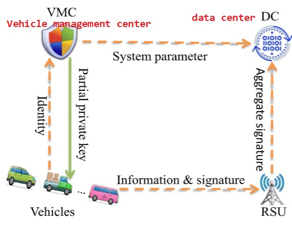

## 介绍

!!! Note

    **无证书公钥密码体制(certificateless public key cryptography，CL-PKC)** 是在基于身份的公钥密码体制 (identity-based public key cryptography，ID-PKC)的基础上提出来的一种新型公钥密码体制[^1]

    [^1]: 张福泰,孙银霞,张磊,耿曼曼,李素娟.无证书公钥密码体制研究.软件学报,2011,22(6):1316-1332

    **没有密钥托管问题，不需要使用证书**

公钥密码(Public-key)即非对称加密——**Q:如何保证用户公钥的真实性和有效性？** 

- 传统的是用证书（public key infrastructure, PKI），即CA(证书中心)为用户签发公钥证书
    - 但管理和维护需要巨大的计算、通信和存储代价

^^84年,Shamir[^2] 提出了基于身份的密码系统^^, 避免了基于PKI的传统公钥密码系统中对证书的使用和验证过程。**用户的公钥是公开、可以唯一确定用户身份的信息即ID**，故不需要查找公钥，即无需公钥证书的存在。
[^2]: Shamir A. Identity-Based cryptosystems and signature schemes. In: Blakely GR, Chaum D, eds. Advances in Cryptology-Crypto’84. LNCS 196. Heidelberg: Springer-Verlag, 1985. 47−53.

- 但存在私钥托管的问题
    - 由 **可信第三方PKG(private key generation)** 利用它掌握的系统唯一主密钥产生
    - 又称为 **KGC** (key generation center 密钥生成中心)

CL-PKC正是解决上述问题，由Al-Riyami和Paterson[^3] 于2003年而提出 (称为AP定义)
[^3]: Al-Riyami SS, Paterson KG. Certificateless public key cryptography. In: Laih CS, ed. Proc. of the ASIACRYPT 2003. LNCS 2894, Berlin: Springer-Verlag, 2003. 452−473

**在CL-PKC中，存在KGC，它拥有系统的主密钥**

- KGC 的作用是根据用户的身份和系统主密钥计算 **用户的部分私钥**，并安全地传送给用户
- 用户收到后，用户再使用 ^^自己的部分私钥和自己随机选择的一个秘密值^^ 生成自己 **完整的私钥**
- 而公钥由 ^^自己的秘密值、身份和系统参数^^ 计算得出,并以可靠的方式公布
- 之后,就可以用自己的私钥进行解密和签名。

这样KGC就无法得知任何用户的私钥，故解决了上述问题

!!! warning "补充"

    无证书签密作为研究热点之一，它将 **签名与加密** 相结合，形成无证书签密方案以及无证书聚合签密方案，也有学者将 **[盲签名技术](https://zh.wikipedia.org/wiki/%E7%9B%B2%E7%AD%BE%E5%90%8D)** 和CL-PKC相结合，提出了 ^^无证书盲签名方案、无证书盲签密方案^^ 等等

## 无证书加密定义（AP定义）

1. 系统设置算法Setup: $(msk, params) \leftarrow 1^k$
2. 提取部分私钥算法Extract-Partial-Private-Key：$d_{ID} \leftarrow (params, msk, ID)$
      - (该算法由 KGC 运行,并通过安全信道把 $d_{ID}$ 发送给用户)
3. 设置秘密值算法Set-Secret-Value: $x_{ID} \leftarrow (params, ID)$
4. 设置私钥算法Set-Private-Key: $sk_{ID} \leftarrow (params, d_{ID}, x_{ID})$
5. 设置公钥算法Set-Public-Key：$pk_{ID} \leftarrow (params, x_{ID})$
6. 加密算法 Encrypt: 
      - 输入：params、接收方身份 ID、公钥 $pk_{ID}$ 和消息 M
      - 输出：密文C 或错误标识$\bot$
7. 解密算法 Decrypt:
      - 输入：params、接收方身份 ID、私钥 $sk_{ID}$ 和密文 C
      - 输出：消息 M 或错误标识$\bot$

此外还可以对其进行简化，(3)(4)(5)进行合并为Set-User-Key

$$
      (x_{id}, pk_{id}) \leftarrow (params, id)
$$

此外还有BSS定义—参考论文[Certificateless public key encryption without pairing](https://documents.uow.edu.au/~/wsusilo/clpkewp_bss_final.pdf)

而早期的无证书加密方案都是基于 **[双线性映射](./bilinear_pairing.md)**

- 计算代价相对于模指数运算要高出很多

如今更倾向于，比如：**零知识证明、多方计算、同态加密**

### 安全模型

无证书体制下 **用户密钥的产生方式** 决定了两类攻击者：

- Type I adversary: 是外部攻击者，可以选择替换任意合法的公钥，不持有用户部分私钥
      - 它模拟了攻击者欺骗用户用自己选择的公钥验证签名的能力
- Type II adversary: 模拟恶意的KGC(拥有secret master key),即可以获得任何用户的部分私钥，但不可以替换用户公钥 

## 无证书签名

> 不需要像传统那样验证公钥的有效性  并且没有Based-ID密钥托管的问题

**算法描述:**

1. 参数生成：$(msk, params) \leftarrow k$
    * $k$为安全参数，$msk$主密钥由KGC保存，$params$向系统中用户公开 
2. 部分密钥生成：$D_{ID} \leftarrow (params, ID, msk)$
3. 设置秘密值: $x_{ID} \leftarrow (params, ID)$
4. 设置私钥: $sk_{ID}  \leftarrow (params, ID, x_{ID}, D_{ID})$
5. 设置公钥: $pk_{ID} \leftarrow (params, ID, x_{ID}, sk_{ID})$
6. 签名: $\sigma \leftarrow (params, M, ID, sk_{ID}, pk_{ID})$
7. 验证：$1/0 \leftarrow (M, \sigma, ID, pk_{ID})$

PS : 安全模型同上——分为两类攻击者

在普通无证书签名基础上，就可以研究特殊性质的无证书签名(如: 群/环签名、聚合签名、代理签名、不可否认签名等)

### 无证书聚合签名(CLAS)

> 聚合签名[^4] : 把n个来自不同签名者对n个不同消息的签名，通过一种 **有效算法** 压缩成单个签名。持有聚合签名的验证人可通过 **确定的验证算法** 检验其有效性, 判定n个签名人对这n条消息的分别认可
>
> - 可以有效地减少签名验证的计算代价和通信开销

[^4]: Boneh D, Gentry C, Lynn B, Shacham H. Aggregate and verifiably encrypted signatures from bilinear maps. In: Biham E, ed. Proc. of the EUROCRPYT 2003. LNCS2656, Heidelberg: Springer-Verlag, 2003. 416-432. [doi: 10.1007/3-540-39200-9_26]

涉及KGC、an aggregate signature generator、 set $\mathbb{U}$ of n users $U_1,...,U_n$

**算法描述：** （来自文献[^5]）

[^5]: Zhang, Lei, and Futai Zhang. "A new certificateless aggregate signature scheme." Computer Communications 32.6 (2009): 1079-1085.

1. Setup: $(params, msk) \leftarrow \lambda$ (由KGC执行)
2. Partial-Private-Key-Extract：$D_i \leftarrow (ID_i, params, msk)$ (由KGC执行)
3. UserKeyGen：$(x_i,pk_i) \leftarrow (ID_i, x_i)$
      - user执行，会选择随机数$x_i \in Z^*_q$
4. Sign：$\sigma_i \leftarrow (params, \Delta, M_i, ID_i, pk_i, (x_i, D_i))$
      - 由在集合 $\mathbb{U}$ 中每个$U_i$执行
      - $(x_i, D_i)$ : signing key
      - $\Delta$ : some state information
5. Aggregate: $\sigma \leftarrow (\Delta, \mathbb{U}, ID_i, pk_i, \sigma_i)$
      - 由aggregate signature generator执行 
6. Aggregate Verify: $T/F \leftarrow (\Delta, \mathbb{U}, ID_i, pk_i, \sigma)$

??? Warning "另外（参考文献[^6]）"

      [^6]: Deng, Lunzhi, et al. "Certificateless Aggregate Signature Scheme With Security Proofs in the Standard Model Suitable for Internet of Vehicles." IEEE Internet of Things Journal (2024).

      将CLAS应用于Internet of Vehicles并在standard model进行安全性分析，而非ROM下 （利用双线性映射）

      **System model模型图如下：**

      

**上述方案CLAS执行过程**：

1. $Setup$: (VMC执行) 
      - $\hat{e}: G_1 \times G_2 \to G_2$ $P,Q$为$G_1,G_2$的生成元，阶数均为$q$
      - $x \in Z^*_q, msk = x, P_{pub} = xP$, 三个hash: $H_1 \sim H_3 : \{0, 1\}^* \to Z^*_q$
      - $params = \{ G_1, G_2, q, \hat{e}, P, Q, P_{pub}, H_1 \sim H_3 \}$
2. $Set_{PPK}(ID_i)$: PPK = Partial private key (VMC执行，并发给Vehicle)
      - $t_i \in Z^*_q$ --> $T_i = t_iP$ --> $k_i = H_1(ID_i, T_i), d_i = t_i + k_ix \bmod q$ --> $D_i = (T_i, d_i)$
3. $Set_{SV}(ID_i)$: SV = secret value(vehicle执行) --> $u_i \in Z^*_q$
4. $Set_{FPK}(ID_i)$: FPK = full public key(Vehicle执行) --> $U_i = u_iP, PK_i = (T_i, U_i)$
5. $Sig(m_i, d_i, u_i)$ : (Vehicle执行)
      - $r_i \in Z^*_q$ --> $R_i = r_iQ$
      - $h_i = H_2(m_i, R_i, ID_i, PK_i, P_{pub}, Q), l_i = H_3(m_i, R_i, ID_i, PK_i, P_{pub}, Q)$
      - $s_i = r_i + h_1d_i + l_iu_i$  -->  $\sigma_i = (s_i, R_i)$ 
6. $Agg((m_i, \sigma_i = (s_i, R_i), ID_i, PK_i)^n_{i=1})$ : RSU执行
      - $\sigma = (s, R_1, ... , R_n)$
7. Verify: (DC执行进行验证)
      - $\hat{e}(sQ - \sum_{i=1}^{n}R_{i},P)= \hat{e}(\sum_{i=1}^n(h_i(T_i+k_iP_{\mathrm{pub}})+l_iU_i), Q)$ 

??? Note "正确性证明"

      $\begin{aligned}      &\hat{e}\left(sQ-\sum_{i=1}^{n}R_{i}, P\right) \\            &=\hat{e}\Bigg(\sum_{i=1}^n(r_i+h_id_i+l_iu_i)Q-\sum_{i=1}^nr_iQ, P\Bigg) \\            &=\hat{e}\Bigg(\sum_{i=1}^n(h_id_i+l_iu_i)P, Q\Bigg) \\            &=\hat{e}\Bigg(\sum_{i=1}^n(h_i((T_i + k_iP_{pub})+l_iU_i), Q\Bigg)\end{aligned}$

## 签密(signcryption)

> 签密把公钥加密和数字签名结合在一起

> In cryptography, **signcryption** is a public-key primitive that simultaneously performs the functions of both digital signature and encryption

在文献[^7]中对 传统的“先签名后加密”的方式进行优化，并提出 **签密**

[^7]: ZHENG Y L. Digital signcryption or how to achieve cost （signature & encryption） ≪ cost （signature） +cost （encryption）［C］//Proceedings of the 17th Annual International Cryptology Conference on Advances in Cryptology. New York，USA：ACM Press，1997：165-179

于是就出现了基于 **无证书签密** 等相关研究