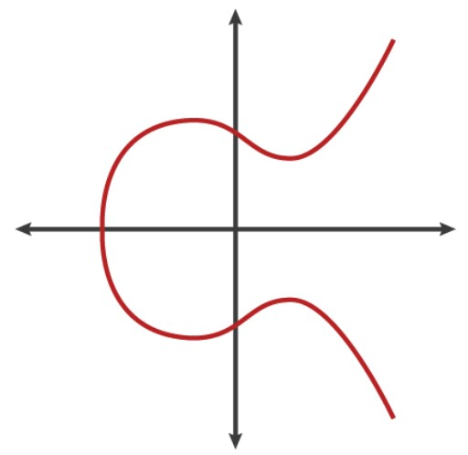
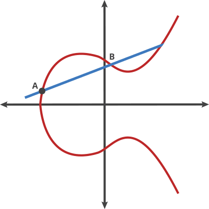

!!! Quote
    来自师兄的[二区论文](https://www.sciencedirect.com/science/article/pii/S0142061524000103)中提到的

    "由于椭圆曲线密码可以以更短的密钥实现相同的安全性，而且椭圆曲线上点乘运算有着较低的计算开销，因此 **基于椭圆曲线离散对数问题（Elliptic curve discrete logarithm problem，ECDLP）设计无证书签名方案是个理想的选择** "

    文献[16-22][^1]提出了基于 ECDLP 设计的无证书签名方案

[^1]: [16] LIU J, WANG L, YU Y. Improved security of a pairing-free certificateless aggregate signature in healthcare wireless medical sensor networks[J]. IEEE Internet of Things Journal, 2020, 7(6): 5256-5266.   [17] GONG Z, GAO T, GUO N. PCAS: cryptanalysis and improvement of pairing-free certificateless aggregate signature scheme with conditional privacy-preserving for VANETs[J]. Ad Hoc Networks, 2023, 144: 103134.   [18] THUMBUR G, RAO G S, REDDY P V, et al. Efficient and secure certificateless aggregate signature-based authentication scheme for vehicular ad hoc networks[J]. IEEE Internet of Things Journal, 2020, 8(3): 1908-1920.   [19] GAYATHRI N B, THUMBUR G, REDDY P V, et al. Efficient pairing-free certificateless authentication scheme with batch verification for vehicular ad-hoc networks[J]. IEEE Access, 2018, 6: 31808-31819.   [20] KAMIL I A, OGUNDOYIN S O. An improved certificateless aggregate signature scheme without bilinear pairings for vehicular ad hoc networks[J]. Journal of Information Security and Applications, 2019, 44: 184-200.  [21] CHEN Y, CHEN J. CPP-CLAS: efficient and conditional privacy-preserving certificateless aggregate signature scheme for VANETs[J]. IEEE Internet of Things Journal, 2021, 9(12): 10354-10365.   [22] 徐贵双, 殷新春. 车载自组网无证书条件隐私保护认 证方案[J/OL].计算机应用: 1-12[2023-06-03]. http:// kns.cnki.net/kcms/detail/51.1307.TP.20230223.1512.014. html. XU GUISHUANG, YIN XINCHUN. Certificateless conditional privacy-preserving authentication scheme for VANET[J/OL]. Journal of Computer Applications: 1-12[2023-06-03]. http://kns.cnki.net/kcms/detail/51.1307. TP.20230223.1512.014.html(in Chinese).

## 介绍ECC

椭圆曲线加密(Elliptic Curve Cryptography)属于非对称加密，而比特币中就是用的此方案

这是一个加密系统，基于 **有限域的椭圆曲线**，在其中，随机选择的私钥用于轻松生成公共密钥，但计算上很难/不可能

!!! Question
    什么是椭圆曲线呢?什么是有限域?为什么在比特币中使用ECC?

### 椭圆曲线

**关于椭圆曲线**: 可写成$y^2 = x^3 + ax + b$的形式。已知曲线上的两点，第三点可以通过椭圆曲线与经过这两点的直线相交得到 （如下图）

<figure markdown="span">
  { width="300" }
</figure>

> 关于其 **标准定义** ([参考](https://mathworld.wolfram.com/EllipticCurve.html))：一条椭圆曲线是由一组被$y^2 = x^3 + ax + b$定义的且满足$4a^3 + 27b^2 \neq 0$的点集，后面限定条件是为了保证曲线不包含奇点

上图所示，A + B得C，再A + C得到D，再A+D得到E。若AB重合(即在某一点做切线)，则会交曲线于一点，做垂线交于曲线上可得到2A，然后A+2A按照上述过程，可得到3A,4A....此过程称为dot运算(椭圆曲线乘法) 

- 若将上述过程重复k次，即kA，得到的就是 **公钥** （而k就是 **私钥**）
- 有了公钥和私钥，就可以利用其进行非对称加密

### 有限域(Finite Fields)： 

**关于域**: 一个可以进行加减乘除运算，但结果不会超出域的集合。如：有理数，实数，复数集合都为域，而整数集合不是

> A thing is said to be finite if it has definable/definite limits.  
> 有限域是具有有限元素集合的任何域(数字的抽象)

对于有限域，下列条件必须成立: 

1. 加法(+)和乘法(.)，执行二进制操作
2. 加法封闭，元素a和b相加的结果必须在集合中
3. 存在一个零元素，使得$0 + c = c$
4. 存在单位元1，使得$1.c = c$
5. 存在$-c$使得$-c + c = 0$
6. 存在$c$的逆矩阵，使得$c^{-1}c = 1$
7. 存在 **素数域**，其中有限域的阶为素数p，且该域的集合(mod p)中的元素为$\{0,1,2...p-1\}$

有限域中元素的个数为有限域的 **阶**

## 群/循环群

把椭圆曲线定义在有限域上，则椭圆曲线变成了 **离散** 的点 『更方便加密』

- （实际上就是取模，即$y^2 = x^3 + ax + b \bmod p$）

> **有限域和该域上的椭圆曲线** 的结合产生了一个有趣的实体——**群(Group)**

若有一个有限域，在这个域上定义了一条椭圆曲线，使得曲线上两点相加的规则得到第三点，同样在此曲线上，那么我们有了一个群。 

群通常有一个定律，即 **点加法(+)**，它扩展了有限域运算的必要条件，条件如下: 

- **加性单位元**: 给定椭圆曲线上的点P(x,y)，存在一个单位元0(x,y)使得$0 + P = P$,这个单位元称为 **无穷远处的点**
- **加性逆**: 在曲线上给定一个点P(x,y)，存在另一个点P(x，-y)使得$-P + P = 0$
- **点加**：给定椭圆曲线上的两点$P_1(x_1,y_1)$和$P_2(x_2,y_2)$，第三点$P_3(x_3, y_3)$的计算方法是计算通过$P_1$和$P_2$的斜率(m)，并代入通过$P_1$或$P_2$和$P_3$的直线方程。方程如下所示，在$P_1$不等于$P_2$的情况下成立: 
    
    $$
    \begin{aligned}
    m &= \frac{y_2 - y_1}{x_2 - x_1} \\
    x_3 &= m^2 - x_1 - x_2 \\
    y_3 &= m(x_1 - x_3) - y_1 \\
    \end{aligned}
    $$

- **点加倍**: 当$P_1 = P_2$时，就会翻倍即$P_1 + P_2 = P_1 + P_1 = 2P_1$ 
- **标量倍数(数乘)**: 点加倍可以进行一种新的运算叫数乘即$P+P=2P$,而2是一个标量倍数
      - 这个性质是非线性的，并引起两个重要的考虑: **有限循环群和离散对数问题**

!!! quote "标量乘"
    **ECC中的基本操作**，通常表示为$kP$，k为标量(整数)，P椭圆曲线上的点

    - 代表将点P加k次

### 有限循环群

在某个选定的P的标量倍数(n)处，计算无穷远处的点nP = 0，对于选择P，这意味着存在P的有限倍数集合，称为 **有限循环群**。

有限域上$\{P, 2P, 3P, 4P...nP\}$的图是有限循环群中点相加的非线性点的散点图

这种非线性，在密码系统中是一个重要的特性，因为计算一个选择点的标量倍数很容易，但预测给定点的标量值是相当困难的。这就是 **离散对数问题(discrete logarithm problem, DLP)**

### 离散对数(DLP)

有限域中的广义离散对数问题定义了在1到p - 1范围内找到整数x(如果存在)

1. 一个阶为p - 1的有限循环群
2. 一个属于有限循环群的本原元素(α)
3. 一种派生元素(β)，使$α^x = β$

如果参数(p,α,β)足够大，计算x的值是非常困难的，尽管计算β的值要容易得多

**推广此方法，可以用椭圆曲线构造DLP**

**椭圆曲线离散对数问题(ECDLP)** : 是求一个整数e，范围在1和椭圆曲线上的点数($\approx$有限循环群的阶数)中，使得一个本原$G$(基点)与$e$的标量倍数即$eG$在椭圆曲线上产生另一个点P，即$eG = P$

在密码系统中，^^e表示一致选择的随机数(即私钥)，G表示生成点，P表示派生的公钥^^

- 给定e（私钥）和G，计算P容易
- 但给定G和P，求e非常难（实际上P很大，穷举出不可能）

!!! Quote "来自师兄论文" 
    ECDLP: 对于给定椭圆曲线$E$，在$E$上取阶为大素数$q$的加法群$G$,$P$为群$G$的一个生成元。给定$P,aP \in G$,在概率多项式时间内，ECDLP的目标是计算出$a \in Z^*_q$

**加密过程:**

1. 选取椭圆曲线$E_p(a, b)$，并取椭圆曲线上的一点作为基点G
2. 选定一个大数$e$为私钥，并生成公钥$P=eG$
3. 加密: 选取随机数$r$, 将消息$M$生成密文$C$
      - 密文是点对，即$C = (rG, M + rP)$
4. 解密: $M + rP - e(rG) = M + r(eG) - r(eG) = M$ 

**椭圆曲线和DLP是很重要的，因为它们构成了ECC的基元**。对于有限循环群(n)的阶、生成点(G)和有限域(p)的阶有足够大的值时，椭圆曲线离散对数问题可以用于具有安全和隐私意识的系统。

!!! Example 
    比特币使用的价值足够大，不会被成功攻击，并且已知可以提供数十年的长期安全性

与同一非对称算法族中的方案相比，**ECC能够以更短的密钥长度提供相同的安全级别**

!!! Example "比如"
    要达到128位的安全级别，ECC需要256位长的密钥
    
    而其他相同安全级别的密钥最小要求是3072位。
    
    处理256位的密钥长度比处理3072位密钥的速度要快得多

