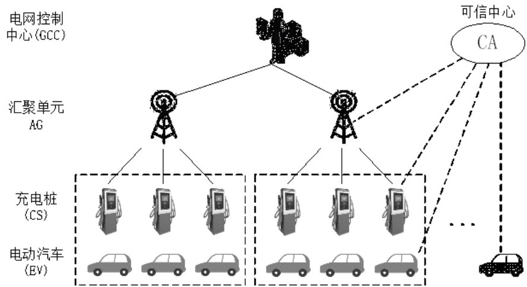
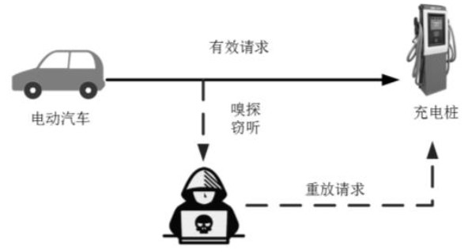
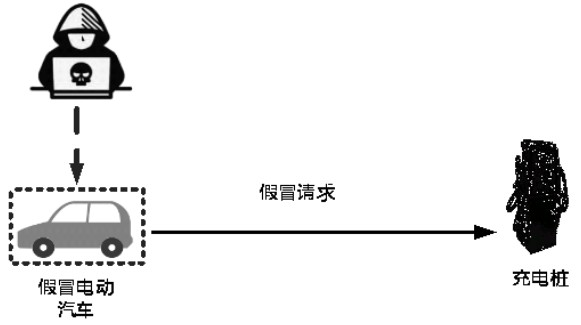
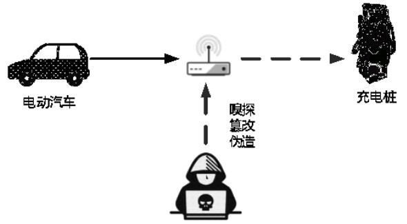
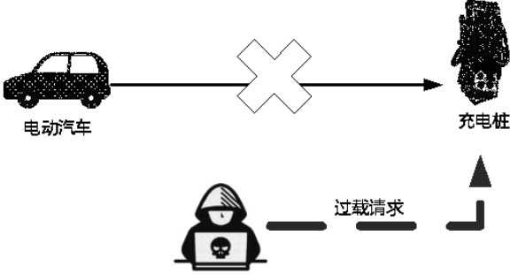

## 基本介绍

> **Vehicle-to-grid (V2G)** describes a system in which plug-in electric vehicles (PEVs) sell demand response services to the grid

!!! quote "来自论文"

    刘晓飞,张千帆,崔淑梅.电动汽车V2G技术综述[J].电工技术学报,2012,27(02):121-127.DOI:10.19595/j.cnki.1000-6753.tces.2012.02.018.

随着可再生能源（如太阳能、风能等）接入电力系统，但由于其不连续性导致发电的波动，需要其他能源（如电池能量存储系统）进行补偿，V2G针对上述问题提出的，**其核心思想就是利用大量电动汽车的储能源作为电网和可再生能源的缓冲**

- 当电网负荷过高时，由电动汽车储能源向电网馈电
- 当电网负荷低时，大量电动汽车的电池组用来存储电网多余的电能

这种方式可以有效对电网起到"**削峰填谷**"的作用，而且还可以给用户带来利益

电动汽车(不同于电网中其他的电负荷)：具有高度的移动性和不可预测性

**从经济上，V2G的效益是引人注目的(好处)** ： 

1. 利用电动车电池作为电网的缓冲，为电网 **提供辅助服务**，如调峰、无功补偿等
2. 能为车主提供额外的收入，抵消购买电动汽车的部分花费，有利于清洁汽车的普及
3. 可以增加电网稳定性和可靠性，降低电力系统运营成本

**V2G的实现方法(根据应用分为四类) :**

- 集中式、自治式、基于微网的V2G、基于更换电池组的V2G

## V2G安全隐私问题

!!! Quote "来自论文"
    张雄,张海春,刘政林.V2G网络的安全和隐私问题研究[J].汽车实用技术,2021,46(23):12-15.DOI:10.16638/j.cnki.1671-7988.2021.023.004.

V2G系统中存在的安全和隐私方面的挑战将极大地影响下一代汽车接入电网技术的实际应用[^1]
[^1]: N.Saxena,S.Grijalva,V.Chukwuka,et al.Network Security and Privacy Challenges in Smart Vehicle-to-Grid[J].IEEE Wireless Communications,2017,24(4): 88-98.

!!! Note "相关研究"

    Saxena等人[^2]提出了一种新的网络安全和隐私保护架构来支持V2G网络

    Eizaet[^3]等人通过结合 **无证书公钥加密和限制性部分盲签名技术**，提出了一种安全且隐私敏感的代理移动 IPv6协议，既保证了电动汽车的位置隐私，又保持了电动汽车与充电服务之间的会话连续性

    Abdallah 等人[^3]提出了一种针对V2G连接的隐私保护认证方案，**利用哈希函数和位异或操作**，设计了一个健壮的密钥协商协议，在V2G环境中实现了相互认证

    [^2]: N.Saxena,S.Grijalva,V.Chukwuka,et al.Network Security and Privacy Challenges in Smart Vehicle-to-Grid[J].IEEE Wireless Communications,2017,24(4): 88-98
    
    [^3]: M. H. Eiza, Q.Shi, A.Marnerides, et al.Secure and privacy-aware proxy mobile IPv6 protocol for vehicle-to-grid networks[C].IEEE International Conference on Communications (ICC),2016:1-6.

    [^4]: Abdallah A,Shen X.Lightweight Authentication and Privacy- Preserving Scheme for V2G Connections[J].IEEE Transactions on Vehicular Technology,2016:1-1.

电动汽车充放电网络架构：

- **电网控制中心(Grid Control Center, GCC)** 负责发布整个电网的实时电力需求和电价等相关信息，同时对电动汽车的实时状态、位置信息以及电池使用情况等进行监测，根据监控的数据和电网的自身相关需求制定出最优的控制策略等
- **可信中心(Central Authority, CA)** 是一个完全可信的第三方机构，如电力监管部门，负责整个系统的安全基础，具有最高的安全级别。
- **汇聚单元(Aggregator, AG)** 充电桩与上层电网控制中心之间的通信媒介，负责对电动汽车的充/放电操作和状态进行监测，并上传给电网控制中心，传达电网控制中心的调度命令，完成电动汽车的有序充放电操作
- **充电桩(Charging Spot, CS)** 负责电动汽车与汇聚单元之间的数据交换
- **电动汽车(Electric Vehicle, EV)** 具有双向能源交易能力。可以作为能源生产者，在高峰时间给电池充电，还可以在非高峰时间充电，充当能源消耗者的角色

### 隐私威胁 

1. 身份隐私：比如用户的真实身份信息（姓名、住址、身份证号等等）
2. 位置隐私：若攻击者得知，则可通过跟踪监视用户的行为，而获知其他敏感信息
3. 电池状态隐私(电压、电池、使用状态)：若得知，可推断出用户的用电喜好和习惯，甚至身份和位置隐私

### 安全威胁

1. **窃听和重放攻击**：攻击者在通信链路间以监听抓包等方式手段获取数据，可造成上述隐私数据泄露。同时攻击者可以拦截、注入或重新发送以前发送的消息，以便执行重放攻击，这可能导致电动车注册身份被盗用或伪造凭证以获取其他电动车用户获取充电服务 【如图所示】

2. **假冒攻击**：若攻击者知道受害者电动汽车或汇聚器的身份或会话密钥，则可以执行假冒攻击，进行假冒车辆，使用伪造的身份生成消息的散列，代表受害车辆将完整的消息发送到各自的充电桩。也可假冒充电桩，向车辆发送伪造信息 

3. **中间人攻击**：(对通信链路的间接攻击)若车辆或充电桩的私钥被泄露，或者源实体的身份和签名没有得到验证，攻击者可以生成共享密钥。作为攻击者可以假冒充电桩，窃取车辆提供的信息，然后使用这些信息从合法的充电桩访问系统

4. **基于流量的 DoS 攻击**：攻击者向汇聚器发送大量的充电或放电请求，建立半开的连接，拒绝完成连接，最终耗尽汇聚器的网络资源，导致充电站无法为需要电力服务的合法车辆提供充放电服务，即充电站瘫痪

### 安全目标

1. 隐私安全目标
       - **身份匿名**
       - **车辆不可追溯** 
2. 认证安全目标
       - **相互认证**（车辆与AG之间互相认证，安全地通信）
       - **信息机密性**：私人信息必须是秘密的或隐藏的【加密】
       - **消息完整性**：对于每个发送的消息，都要验证在传输过程中 是否发生任何违规行为

## 安全及隐私防护策略

### 匿名认证

该网络必须保持身份匿名性和不可跟踪性属性，**只有认证服务器知道并验证车辆的实际身份**，但通信服务器和充电设施等中间实体并不知道。**匿名认证可以使用各种技术来实现，如环签名、盲签名方案和部分盲签名方案**

- 匿名可以确保AG无法知道车辆的身份，而只是验证车辆是否属于一个经过授权的车辆组

### 同态加密

同态加密是 **保护汇聚信息** 的一种很好的解决方案

- 将加密消息从车辆传输到汇聚单元来维护端到端的 **信息机密性**

在V2G网络中，为维护 **消息完整性**，可以用 **散列函数或消息验证功能（MAC）** 来进行签名和校验。 **先加密后验证** 被认为是最安全的模式