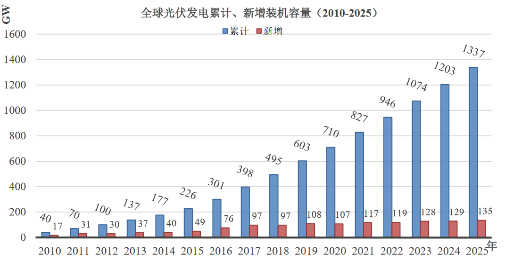
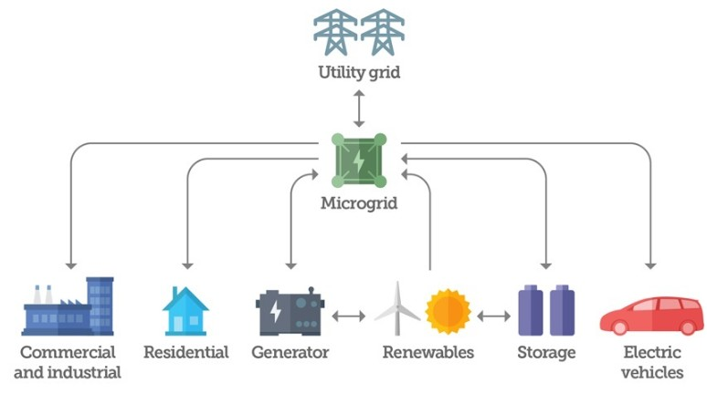
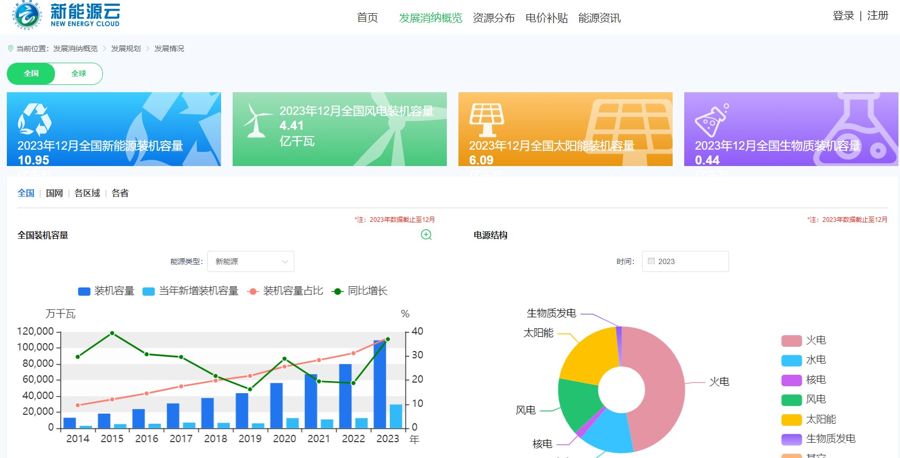

  author:
    name: 硕计231黄一恒
    url: https://codeheng.github.io/home/about/

  departments:
    - name: " 华北电力大学计算机系 "
      url: https://cs.ncepu.edu.cn/
      img: ./img/ncepu-logo.jpg

+++++

# 云计算在微电网中的研究及其应用

----

## Overview
**本次汇报主要分为三部分:**

1. 研究背景
2. 相关研究
      - 云计算研究现状
      - 云计算在微电网中应用的现状
      - 相关技术（云计算、微电网）
      - e.g. [国网新能源云平台](https://sgnec.sgcc.com.cn/)
3. 总结展望

---

# 一. 研究背景

----

## 能源问题
能源变化：木头 -> 煤炭 -> 石油 （后者取代前者）

过度开采和使用导致**化石能源下降**  => 能源短缺

--

**<red>然而，风光等新能源的发展，逐渐获得普及<red>**

--

----

## 能源问题

> 大约到2040年，全球电力装机容量将增加约8.5TW，约是2019年的13倍
>
> ——国际能源署（International Energy Agency,IEA）

风光新能源 VS. 普通的能源

- 最大的区别在于受气候以及地理环境影响较大
- 新能源：**随机性，波动性和间歇性**

--

**微电网**作为一种灵活可靠的能源分布系统得到了广泛关注

BUT, 微电网存在一些比较明显的问题: 

- 存储计算能力有限；数据不能共享 & 各自分散独立
- 历史数据不能充分挖掘分析利用

--

**云计算**能够实现微电网的海量数据存储和实时并行计算！

---

# 二. 相关研究

----

## 云计算研究现状

> 云计算是分布式计算类型之一，它把数据处理和计算任务由大化小，智能分解，通过网络分配给**多个服务器或者有闲置算力的计算机**对小任务分析处理，最后把计算结果返回给任务分发主机

- 早期：简单分发与合并任务
- 如今：多种技术融合的产物
    - 并行计算、分布式计算
    - 网络存储、负载均衡
    - 虚拟化....  

实际来讲它就是一个提供计算资源的网络系统，是信息技术、软件、互联网服务的混合产物。云计算概念从 2006 年首次提出，发展至今已经巨大地改变了社会的商业模式和人们生活方式

----

## 云计算在微电网中应用现状

微电网建设数量 和 新能源装机容量激增 → 以下需求大量增加：

- 电力系统智能终端设备的安装
- 数据采集、通信传输、实时计算

**云计算这一种新的计算模式给电力系统的数据处理提供了方向**

--

- [文献[4]](#/4)把云计算和电力系统进行结合，把电网计算和存储资源统一利用，整合组建电力云，使电力系统拥有了“超级算力”
- [文献[5]](#/4)针对快速兴起的家庭微电网如何与电网良好互动问题，提出了基于 PaaS 云平台的多网络混合户用微电网用能互动管理方案，满足了双方对信息的预测、处理以及相互交流互动
- ...

<red>将云计算技术应用到电网，在现有资源基础上组建电力云是行业发展的需要，也是电网迈向智能化的发展趋势</red>

----

## 微电网（Micro-Grid，MG）

> 又称微网，属于分布式能源系统中的高级应用形式，是一种局部能源系统并且能基本实现供电系统内部的电力和电量平衡，**本质是一个微小发配用电网络**，由以下几部分构成：
> 
> - 分布式能源资源（如太阳能、风能、储能等）
> - 负载设备及能量管理系统（监控、保护和自动化装置）

----

## 案例

&nbsp; &nbsp; &nbsp; &nbsp;国家电网也正朝着智能化电网方向发展，能源电力行业正加速数字化和工业化深度融合，**基于云计算和数字化转型趋势**，国家电网推出了[国网新能源云平台](https://sgnec.sgcc.com.cn/)，平台包括<u>电网服务、储能服务、供需预测、消纳计算</u>等15个子平台

---

# 三. 总结与展望

----

## 总结与展望

**随着科技以及人工智能技术的高速发展，电网朝数字化，智能化发展是未来的趋势**，面对人类社会惊人的能源需求量和日益严峻的生态环境问题，新能源分布式发电和微电网为我们指明了方向。

把云计算等技术应用到微电网发用电系统控制中去，可以改善系统运行的*可预测性和可控性*，进而提高系统运行的*安全性和稳定性*

--

> 2021.4.16日（[丰台区“4·16”较大火灾事故](https://m.in-en.comarticle//html/energy-2309745.shtml)）
> 
> &nbsp; &nbsp; &nbsp; &nbsp; 北京南四环的集美家居大红门店的光储能微电网起火，经历 12 小时消防抢 救才扑灭明火，期间发生爆炸，消防员牺牲 2 名、受伤 1 名 

&nbsp; &nbsp; &nbsp; &nbsp; 然而对微电网的控制和保护必须双管齐下，微电网云平台对系统运行监控的同时，**应具备实用可靠的应急保护措施和策略**，才能够让其更好更安全地为我们所用

---

# 参考文献

- [1]	王美丽.试论第三次能源革命的特征[J].科技经济市场,2019(12):1-2
- [2]	国际能源署“2020 世界能源展望”四大看点[J].中外能源,2021,26(02):98
- [3]	王成山,武震,李鹏.微电网关键技术研究[J].电工技术学报,2014,29(02):1-12.
- [[4]](#/2/2)	杨旭昕,刘俊勇,季宏亮,潘睿,贺星棋,郭晓鸣.电力系统云计算初探[J].四川电力技术,2010,33(03):71-76
- [[5]](#/2/2)	刘科研,吴志佳,贾东梨,王守相.基于云计算 PaaS 平台的家庭微源网智能用电互动模式[J].电网技术,2016,40(07):2212-2218.
- [6]	陈昌松. 光伏微网的发电预测与能量管理技术研究[D].华中科技大学,2011
- [7]	薛午霞. 基于大数据的光伏电站运维云平台构建与评价研究[D].华北电力大学 (北京),2019.

---

# 谢谢大家！