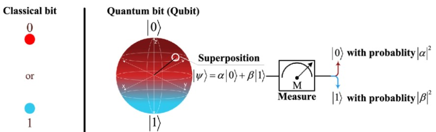
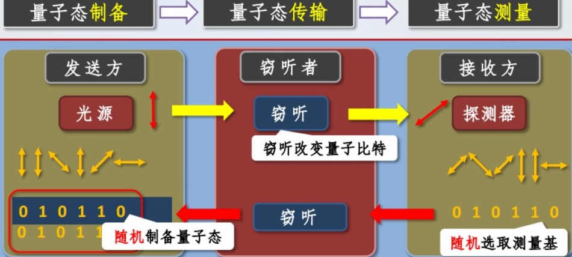
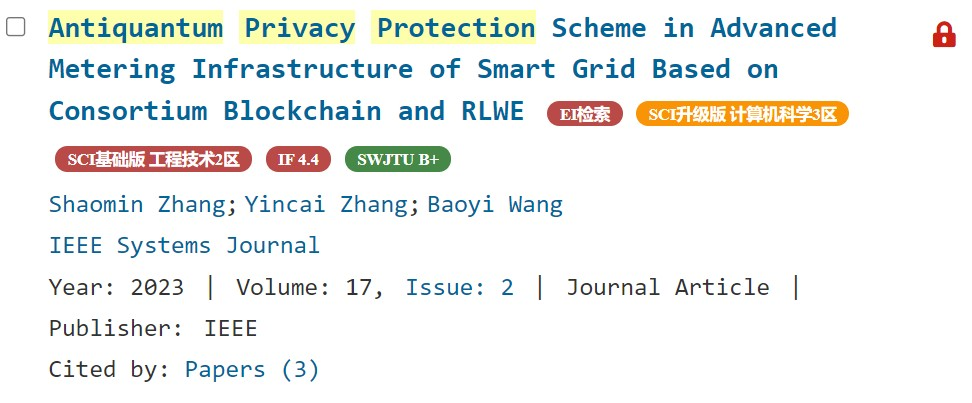
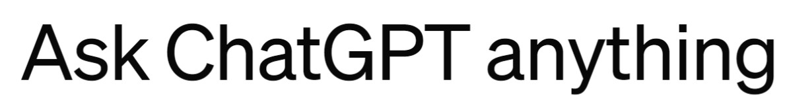
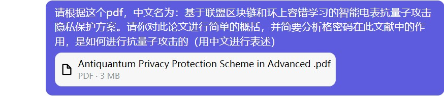
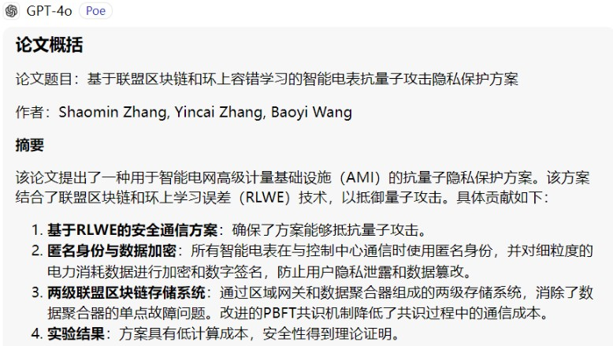
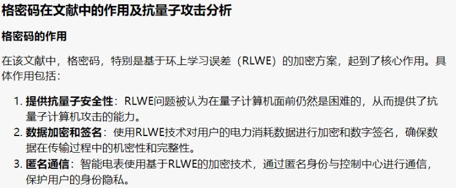
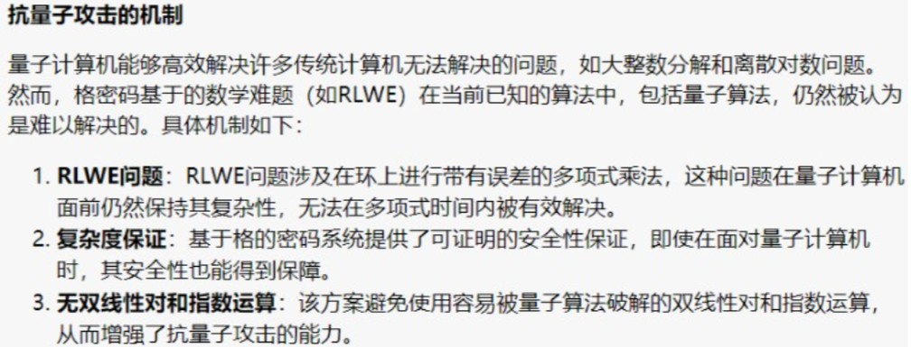

  author:
    name: 硕计231黄一恒
    url: https://codeheng.github.io/home/about/

  departments:
    - name: " 华北电力大学计算机系 "
      url: https://cs.ncepu.edu.cn/
      img: ./img/ncepu-logo.jpg

+++++

# 抗量子计算的隐私保护方案的研究

----

## Overview
**本次汇报主要分为以下几个部分:**

1. **研究背景**
      - 传统密码 VS. 量子密码 
2. **相关研究**
      - *量子密码现状*
          * 量子计算机 & 量子密码 
      - *抗量子相关技术*
          * 量子计算
          * 量子密钥分发QKD 
      - *隐私保护方案*
          * 格密码 
3.  **总结展望**

---

# 一. 研究背景

----

## 传统密码 VS 量子加密

<red>传统密码：基于密钥（key）<red>

- 对称加密(e.g. AES)和非对称加密(RSA)
     * 目前都是基于**数学问题的单向困难性**
         + e.g. 基于因子分解——RSA
         + e.g. 基于离散对数——Diffie-Hellman 
         + 故破解传统密码需要数学
     * 但如RSA，传统计算机算力是无法破解，但量子计算机可以

--

<red>量子密码(又称抗量子计算密码学或后量子密码学PQC)：利用 **量子力学** 的特性来加密<red> 

- 84年Bennett和Brassard提出量子密钥分发(QKD)$^{[1]}$
    - 利用量子态的 **不可克隆性** 来实现密钥的安全分发
    - 破解量子密码需要物理

---

# 二. 相关研究

----

## 量子密码现状——量子计算机

- 19年《Nature》上发表了Google最新一代量子处理器Sycamore$^{[2]}$
    * 包含53个量子比特(qubit)
    * 并与经典计算机相比：
          + Sycamore完成同样的任务只需200s
          + 而Google使用超级计算机Summit需要1万年
    * 以此证明该量子处理器实现了 **量子优越性**
- 23.4月Sycamore量子处理器从19年53个qubit飞跃到70个qubit

--
24.1月中国第三代量子计算机——[本源悟空](https://baike.baidu.com/item/%E6%9C%AC%E6%BA%90%E6%82%9F%E7%A9%BA/63928183)上线运行

- 5月6日，受邀接入长三角枢纽芜湖集群算力公共服务平台
    * 实现了<u>通算、智算、超算、量算</u>“四算合一”
    * 搭载72位自主超导量子芯片“悟空芯”，共有[198个qubit](http://www7.zzu.edu.cn/nscczz/info/1155/2552.htm)

与传统相比，存储强、运算快，是未来计算技术发展的新方向$^{[3]}$

----

## 量子密码

**有了量子计算机：**

- 94年，Shor$^{[4]}$提出了著名的量子整数分解算法，该算法使用量子计算机可以在多项式时间内找到大整数的因子
    * Shor算法可轻松攻破基于整数分解、离散对数的多种公钥密码
- Grover$^{[5]}$提出了一种量子搜索算法，可以对无结构数据的搜索加速
    * Grover算法应用于穷举攻击，可以产生二次加速的效果$^{[6]}$

--

Microsoft和Google量子研究组的研究人员Matthias Troyer和John Martinis均表示由于 **通用量子计算机硬件的限制** 短期内无法实现Shor算法破译现在实际使用的RSA加密体系

- 寻找通用量子计算机的杀手级应用仍是一大挑战

但研究表明,到35年,量子技术可能已经足够成熟,能够有效打破RSA2048密码算法$^{[7]}$

----

## 相关技术——量子计算

> Quantum computing is a type of computation whose operations can harness the phenomena of **quantum mechanics(量子力学)**, such as **superposition(叠加)**, **entanglement(纠缠)**, etc

- **传统bit**: 0 or 1. （可看出qubit的特例——a = 0或b = 0）
- **量子bit (qubit)**: A vector $ a|0\rangle + b|1\rangle,|a|^{2}+|b|^{2}=1 $
      * 量子比特的值可以是0、1或 0和1的量子叠加 

此处$|0\rangle=\binom{1}{0}, \quad|1\rangle=\binom{0}{1} .$ （采用狄拉克标记右括向量表示）

----

## 抗量子攻击——QKD

量子密钥分发（quantum key distribution，QKD）是利用量子力学特性实现密码协议的安全通信方法。

- 通信双方能够产生并一个随机的、安全的密钥，来加密和解密消息

- 基于两种共扼基的量子密钥分配方案：e.g. **BB84协议**

----

## 基于格的密码学

高效简单、高度并行化，可提供强有力的可证明安全保证备受关注$^{[8]}$

- 目前没有多项式时间的算法解决格上困难问题，包括量子计算机
    * 格密码被认为是抗量子的
- 直到09年，Gentry首次给出了基于格的<u>全同态加密</u>方案的构造$^{[9]}$
    * 促成格密码研究的第一次热潮

--

> 全同态加密（FHE）：可以在加密状态下进行任意多次的加法和乘法运算，并且可以得到与明文数据相同的结果

**格(lattice)是一种数学结构**，定义为一组在n为欧式空间$R^n$上的一组线性无关的非0向量（称为格基）的整系数线性组合

- 表示为$\Lambda=a_{1} x_{1}+a_{2} x_{2}+\cdots+a_{i} x_{i}+\cdots+a_{n} x_{n}$

$a_1,…,a_n$是任意整数，$x_1,…x_n$是实向量空间中一组线性无关的向量
----

## 基于格的密码学

在格密码学中，对于一个维数足够高的格，通过一组随机选取的格，找到一组线性无关的短格基向量是困难的

- 此困难性问题有助于构造格上的密码技术

格密码作为一类经典的抗量子密码，公认是后量子密码算法标准最有力的竞争者

- 如：<u>基于格的零知识证明、格加密、格签名以及格密钥交换</u>

--

**格密码具有较好的扩展性**，可利用格理论为设计基础，设计加密、签名、伪随机发生器、密钥交换协议、基于身份的加密、全同态密码等

在格密码体制的设计方面，格密码在安全性方面有着很大的潜力，但在效率和实用性方面，它与目前传统的较实用的密码方案还有很大的差距，格密码的研究历程还有很长的路要走

- 除此方案，还有 **<u>基于Hash使用Merkle树生成数字签名，基于多变量</u>** 等等的密码体制

----

## 基于格的密码学

基于联盟区块链和环上容错学习的智能电表抗量子攻击隐私保护方案

--

----

## 基于格的密码学

----

## 基于格的密码学

---

# 三. 总结与展望

----

## 总结与展望

抗量子计算的隐私保护方案是当前密码学研究领域的一个重要课题。随着量子计算机的发展和量子算法的崛起，传统的加密算法面临着被量子计算攻击破解的风险。

- 抗量子密码算法：如基于格的密码学、多线性映射密码学等。
    * 这些算法的目标是在量子计算机攻击下保持安全性，同时保持高效性和可扩展性

**基于量子力学机制，量子密码学有着先天的优势**。从理论上来讲，量子密码学有着无条件安全性的特点

- 但实际应用时，由于设备缺陷、噪声影响等因素，仍存在安全问题
- 此外在效率、易用性、健壮性等方面也存在诸多问题有待解决

---

# 参考文献

----

## 参考文献

- [1] Brassard C, Bennett C H. Quantum cryptography: Public key distribution and coin tossing[C] //Proc of Int Conf on Computers, Systems and Signal Processing. Piscataway, NJ: IEEE, 1984: 175-179
- [2]	Arute F, Arya K, Babbush R, et al. Quantum supremacy using a programmable superconducting processor. Nature, 2019, 574(7779): 505-510
- [3]	郭国平. 量子计算技术的产业变革与生态建构.人民论坛,2023(16)
- [4] Shor P W. Algorithms for quantum computation: Discrete logarithms and factoring[C] //Proc of the 35th Annual Symp on Foundations of Computer Science. Piscataway, NJ: IEEE, 1994: 124-134

----

## 参考文献

- [5] Grover L K. A fast quantum mechanical algorithm for database search[C] //Proc of the 28th Annual ACM Symp on Theory of Computing. New York: ACM, 1996: 212-219
- [6] BRAssARD G, HoyER P, MoscA M, et al. Quantum amplitude amplification and estimation [J]. Contemporary Mathematics. 2002, 305: 53-74.
- [7] MOSCA M．Cybersecurity in an era with quantum computers:Will we be ready? [J]．IEEE SecurPriv,2015,16(5): 3841
- [8] J. Porras, J. Baena, and J. Ding, “ZHFE, a New Multivariate Public Key Encryption Scheme,” Post-Quantum Cryptography, LNCS 8772, Springer, 2014, pp. 229–245.
- [9] Gentry C.Fully homomorphic encryption using ideal lattices[C] //Proc of ACM Symp on Theory of Computing 2009. New York: ACM,2009: 169-178

---

# 谢谢大家！