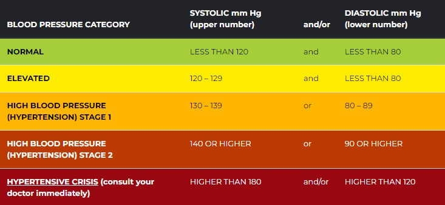

!!! Abstract 
    父亲甚至爷爷奶奶多年高血压,[视频](https://www.youtube.com/watch?v=qEFnaCOmu5E&ab_channel=%E5%BC%B5%E4%BF%AE%E4%BF%AE%E7%9A%84%E4%B8%8D%E6%AD%A3%E5%B8%B8%E4%BA%BA%E7%94%9FShosho%27sAbnormalLife)中博主说到他父亲: **为何吃得健康且运动仍有高血压?**

## 介绍

- 收缩压: 心脏把血液经由左心室从主动脉打出来的那瞬间血管壁所承受的压力(血压的最大值)
- 舒张压: 心脏在舒张让血液流回右心房时血管所承受的压力(血压的最小值)

高血压是[动脉粥样硬化](https://www.mayoclinic.org/zh-hans/diseases-conditions/arteriosclerosis-atherosclerosis/symptoms-causes/syc-20350569)的三大危险因子之一，吸烟对血管是化学性伤害，而高血压则是物理性的

正常范围如下:  -->  [参看中国标准](https://www.bjhd.gov.cn/ztzx/2022/zwxmt/msgz/202211/t20221116_4563515_m.shtml#:~:text=%E6%88%91%E5%9B%BD%E9%AB%98%E8%A1%80%E5%8E%8B%E8%AF%8A%E6%96%AD%E6%A0%87%E5%87%86,%E5%88%B0%E5%A6%82%E4%BB%8A%E7%9A%84130%2F80mmHg%E3%80%82)

**若高压>= 130 或者低压 >= 80则处于第一型高血压范围**

- 若存在高血压,则会一次性冲击到大脑、心脏、肾脏

**如何测血压**:

- 家庭中,每天起床和睡前,每静坐5min测一次,早晚各两次分别取平均

## 高血压诱因

1. 睡眠呼吸终止症
2. 噪音/空气污染
3. 久坐不动
4. 不当处理自身的压力

## 降血压方法

> 一定从改善生活习惯先入手!!!

1. 减重 (每减少1公斤,收缩压降低约1.05)
2. **有氧运动 + 重训** (一周5~7 次,一次30~60 min) --> Zone2
3. 少吃外食(一定少油少盐),减少钠的摄入
4. 多吃含钾的食物 --> 鱼、肉、香蕉、奇异果、樱桃、火龙果
5. 少喝酒和吸烟
6. [DASH饮食法](https://baike.baidu.com/item/DASH%E9%A5%AE%E9%A3%9F/12789127)
7. 等长阻力训练,e.g. IRT(握力器)
8. 纯水断食(医疗监督下)

## 自身血压记录

|  | 高压(收缩压) | 低压(舒张压) | 脉搏 | 测量时间 |
| :-----| ----: | :----: | : ----: | : ----: |
| 测量情况 | 128mmHg | 77mmHg | 89Bpm | 2023.9.15 研究生体检 |
| &nbsp; | 125mmHg | 82mmHg | 84Bpm | 2024.2.17 家庭检测 |  