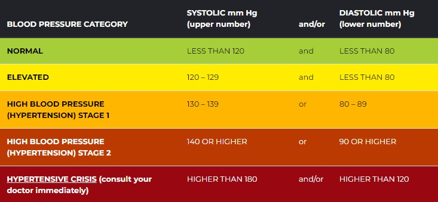

> 血压和血糖一对难兄难弟。血糖是“拆迁队”，专门破坏血管内壁；血压是“高压泵”，专门冲击受损的血管

**一个典型的循环**：缺乏运动 + 肥胖 $\rightarrow$ 产生胰岛素抵抗 $\rightarrow$ 血糖升高 $\rightarrow$ 血管受损、变硬 $\rightarrow$ 血压升高 $\rightarrow$ 进一步加重血管和心脏负担 

## 血压

!!! Abstract
    父亲甚至爷爷奶奶多年高血压，[视频](https://www.youtube.com/watch?v=qEFnaCOmu5E&ab_channel=%E5%BC%B5%E4%BF%AE%E4%BF%AE%E7%9A%84%E4%B8%8D%E6%AD%A3%E5%B8%B8%E4%BA%BA%E7%94%9FShosho%27sAbnormalLife)中博主说到他父亲: **为何吃得健康且运动仍有高血压?**

> 血压（blood pressure）指血管内的血液在单位面积上的侧压力

- 收缩压: 心脏把血液经由左心室从主动脉打出来的那瞬间血管壁所承受的压力(血压的最大值)
- 舒张压: 心脏在舒张让血液流回右心房时血管所承受的压力(血压的最小值)

高血压是[动脉粥样硬化](https://www.mayoclinic.org/zh-hans/diseases-conditions/arteriosclerosis-atherosclerosis/symptoms-causes/syc-20350569)的三大危险因子之一，吸烟对血管是化学性伤害，而高血压则是物理性的

正常范围如下:  -->  [参看中国标准](https://www.bjhd.gov.cn/ztzx/2022/zwxmt/msgz/202211/t20221116_4563515_m.shtml#:~:text=%E6%88%91%E5%9B%BD%E9%AB%98%E8%A1%80%E5%8E%8B%E8%AF%8A%E6%96%AD%E6%A0%87%E5%87%86,%E5%88%B0%E5%A6%82%E4%BB%8A%E7%9A%84130%2F80mmHg%E3%80%82)

**若高压>= 130 或者低压 >= 80则处于第一型高血压范围**

- 若存在高血压，则会一次性冲击到大脑、心脏、肾脏

**如何测血压**: 家庭中，每天起床和睡前，每静坐5min测一次，早晚各两次分别取平均

**高血压诱因**

1. 睡眠呼吸终止症
2. 噪音/空气污染
3. 久坐不动
4. 不当处理自身的压力

### 降血压方法

> 一定从改善生活习惯先入手!!!

1. 减重 (每减少1公斤,收缩压降低约1.05)
2. **有氧运动 + 重训** (一周5~7 次,一次30~60 min) --> Zone2
3. 少吃外食(一定少油少盐),减少钠的摄入
4. 多吃含钾的食物 --> 鱼、肉、香蕉、奇异果、樱桃、火龙果
5. 少喝酒和吸烟
6. [DASH饮食法](https://baike.baidu.com/item/DASH%E9%A5%AE%E9%A3%9F/12789127)
7. 等长阻力训练,e.g. IRT(握力器)
8. 纯水断食(医疗监督下)

### 自身血压记录

|  | 高压(收缩压) | 低压(舒张压) | 脉搏 | 测量时间 |
| :-----| ----: | :----: | : ----: | : ----: |
| 测量情况 | 128mmHg | 77mmHg | 89Bpm | 2023.9.15 研究生入学体检 |
| &nbsp; | 125mmHg | 82mmHg | 84Bpm | 2024.2.17 家庭检测 |
| &nbsp; | 138mmHg | 88mmHg | xxBpm | 2025.12.11 ICBC体检 |  
| &nbsp; | 131mmHg | 84mmHg | 94Bpm | 2026.3.31 公务员体检 |

## 血糖

> 血糖（blood sugar）指血液中的葡萄糖，即血糖浓度的简称。消化后的葡萄糖由小肠进入血液，并被运输到机体中的各个细胞，是细胞的主要能量来源空腹。

- 空腹血糖标准：`3.9-6.1` mmol/L，空腹 > 7即确诊了糖尿病
- 餐后两个小时：11.1以上基本就确诊了 

### 糖尿病

> 糖尿病: 以持续性高血糖为特点的代谢性疾病，患者的胰脏无法制造出足够的胰岛素或身体细胞对胰岛素欠反应，是一个缓慢的过程。
> 
> - 糖耐量/胰岛素分泌能力/细胞接受胰岛素的能力逐渐不行

血糖高 ➡️  糖尿病(~~全国5点多亿有的病症...可见之普遍~~)，同时又会血管/神经造成严重损害

==并不可怕，早发现早治疗!==

**症状：** 三多一少（多饮多食多尿、消瘦）Why?

&nbsp; &nbsp; &nbsp; &nbsp; 肾相当过滤器会将流经肾脏的糖分重新吸收，若血液中糖分太多，肾过滤不过来了，部分葡萄糖就流入尿液。由于渗透压，葡萄糖会把水带出来，进而多尿，多尿导致口干/口渴进而多饮，此外血液中葡萄糖送不进入细胞，细胞能量不足，人体开始分解脂肪和蛋白质，进而导致消瘦，消瘦饥饿感会增加导致多食 （吃得多但葡萄糖无法得到利用，恶性循环）

**糖尿病分类**：I型（更多是天生的，遗传导致）和II型（后天的，大部分都是此类型）

- 若临床诊断为II型糖尿病，大概率脑梗心梗都会存在

!!! Question "什么情况可能导致?"

    1. 父母有糖尿病（遗传）导致概率增加20%-40%
    2. 生活习惯不好，**饮食高糖高油**，整天大米饭/面条，不吃粗粮
    3. 久坐不动（每天至少走30min）
    4. 肥胖（尤其腹型，肚子大）

