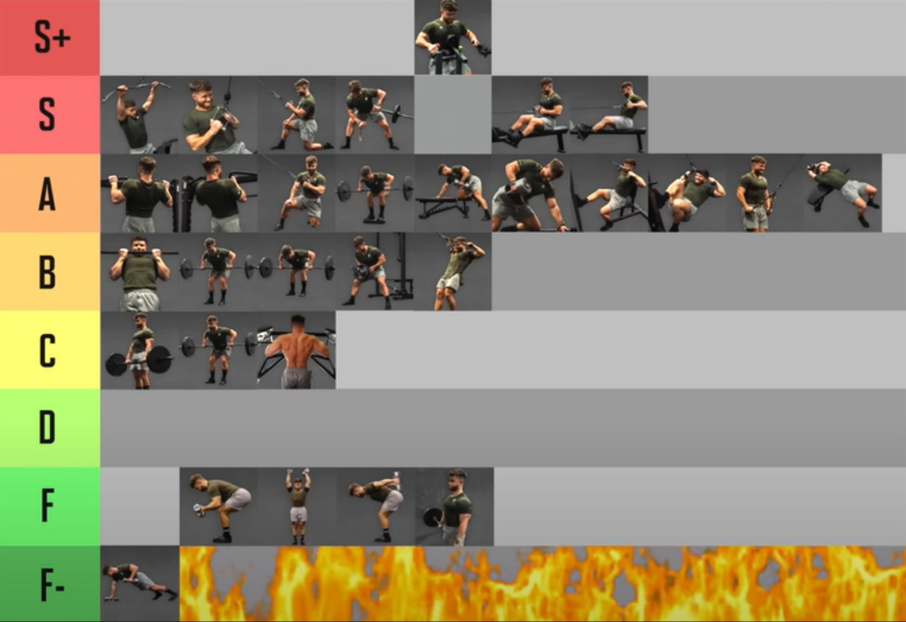

## 胸 + 二头

## 背 + 腹肌

### 背(back)

背阔肌的主要功能是使肩部伸展、内收、内旋 --> [滑轮/高位下拉](https://vdn.vzuu.com/SD/76e9d7f8-2373-11eb-99b8-9e5e67a95bc5.mp4?disable_local_cache=1&bu=078babd7&c=avc.0.0&f=mp4&expiration=1712740097&auth_key=1712740097-0-0-e92b03b3bbcde24b249140da082b7f8f&v=ali&pu=078babd7)

### 腹肌

## 肩膀 + 三头

### 肩膀(shoulder)

肩膀部位[参考图](https://vdn3.vzuu.com/SD/b46aaee2-2353-11eb-a6aa-a6a43386dca3.mp4?disable_local_cache=1&bu=078babd7&c=avc.0.0&f=mp4&expiration=1712329536&auth_key=1712329536-0-0-cdb0bb32392636136da9a9298e44f3af&v=tx&pu=078babd7) 

**分为三部分：**

1. Front Deltoid：三角肌前束

      - 功能：屈曲(flexion) 、内收(adduction)、内旋(interal rotation)手臂/肩关节

2. Deltoid Medial： 三角肌中束
   
      - 功能：手臂的外展(abduction)

3. Rear Deltoid： 三角肌后束

      - 功能：伸展(extension)、外展(abduction)、外旋(external rotation)手臂/肩关节

主要动作：

- **肩部推举**： 前束为主，中束为辅，三头、上胸、斜方肌、后背为协同肌

- 中束： 哑铃侧平举(哑铃飞鸟)  --> [参考](https://vdn6.vzuu.com/SD/2a1bdf54-2394-11eb-8153-ca2ecb5acec4.mp4?pkey=AAXsJS0oLfY7ugU3XpprZ3PS4gTv6szXZ64DowGeuDSVY0Z_l03EohDSBVsP1vcJKE0cBvI_09dg4vMi4aRRDaa7&c=avc.0.0&f=mp4&pu=078babd7&bu=078babd7&expiration=1712333341&v=ks6)
- 后束: 面拉 --> [参考](https://vdn3.vzuu.com/SD/c1f7ee56-23c3-11eb-bcbe-8e97af58ca4d.mp4?disable_local_cache=1&bu=078babd7&c=avc.0.0&f=mp4&expiration=1712329827&auth_key=1712329827-0-0-ae5d237ebcd6789451e007962a38dcea&v=tx&pu=078babd7)

## 臀腿