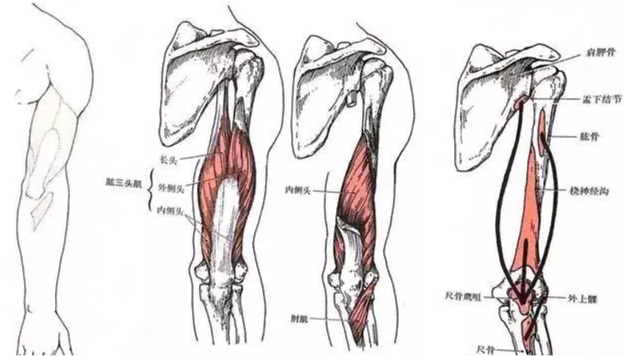

## 胸

胸大肌最主要的而两个功能：肩前屈、水平内收

!!! Note "动作"
      热身：招财猫润滑肩关节 或 肩关节外转外旋环绕

      - 大臂水平地面，肘关节保持90°，肩胛骨和肩关节下沉

      **水平卧推**：乳头连线处开始，小臂垂直地面 （多关节多功能复合型动作）

      **蝴蝶机夹胸**：胸大肌整体单关节动作

      - 龙门架夹胸也可，但无法完全替代

      上胸：**上斜卧推**、**龙门架上斜夹胸**(手臂要外展开)

      下胸复合型动作：双杠臂屈伸 （下胸垂直地面，握距打开，肘关节向两边走）

## 背

背阔肌的主要功能是使肩部伸展、内收、内旋

- 从上往下拉、从前向后拉、从斜下向斜上拉、从地面往起拉 

!!! Note "动作"
      引体向上、高位下拉、坐姿划船、直臂下压

      单臂哑铃俯身划船，对握高位斜拉

## 肩膀

即主要针对三角肌

 

**分为三部分：**

1. Front Deltoid：三角肌前束

      - 功能：屈曲(flexion) 、内收(adduction)、内旋(interal rotation)手臂/肩关节

2. Deltoid Medial： 三角肌中束
   
      - 功能：手臂的外展(abduction)

3. Rear Deltoid： 三角肌后束

      - 功能：伸展(extension)、外展(abduction)、外旋(external rotation)手臂/肩关节

!!! Note "动作"

      **热身**：拉力带/直杆绕肩、龙门架绳索肩外旋、YTW
       
      后束: 绳索面拉、蝴蝶机反向飞鸟、龙门架绳索交叉反向飞鸟

      **肩部推举**： 前束为主，中束为辅，三头、上胸、斜方肌、后背为协同肌
      
      前束： 正手哑铃前平举 

      中束： 哑铃侧平举(哑铃飞鸟)

## 手臂

### 肱三头肌

!!! Note "动作"

      **长头:** 哑铃颈后臂屈伸、俯身哑铃臂屈伸 
      
      **外侧头:** 直杆/绳索下压

      - 臂打开，肘向外，俯身，绳索向外划。不要肩内收和肩后伸，而是肩向外展

### 肱二头肌

> 屈肘由肱二头肌、肱肌和肱桡肌共同完成

握距: 自然站立状态，手掌向外，以此为标准面（即[医学解刨面](https://5b0988e595225.cdn.sohucs.com/images/20171012/0d266102fd064e539833cb155a86eac9.jpg)），比此宽即为宽握，否则是窄握

- 若以肩同宽，则此时处于窄握的位置
- **宽握： 刺激短头**
- **窄握： 刺激长头**

!!! Note "动作"
      **热身**：肩、肘、腕内外旋热身整个上肢 2 x 30

      哑铃/杠铃弯举  --> 长短头
      
      绳索锤式弯举  --> 肱肌
      
      龙门正直杆正握弯举  --> 肱桡肌

## 腹肌

!!! Note "动作"
      **悬垂举腿YYDS！！！**
      
      卷腹

## 臀腿

!!! Note "动作"

      - [ ] 目标：单腿深蹲

      深蹲以及后脚抬高蹲(保加利亚深蹲)、器械腿屈伸 + 髋外展和髋内收器械 + 臀桥

      

##  长远目标

1. **好身材、好情绪、好身体**
2. **街健：解锁五大神技**

- [ ] 双力臂
- [ ] 顺风旗
- [ ] 前/后水平
- [ ] 单臂引体
- [ ] 俄挺

### 街健

多强化重视基础：

- [ ] 标准引体至少10个
      - [ ] 各种握距澳式引体10个
      - [ ] 离心引体10个
- [ ] 标准俯卧撑至少30个
      - [x] 俯卧撑20个（24.7.19）
      - [ ] 钻石俯卧撑
      - [ ] 弓箭型俯卧撑
      - [ ] 单臂俯卧撑
- [ ] 双杠臂屈伸标准10个
- [ ] 单腿深蹲
      - [x] 标准深蹲20个（24.7.19）
- [ ] L型支撑45s
      - [ ] 船型维持45s
- [ ] 倒立
      - [ ] 折刀俯卧撑12个  
- [ ] 单臂悬吊1min
      - [ ] 单杠悬吊1min
- [ ] 悬垂举腿10个