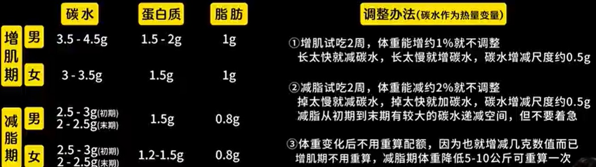

来自[B站](https://www.bilibili.com/video/BV1yX4y1q7LP/?spm_id_from=333.1387.upload.video_card.click&vd_source=41a19477b1cd284eb33c00c0aae3f725)

> 不看什么热量，而是看 **碳蛋脂** （管理碳蛋脂分配！！）
>
> 不是用什么公式计算，还是根据经验化配额调整

单位: g = 每kg体重的日摄入量（g/kg）

而热量根据 ^^碳蛋脂449比例^^ 可进行计算，比如我70kg，自身需要增肌按照上图计算如下：

- `(碳)4g/kg x 4kcal/g x 70kg + (蛋)2g/kg x 4kcal/g x 70g + (脂)1g/kg x 9kcal/g x 70kg = 2310大卡`

!!! Question "如何计算碳蛋脂"

    - 包装食物：看营养成分表——每100g的碳蛋脂含量
    - 常吃的食物：需要个厨房秤（常吃的食物）
        * 用薄荷app查数据 
    - 主食分清生熟：生米碳水75%，干饭碳水30%，稀饭10~15%；生面70%，熟面23% 
        * 100g食物多少碳水 

PS: 多吃先吃蔬菜能抑制胰岛素

## 蛋白质

> 蛋白质存在于包括人在内的所有生物体中,它是细胞生存的基础。

可以说肌肉是仅次于大脑的最重要的器官,而肌肉的合成,蛋白质发挥了关键的作用!

**何为优质蛋白质?**  

- 植物性蛋白 > 奶蛋类 > 没有脚的鱼类 > 两只脚的禽类 > 四只脚的猪肉,牛肉等
- 肉类、鱼类、蛋类、奶制品、豆腐以及各种扁豆和豆类

最低标准: 大约每公斤摄取0.8g; 若以增肌为目标,建议每日每公斤1.6~2.4g

- 只需每天确保摄取足够的白氨酸,离氨酸以及甲硫氨酸即可(三种必须的)
- 第一餐和最后一餐吃大约 2.5~3g 白氨酸,来启动肌肉的[mTOR](https://cellandbioscience.biomedcentral.com/articles/10.1186/s13578-020-00396-1#),即 **对应蛋白质 25~30g**
- **选择均衡的原型食物正常吃,蛋白质摄取一定够!**