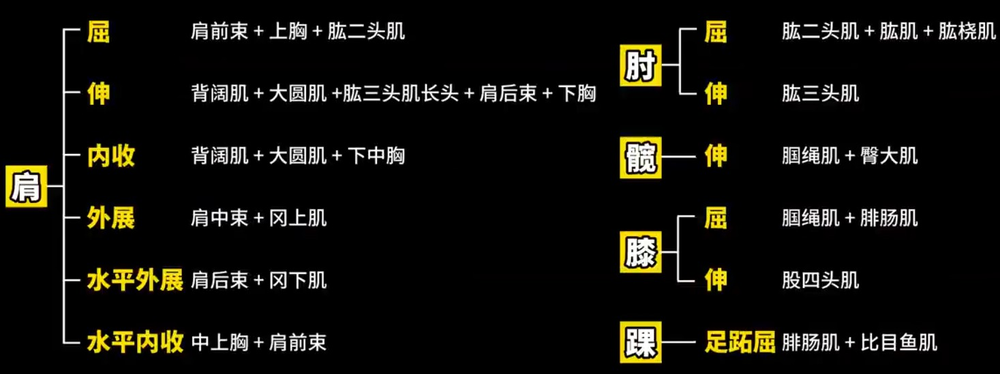
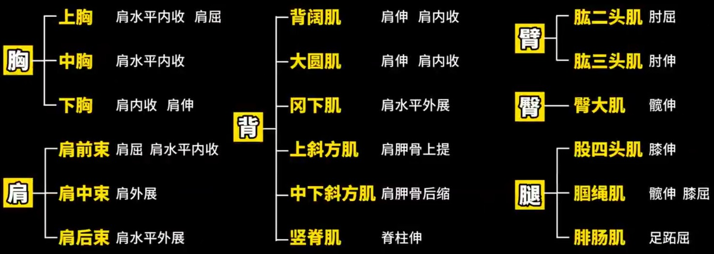
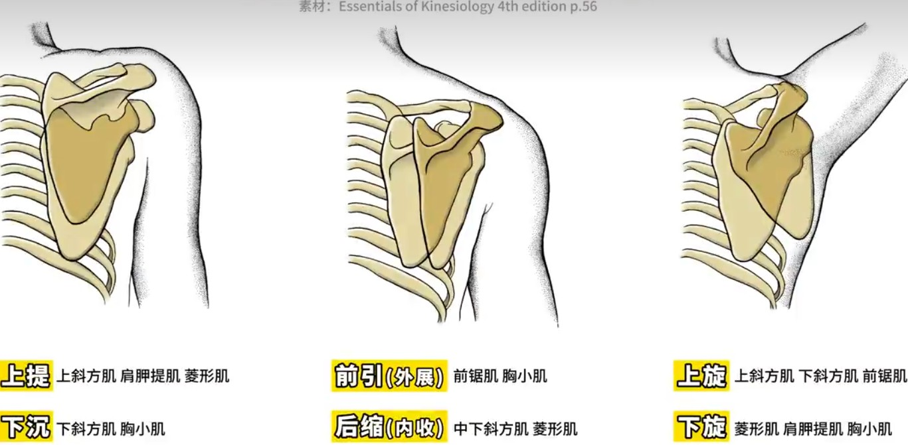
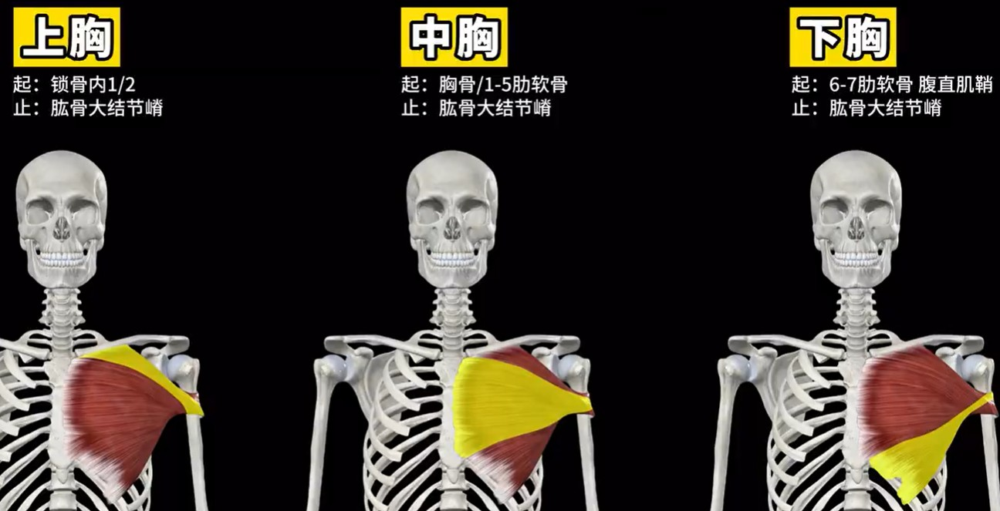
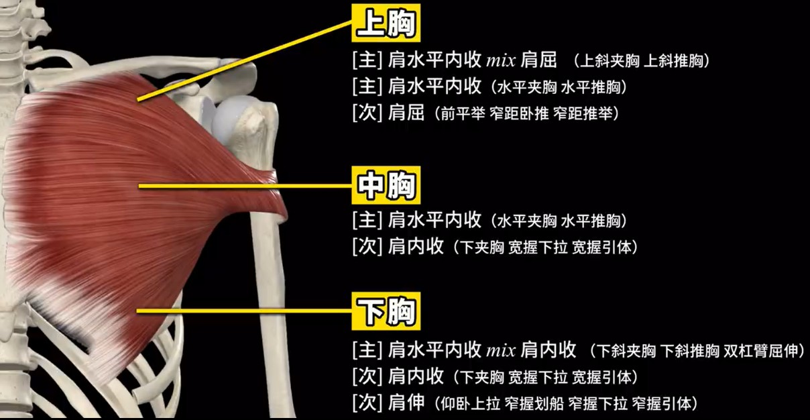
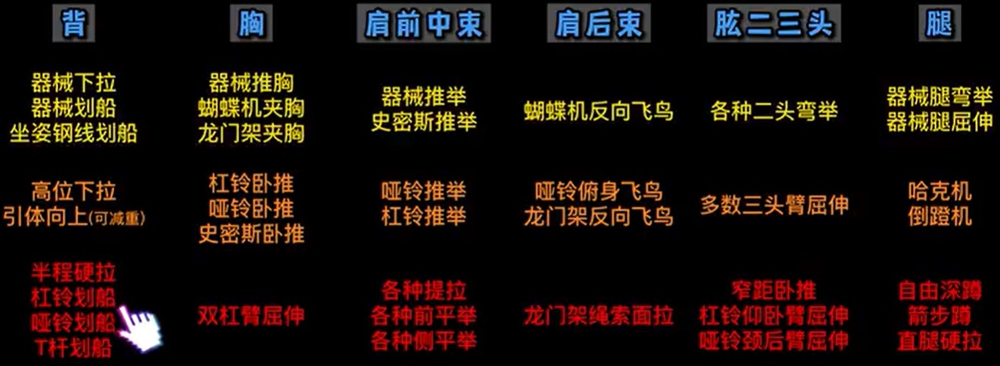
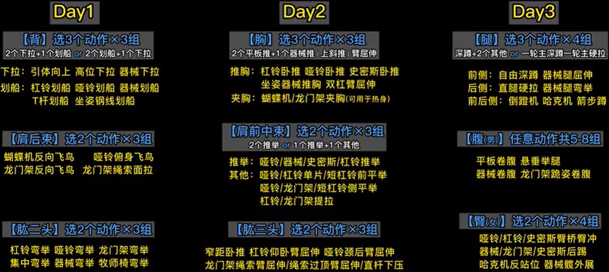

整理参与自up[好人松松](https://space.bilibili.com/2078781964)

## 关节活动

关节活动肌肉图 & 肌肉的关节活动

**总纲如下(所有的基础)** ：

**健身涉及的6个关节：**

> 判断关节活动，是看克服阻力阶段
>
> 克服阻力 = 肌肉缩短 = 向心收缩

- 肩关节：肩关节运动即 **大臂在运动**
    * 大臂在矢状面从后往前即 **肩屈**  (前平举)
    * 大臂在矢状面从前往后即 **肩伸**
    * 大臂在冠状面从内往外即 **肩外展** （侧平举）
    * 大臂在冠状面从外往内即 **肩内收**（龙门架下夹胸）
    * **肩水平外展/内收**  （蝴蝶机正着做即肩水平内收，反着做即肩水平外展）
        * 肩水平外展：反向飞鸟
        * 肩水平内收: 夹胸
- 肘关节：大臂和小臂之间的相对运动，只能在矢状面进行
    - **肘关节屈**：从打直变为折叠 -> 各种弯举类 
    - **肘关节伸**：从折叠变为打直 -> 臂屈伸类
    - PS: ^^胸 + 肩前束 + 肱三头^^ 一起练
- 髋关节: 大腿相对躯干的运动
    - **髋伸**：大腿相对躯干从前往后的运动 （后踢）
- 膝关节：大腿和小腿之间的
    - **屈膝** ：从大腿打直到折叠 （腿弯举）
    - **伸膝** : 从大腿折叠到打直 （腿屈伸）
- 踝关节：小腿和足的运动
    - 绷脚尖动作即 **踝屈** （易混）
- 肩胛胸壁关节(肩胛骨) ：如下运动

上旋/下旋跟着大臂发生的

**三种运动面:**

- 矢状面(前后) -> 屈/伸
- 冠状面(左右) -> 内收/外展
- 水平面 -> 内旋/外旋

## 胸

> 胸大肌俗称胸肌

胸大肌关节活动：

- **肩水平内收**： 水平夹胸类，水平推胸类（肩水平内收+肘伸）
    - 刺激上胸最佳，中胸次之 
    - PS: 屁股前坐或挺胸会导致最佳肌纤维下移(人造下斜板)  
- **肩内收**：龙门架下夹胸、宽握下拉/引体（肩内收+肘屈）
    - 刺激下胸最佳，中胸次之
- **肩屈**(属于上胸的次要关节活动)：前平举、窄距卧推(肩屈+肘伸)
- **肩伸** ：下胸的活动

**动作:** （大臂相对躯干怎么运动？）

- 大臂相对躯干斜上运动：上胸 （上斜夹胸/推胸）
- 大臂相对躯干水平运动：中胸、上胸（水平夹胸/推胸）
- 大臂相对躯干轻微斜下运动：中胸偏下（下斜夹胸/推胸）
- 大臂相对躯干严重斜下运动：下胸（足够的下斜绳索夹胸、双杠臂屈伸）

总：推胸类动作握距大于肩宽 (即原理：胸大肌收缩接近大臂)
- 目的：让大臂从外到内运动

## 健身房计划

**三分化:**  

1. Day1:背 + 肩后束 + 肱二头 （协同肌肉）
2. Day2:胸 + 肩前中束 + 肱三头 （协同肌肉）
3. Day3:胸 + 腹肌

**四分化：（手臂单独练）**

1. Day1:背 + 肩后束
2. Day2:胸 + 肩前中束
3. Day3:肱二头 + 三头
4. Day4:腿 + 腹肌

**四分化：（肩单独练）**

1. Day1:背 + 肱二头 
2. Day2:胸 + 肱三头
3. Day3:肩
4. Day4:腿 + 腹

**各部位动作模式：**

- 胸： 推胸为主 + 夹胸可作为热身
- 背： 下拉 + 划船
- 腿： 前侧(深蹲) + 后侧(硬拉/腿屈伸)
- 肱二头：弯举
- 肱三头：臂屈伸
- 肩前束：推举 + 前平举
- 肩中束：推举 + 侧平举
- 肩后束：面拉、反向飞鸟

**动作难易程度：从简单到困难**

??? Note "健身房三分化训练计划"

    

??? Note "四分化(手单独练)"

    .jpg)

配重可选择6~10次力竭重量