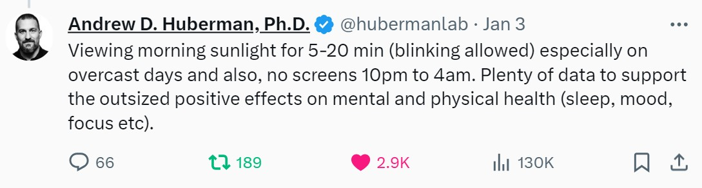

!!! abstract

    看这本书的原因是最近一些睡眠不好，经常出现 **早醒** 症状
    
    偶尔看到了一个[视频博主](https://www.youtube.com/@shoshotw)推荐的这本书
    
    旨在希望了解基本的睡眠原理，改善自己的睡眠。

## 书籍简介
英文原版为[Why we sleep](https://www.goodreads.com/book/show/34466963-why-we-sleep)，作者是[Matthew Walker](https://www.sleepdiplomat.com/professor)

- [豆瓣8.5](https://book.douban.com/subject/35332778/)
- [Amazon 4.7](https://www.amazon.com/Why-We-Sleep-Unlocking-Dreams/dp/1501144316)

> 健康的睡眠需要我们持续投资。健康是1，家庭、事业、财富都是0；没有前面的1，后面有再多0也毫无意义！

本书四个部分:

- 第一部分睡眠这件事
- 第二部分你为什么需要睡眠？
- 第三部分梦的产生和原因
- 第四部分从安眠药到社会变革

## 摘抄整理

当阳光照到视网膜时，^^视网膜神经节细胞^^([retinal ganglion cells](https://en.wikipedia.org/wiki/Retinal_ganglion_cell))接受到特定波长的光线时，会送出信号给 ^^视交叉上核^^(suprachiasmatic nuclei又称[SCN](https://www.ncbi.nlm.nih.gov/books/NBK546664/#:~:text=The%20suprachiasmatic%20nucleus%20(SCN)%20is,tracts%20project%20to%20the%20SCN.))，虽然这个地方比较小，但包含两万多个神经元，是人体的总指挥，经由神经连接到身体各个器官，唤醒身体。

- 若视网膜接受到了足够的光，SCN就会唤醒身体，告知我们:"天亮了！"，于是[肾上腺](https://zh.wikipedia.org/wiki/%E8%85%8E%E4%B8%8A%E8%85%BA)开始分泌肾上腺素以及皮质醇(压力荷尔蒙)，人变清醒过来了

那么什么时候开始有睡意?  -->  **褪黑激素 和 腺苷**

- 褪黑激素：天色越暗，分泌越多，半夜达到高峰，接受到光停止分泌。功能即让人昏昏欲睡
- 腺苷: 活动的时候产生的化学物质，醒的时间越长，浓度越高，进而让我们想睡

人类睡眠不仅是睡觉，而是两种完全不同的睡眠模式在交替循环。他们根据典型的 **眼部特征** 来命名这两种睡眠阶段：==^^非快速眼动(NREM)睡眠和快速眼动(REM)睡眠^^==

非快速动眼睡眠是指没有快速动眼运动的睡眠。在这段睡眠期间，大脑的活动下降到最低，使得人体能够得到完全的舒缓。不同于快速动眼睡眠，在这段期间眼球几乎没有运动。做梦在此时也很少出现，而肌肉在非快速动眼睡眠时并不会麻痹。

当一个生物体进入快速眼动睡眠时，大脑就会麻痹身体，使它变得软弱无力

我曾经很喜欢说：“睡眠是除饮食和锻炼之外的第三大健康支柱。”我如今改变了自己的说法。**睡眠不仅是一个支柱，更是另外两个健康堡垒的基础**。如果把睡眠的基础拿掉，或者稍微削弱一下，严格的饮食或者体育锻炼就会变得不那么有效了

*why sleep?*(好处)

1. 人体的所有组织器官都是在睡眠期间受到修补和加强
2. 睡眠帮助我们情绪调整，更冷静沉默面对白天的挑战!
3. 提高记忆、学习和创造力

睡眠是自然母亲赋予万物的一份礼物，它神秘而迷人，蕴含着无限的可能性。感谢这本书让我们认识到，善待睡眠，才能善待自己。**睡吧，愿所有人，今夜好梦！**

## 睡越少，活越短

若 **睡眠不足** 上述好处都无法得到，如器官得不到恢复，情绪不稳定，记忆力和学习力下降...

1. 损害心血管系统，压力荷尔蒙会增加，生长激素分泌大大减少，血压变高血管变弱  --> 猝死
2. 增加[糖尿病](https://www21.ha.org.hk/smartpatient/spw/zh-hk/disease-information/disease/?guid=c73a0386-fe66-42eb-a979-7619ac8359da)的风险
3. 让免疫力低下，容易生病
4. 增加得癌症的风险
5. 疲劳驾驶 = 酒驾

## 午睡

1. 增加生产力
2. 恢复大脑认知能力
3. 增加运动能力
4. 降低心血管疾病风险
   
**PS: 建议不超过30min**

## 健康睡眠小贴士

1.	**坚持固定的睡眠时间**。尽量每天在同一时间上床睡觉，在同一时间醒来
2.	锻炼很有益，但不要在一天中太晚的时间进行。尽量每天尝试锻炼至少30分钟
3.	睡前避免咖啡因、尼古丁、酒精饮料，避免大量进食，避免会延迟或破坏睡眠的药物
4.	午睡可以帮助弥补缺失的睡眠，也可做[NSDR](https://www.youtube.com/watch?v=3bMP0NSwPgw&ab_channel=RosalieYoga)
5.	**建立自己的睡前仪式(睡前放松)**。应该包含一项轻松的活动，如阅读或听音乐
6.	睡前洗个热水澡 & 保持卧室幽暗凉爽，**并且不要放置任何电子产品**
7.	适当晒晒太阳，**日光是调节日常睡眠模式的关键**。尽量每天在自然阳光下晒30分钟以上

