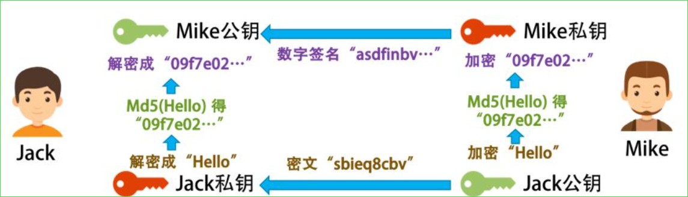

## 比特币的加密方法

**密钥对：**  一种非对称加密技术，加密和解密使用不同的密钥。^^把一个密钥公布出去的称为公钥，另一个自己保存好，称为私钥^^。现实中可以使用公钥加密，私钥解密，也可以反过来。

- 比特币使用[ECDSA](https://www.encryptionconsulting.com/education-center/what-is-ecdsa/#:~:text=Elliptic%20Curve%20Digital%20Signature%20Algorithm,generated%20by%20digital%20signing%20algorithms.)(椭圆曲线数字签名算法)密钥对比技术

比如：我把加密的密钥发布给所有人，大家都用这个公钥加密信息，但别人没有私钥，所以解不了密文，只有我能解，也只有我看得懂别人用我的公钥加密后发给我的密文。但因为所有人都有公钥，可能存在被拦截并且伪装成那个人给我发消息，故需要对身份进行验证，即 **数字签名**

一步步来看...

假设Mike要发信息给我，她也有密钥对，公钥给了我，私钥自己保存。Mike先将自己想发送的信息做个SHA或MD5的Hash，得到一个Hash串，又称为 **Digest**，然后Mike用自己的私钥把Digest加密，得到一段Digest的密文，**这个过程叫做数字签名(Signature)**，再然后Mike把要发送的信息用我的公钥加密后，连同数字签名一同发给我。

我收到之后，用我的私钥解密Mike发给我的密文，然后再用Mike的公钥解密其数字签名得到Digest。再然后，我用SHA或MD5对解开的密文做Hash。如果结果和Digest一致，则信息是Mike发给我的，即没有人更改

但现在有个黑客偷偷地把Jack电脑上的Mike公钥换成自己的，然后截获Mike发出来的信息，用自己的密钥加密一段自己的信息，以及自己的数字签名。于是，对于Jack来说，因为他用了黑客的公钥，而不是Mike的，所以他就以为信息来自Mike，于是黑客可以 **用自己的私钥伪装成Mike给Jack通信**。于是黑客就可以在中间伪装成Jack或Mike来通信，这就是 **中间人攻击**

怎么办？ --> Mike看到有人在伪造他的公钥，他就和Jack找了个大家都相信的永不作恶的权威的可信机构来认证他的公钥。^^这个权威机构，用自己的私钥把Mike的公钥和其相关信息一起加密，生成一个证书。此时，Jack就可以放心地使用这个权威机构的证书了^^。Mike只需要在发布其信息的时候放上这个权威机构发的数字证书，然后Jack用这个权威机构的公钥解密这个证书，得到Mike的公钥，再用Mike的公钥来验证Mike的数字签名

## 比特币的加密