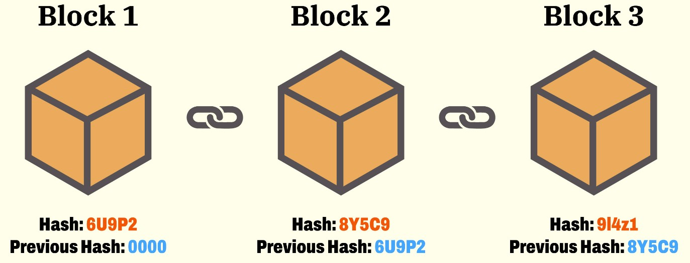
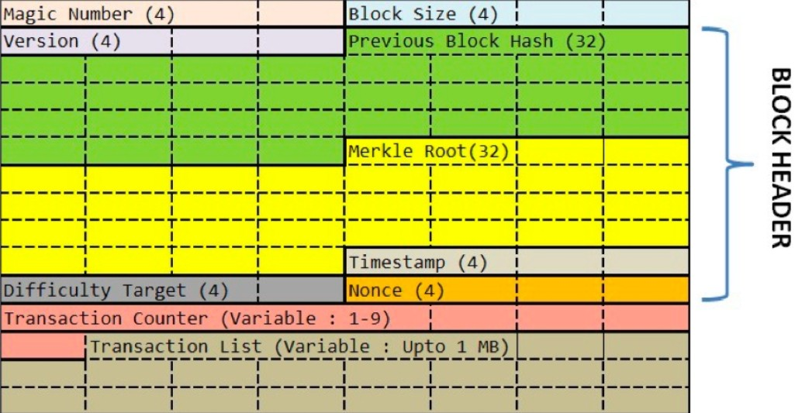
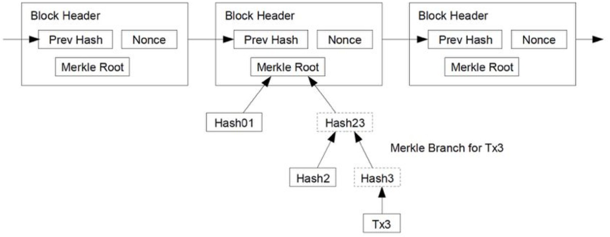

---
comments: true
--- 

## 比特币(Bitcoin)

> 区块链源于比特币，先简单说说比特币

比特币是一种数字货币, 有以下特性:

- **去中心化** 没有中心的服务器，不受某个人的控制，整个系统直接由用户端电脑构成
- **数据防篡改** 所有交易记录[全量存储](https://www.google.com/search?q=%E5%85%A8%E9%87%8F%E4%BF%9D%E5%AD%98&oq=%E5%85%A8%E9%87%8F%E4%BF%9D%E5%AD%98&gs_lcrp=EgZjaHJvbWUyBggAEEUYOTIKCAEQABiABBiiBDIKCAIQABiABBiiBDIKCAMQABiABBiiBDIKCAQQABiABBiiBNIBCDg4MDBqMWo3qAIAsAIA&sourceid=chrome&ie=UTF-8#:~:text=%E6%AF%8F%E5%A4%A9%E5%AD%98%E5%82%A8%E6%9C%80%E6%96%B0%E4%B8%80%E5%A4%A9%E5%85%A8%E9%87%8F%E6%95%B0%E6%8D%AE%EF%BC%8C%E6%AF%8F%E5%A4%A9%E5%9C%A8%E6%BA%90%E7%B3%BB%E7%BB%9F%E5%85%A8%E9%87%8F%E6%8F%90%E5%8F%96%E6%9C%80%E6%96%B0%E6%95%B0%E6%8D%AE%EF%BC%8C%E8%BF%9B%E8%A1%8C%E5%AD%98%E5%82%A8)，并公开给所有的人，而且还被加密和校验
- **固定的发行量**

去中心化的比特币 **交易处理流程:**

1. 用户先把交易传到网络中
2. 网络上会有一些机器叫记账结点，它们通过 **比拼计算力** 的方式竞争记账权。这称为 **挖矿**
3. 获得记账权的结点，会把待记账的交易进行计算打包，并向全网广播。收到新的记账包的结点会对其进行验证，验证通过后加入自己的区块

*PS: 比特币世界没有服务器，完全是靠大家用自己的电脑拼出来的一个分布式系统*

故前提假设是: ^^网络中的任何结点都是不能信任的，每一个都可能会作恶^^

进一步说这个分布式账本系统需要: 任何人都可以拿到所有的数据，即数据要能很容易被验证是合法的，没有被修改过的，而且也要很难被人修改的

故比特币用了两大技术 :  ==区块链技术 & 工作量证明共识机制==

## 区块链技术(BlockChain)

> 有一个一个的Block，每个Block中包括着一组交易信息，然后，每一个Block都会有一个ID（或是一个地址），这些Block通过记录前一个Block的ID来形成一条链

其实就类似于单向链表，包含三个信息：

- 真正的数据
- 自己的ID(或地址)：地址的编码使用了 **Secure Hash**
- 前一个Block的地址

PS: 每个Block的ID都是由内容来定的，只要内容变了，ID则完全不一样。因还包括上一个Block的ID，故产生连锁反应，即一个Block变化，后续的Block全要变化，修改成本大大提升。因此越旧的Block，越安全不容易被篡改，而新的Block则会越不安全

但仅仅是难以篡改，**工作量证明的共识机制** 使得无法篡改

### 哈希算法

**Hash功能：**

1. 用来生成唯一标识一个数据块的ID，几乎不能重复
2. 用来做数据的特征码。只要数据中有一个bit出现修改，那么整个hash值就完全不一样

!!! Note
    很多公司在互联网上发布信息或软件的时候，都会带上一个Checksum（校验码）
    
    只要把整个文件的数据传入到那个特定的hash算法中，就会得到一串很长的字符串
    
    如果和官方发布的Checksum字符串不一样，那么就说明信息或文件内容被人更改或是信息残缺了。
    因此，也被应用在[数字签名](https://www.google.com/search?q=%E6%95%B0%E5%AD%97%E7%AD%BE%E5%90%8D&oq=%E6%95%B0%E5%AD%97%E7%AD%BE%E5%90%8D&gs_lcrp=EgZjaHJvbWUyBggAEEUYOTIGCAEQABgeMgYIAhAAGB4yBggDEAAYHjIGCAQQABgeMgYIBRAAGB4yBggGEAAYHjIGCAcQRRg90gEINTQ2M2oxajSoAgCwAgA&sourceid=chrome&ie=UTF-8#:~:text=%E5%8F%AA%E6%9C%89%E4%BF%A1%E6%81%AF%E7%9A%84%E5%8F%91%E9%80%81%E8%80%85%E6%89%8D%E8%83%BD%E4%BA%A7%E7%94%9F%E7%9A%84%E5%88%AB%E4%BA%BA%E6%97%A0%E6%B3%95%E4%BC%AA%E9%80%A0%E7%9A%84%E4%B8%80%E6%AE%B5%E6%95%B0%E5%AD%97%E4%B8%B2%EF%BC%8C%E8%BF%99%E6%AE%B5%E6%95%B0%E5%AD%97%E4%B8%B2%E5%90%8C%E6%97%B6%E4%B9%9F%E6%98%AF%E5%AF%B9%E4%BF%A1%E6%81%AF%E7%9A%84%E5%8F%91%E9%80%81%E8%80%85%E5%8F%91%E9%80%81%E4%BF%A1%E6%81%AF%E7%9C%9F%E5%AE%9E%E6%80%A7%E7%9A%84%E4%B8%80%E4%B8%AA%E6%9C%89%E6%95%88%E8%AF%81%E6%98%8E)中

两个著名的Hash算法： [MD5](https://en.wikipedia.org/wiki/MD5)和[SHA-2](https://en.wikipedia.org/wiki/SHA-2)，而区块链用的是[SHA-256](https://en.wikipedia.org/wiki/SHA-2)

### 比特币的哈希算法

**区块链的协议格式：**

- **区块数据协议头:**
    - Version：当前区块链协议的版本号(4字节)
    - Previous Block Hash：前面那个区块的hash地址(32字节)
    - Merkle Root：后面交易信息的hash值(32字节)
    - Timestamp：区块生成的时间(4字节)
    - Difficulty Target(Bits)：表明了当前的hash生成的难度(4字节)
    - Nonce：一个随机值，用于找到满足某个条件的hash值(4字节)

^^对这六个字段进行hash计算，就可以得到本区块的hash值，即其ID或是地址^^

然而比特币对hash值是有要求的，要求是由Bits字段控制的，可以调整Nonce这个32位整型的值来找到符合条件的hash值。把这个事情叫做 **挖矿**

- **后面的为交易数据：**
    - 本块中的交易笔数H
    - 交易列表

Q: Merkle Root如何计算？

**因比特币的交易有三个字段：转出方 & 转入方 & 金额**，则会对每个交易的这三个字段求hash，然后把交易的hash做两两合并，再求其hash，直到算出最后一个hash值，即是要求的值

## 工作量证明的共识机制

!!! Question

    在分布式系统中结点是被信任的，而去中心化的网络中则不可信任，那如何保证数据一致性？

数据一致 --> ^^和谁的数据一致？以谁为标准？^^

- "大部分认同的数据即是对的"  --> **Proof-of-Work工作量证明机制** 即 ==挖矿==
- 用大规模的计算来找到一个符合系统要求的区块ID
    * 要找到相应ID只能暴力穷举，故要付出系统的大量计算资源和电力