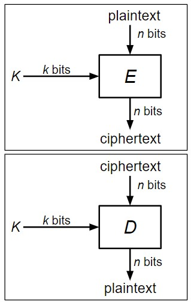

# Block-Ciphers(分组密码)

## 定义

因对于每次加密产生新的密钥是困难并且昂贵的，所以在大多数对称加密方案中，Alice和Bob共享密钥，并且使用此密钥进行重复和解密消息。  
**分组密码则是实现这种对称加密方案的基本单元**

> 分组密码: 一种加密/解密算法，用于加密固定大小的比特块

**简介：** 分组密码转换 ^^n比特固定长度的输入^^ 为 ^^n比特固定长度的输出^^ ，并且它有$2^k$个不同的打乱设置，所以它也需要 **k比特的密钥** 作为输入，以确定应该使用哪种置乱设置，每个密钥对应一个不同的打乱设置。因攻击者不知道密钥，也将无法知道正在使用哪种加密模式，因此将无法解密使用分组密码加密的消息。

{ align=right }

**分组密码有两个操作：**

- 加密：$E_k(M)$ --> C
    * 输入：k位密钥K和n位明文M
    * 输出：n位密文C
    * 也可以表示为: $\{0,1\}^k \times \{0,1\}^n \rightarrow \{0,1\}^n$
- 解密：$D_k(C)$ --> M (即加密函数的逆)
    * 输入：一个k位密钥和一个n位密文C
    * 输出：n位明文M
    * 也可以表示为: $\{0,1\}^k \times \{0,1\}^n \rightarrow \{0,1\}^n$
- 属性: 
    * 正确性：$E_K$是个变换，$D_K$是它的逆
    * 效率：加密/解密应该比较快
    * 安全性: E的行为类似于随机变换

## 分组密码：正确性

$E_K(M)$ 必须是n位串上的置换([双射函数](https://zh.wikipedia.org/wiki/%E5%8F%8C%E5%B0%84))

- 每个输入必须对应一个唯一的输出

假设$E_K(M)$不是双射函数，那么两个输入可能对应相同的输出：$E(K, x_1) = E(K, x_2) = y$，此时对于密文，将不能唯一地解密，即$D(K, y) = x_1?$ 还是$D(K, y) = x_2?$ 

所以如果给定相同的输入和密钥，分组密码应该总是给出相同的输出

然如上所定义的分组密码是一类函数，即意味着分组密码有许多不同的实现。如今，最常用的分组密码实现被称为[AES](https://www.techtarget.com/searchsecurity/definition/Advanced-Encryption-Standard)，是由来自比利时的两位研究人员Joan Daemen和Vincent Rijmen在1998年响应[NIST](https://en.wikipedia.org/wiki/National_Institute_of_Standards_and_Technology)组织的竞赛而设计的

## 分组密码：高效性
加密和解密应该在微秒内计算,即KeyGen()，Enc()和Dec()不应该花费指数时间

分组密码算法通常使用异或、位移位和利用小查找表来进行查找等操作

- 在现代处理器上非常快
  
现代CPU还为分组密码提供专用硬件支持

## 关于DES和AES

### DES 

(Data Encryption Standard)

于70年代后设计，块大小64位(n = 64)，密钥大小为56位(k = 56)

[NSA](https://en.wikipedia.org/wiki/National_Security_Agency)影响了设计的两个方面：

- 将密钥大小从64位减少到56位
- 使得暴力攻击对于拥有大量计算资源的攻击者来说是可行的(按照20世纪70年代的标准)

40年后，这个算法基本上没有被打破，然而现代计算机的速度使它完全不安全，由于密钥太小

- 假设在一个台式电脑的Nvidia显卡上每秒尝试$10^{10}$，需花费$6.4 \times 10^6$ 约70天

### AES 

(Advanced Encryption Standard)

1997~2000年，NIST举办了一场竞赛，为了挑选一种新的分组密码标准。在5个决赛中: 

- Rijndael, Twofish, and Serpent有非常好的性能
- RC6 性能还算ok
- Mars 性能不佳

在任何给定的计算平台上，Rijndael从来都不是最快的，但在 **每一个** 计算平台上，Rijndael总是第二快的。然而Twofish和Serpent各自至少有一个不擅长的计算平台。**所以最终Rijndael被选为新的分组密码标准**

密钥大小128、192或256位(k = 128、192或256)

- 实际的密码名称是AES-128、AES-192和AES-256
  
块大小128位(n = 128)，PS:无论密钥大小如何，块大小仍然总是128位

不需要知道[AES算法](https://docs.google.com/presentation/d/1RMdkoQ5SxvPaK68Ul-ywB05WVsTx-SXneegCzrIsoKM/edit#slide=id.g111e67e433c_0_352)怎么工作的，只需知道参数即可 --> 参考[漫画](https://www.moserware.com/2009/09/stick-figure-guide-to-advanced.html)

总之：==**AES是现代标准分组密码算法**==，（标准密钥大小(128位)足以防止暴力攻击）

## 分组密码：安全性

**考虑场景：** Eve发送$M_0$和$M_1$给对方，它要么会收到$E(K,M_0)$要么收到$E(K, M_1)$，接着它再询问对于$M_0$的加密，得到$E(K, M_0)$，只需比较于之前的是否相同，即Eve能赢得IND-CPA以100%的概率 > $1/2$

故分组密码(包括AES)本身并不是IND-CPA安全的，因为它们是确定的。^^也就是说，用相同的密钥对相同的消息加密两次会产生相同的输出两次^^。虽然分组密码不是IND-CPA安全的，但有一个理想的安全属性，可以帮助我们构建IND-CPA安全的对称加密方案 --> 即安全分组密码的行为就像从n位字符串上的所有排列集中随机选择的排列

> 随机排列：每个n位输入映射到一个随机选择的n位输出

其中一个是用了随机选择K的$E_K$，另一个是随机选择的排列，Eve无法进行分清

即如果没有密钥K，$E_K(M)$在计算上与随机排列无法区分

### 存在问题

1. 分组密码不是IND-CPA安全的，因为它们是确定的
    - 如果相同的输入总是产生相同的输出，则方案是确定性的
    - 任何确定性方案都不会是IND-CPA安全的，因攻击者总知道同一消息是否被加密两次
2. 分组密码只能加密固定大小的消息

为了解决上述问题, 将添加使用分组密码作为构建块的操作模式(**modes of operation**)