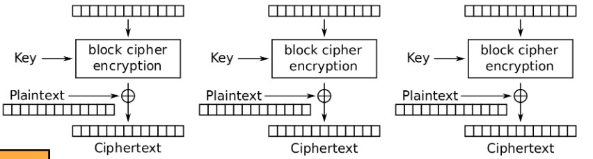
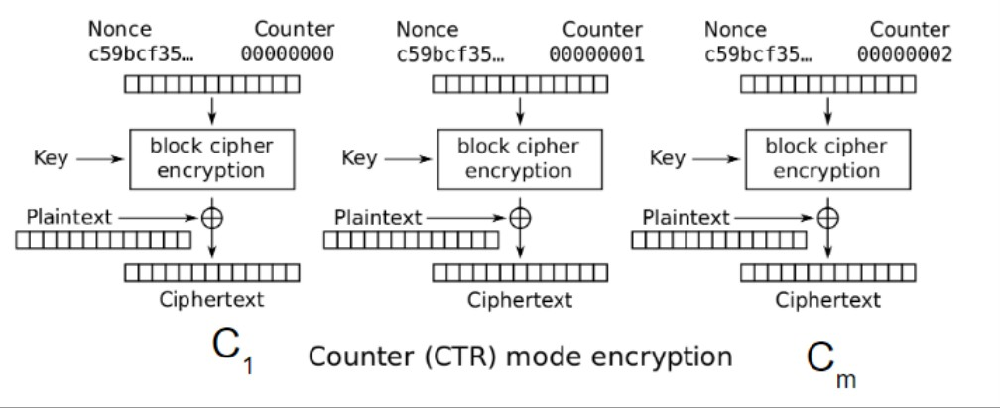
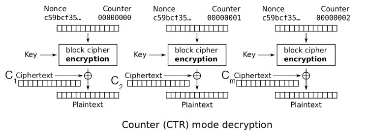

# Block Cipher Modes of Operation

有几种 **使用分组密码构建加密算法** 的标准方法(或操作模式):

- ECB Mode (Electronic Code Book)
- CBC Mode (Cipher Block Chaining)
- Counter (CTR) Mode
- CFB Mode (Ciphertext Feedback Mode)
- OFB Mode (Output Feedback Mode)

## ECB

假设AES现在只能加密128bit的消息，那么如何加密更长的？(比如256bit)

- Idea： 使用AES更多次（比如若256bit，则用两次）

在这种模式中，明文M被分为n-bit的块$M_1...M_m$(假设m是M中明文块的数量，每个块的大小为n)，并且每个利用分组密码进行 **加密**: $C_i = E_K(M_i)$，密文只是这些单独块的连接: $C = C_1 \cdot C_2 \cdots C_m$，因ECB是确定的，故AES-ECB不是AND-CPA安全

PS: **解密** --> $M_i = D_K(C_i)$

缺陷：可能泄露明文的信息。 比如：如果$M_i = M_j$，则$C_i = C_j$

??? Example

    === "原始的图片"
        

    === "利用ECB加密后的图片"
        

## CBC

通过添加一些 **随机性** 来解决上述问题

给出初始化向量，它对于每种加密都是不同的。此时每个加密的第一个密文块将都是不同的!

此时因第一个密文块的计算具有一定的随机性，之后再给后面的块添加随机性，如图

**加密**：$C_0 = IV, C_i = E_K(M_i \bigoplus C_{i - 1})$

- 将M拆分为m个明文块$P_1 \cdots P_m$,每个块大小为n
- 随机一个随机的IV
- 计算并输出$(IV, C_1, \cdots, C_m)$作为整个密文

那么如何进行解密？-->  对密文两边先进行解密，再两边进行$\bigoplus$操作，如下：

$$
\begin{align}
    & \because C_i = E_K(M_i \bigoplus C_{i - 1}) \\
    & \therefore D_K(C_i) = D_K(E_K(M_i \bigoplus C_{i - 1})) \\
    & \therefore D_K(C_i) = M_i \bigoplus C_{i - 1} \\
    & \because D_K(C_i) \bigoplus C_{i - 1} = M_i \bigoplus C_{i - 1} \bigoplus C_{i - 1} \\
    & \therefore D_K(C_i) \bigoplus C_{i - 1} = M_i
\end{align}
$$

即 **解密** ：$M_i = D_K(C_i) \bigoplus C_{i - 1}$

Q: 加密和解密可以并行化吗？

- 加密：不可以！必须等待区块i完成后才能加密区块i+1
- 解密：可以！仅仅需要密文作为输入

Q: 如果要加密的消息不是块大小的倍数，该怎么办?

(明文长度是块大小的倍数AES-CBC才可被定义)

**解决办法: 填充消息，直到它是块大小的倍数**
  
- 填充(padding):在消息的末尾添加虚拟字节(dummy bytes)，直到它达到适当的长度

那么应该采取哪种填充的方案？

^^一个正确的填充方案是[PKCS#7](https://en.wikipedia.org/wiki/PKCS_7)，根据所使用的填充字节数填充消息^^

- 如果需要1个字节，用`01`填充;如果需要3个字节，就用`03 03 03`填充
- 如果需要0个填充字节，则填充整个虚拟块

> 如果IV随机生成，并且不重复使用，则AES-CBC是IND-CPA安全的

??? Example

    === "原始的图片"
        

    === "利用随机的IV通过CBC加密后的图片"
        

## CTR

如果我们不重复使用密钥key，*one-time pads* 就很安全; 如果攻击者不知道密钥，则分组密码的输出看起来就是随机的 -->  Idea: **可以使用分组密码来模拟 *one-time pads* 吗?**

使用随机输出作为 *one-time pad* --> **记住 *one-time pads* :将pad与明文进行XOR获得密文**

那么应该用什么作为分组密码的输入? 

- IND-CPA方案需要随机性，所以放置一个随机的nonce
     * PS: 这里的随机值被命名为nonce，其思想与CBC模式中的IV相同
- counter每个块递增，以确保每个块密码输出是不同的

**加密Enc(K, M)**：

- 将M拆分为明文块$P_1…P_m$(每个块大小为n)
- 选择随机的nonce
- 计算和输出$(Nonce, C_1,…,C_m)$

如何进行解密？ -->  回想one-time pads:使用密文进行XOR以获得明文

- 解析C为$(Nonce, C_1,…,C_m)$
- 计算$P_i$，通过$C_i$与$E_k$在nonce和counter作用下的输出之间进行XOR
- 连接结果明文并输出$M = P_1…P_m$

^^PS: 我们只使用分组密码加密，而不使用其解密^^

Q: 加密和解密可否并行化？  --> YES!

Q: 是否需要填充信息？  --> 不需要，可以把XOR中比信息长的部分剪掉

如果nonce是随机的并且不被再次使用，则AES-CTR是IND-CPA安全的

如果再次使用了会怎么样？-->  相当于在one-time pads中重复使用密钥

- one-time pads中密钥重用是灾难性的:通常会泄露足够的信息，使攻击者推断出整个明文

**IVs and Nonces** ：

**初始化向量(IV)**：一个随机的，但公开的，一次性使用的值，将随机性引入算法

- 对于CTR，使用nonce(一次使用的数字)，因为值必须是唯一的，而不一定是随机的

不要重复使用IVs :

- 在某些算法中，IV/nonce重用会泄漏有限的信息(例如CBC)
- 在某些算法中，IV/nonce重用会导致灾难性故障(例如CTR)

**比较** ： 

如果需要高性能，哪种模式更好? --> CTR，因为可以并行加密和解密

如果担心安全性，哪种模式更好? --> CBC

!!! Note
    理论上，如果使用得当，CBC和CTR模式同样安全
    
    但如果使用不当(IV/nonce重用)，CBC只会泄露部分信息，而CTR则会灾难性地失败

## Other Modes of Operation

### CFB

CFB另一种流行的模式，其属性与CBC模式非常相似。

**加密**： $C_0 = IV, C_i = E_K(C_{i - 1}) \bigoplus M_i$

**解密:** $M_i = E_K(C_{i - 1}) \bigoplus C_i$

### OFB

在此模式下，对初始向量IV进行多次加密，得到一组值$Z_i$：$Z_0 = IV, Z_i = E_K(Z_{i - 1})$，$Z_i$被当作one-time pads中的密钥使用，即$C_i = Z_i \bigoplus M_i$，也就是密文是初始向量和这些单独块的连接:$C = IV \cdot C_1 \cdot C_2 \cdots C_m$

**解密**： $M_i = C_i \bigoplus Z_i$

## 总述

分组密码是为 **保密性(confidentiality)** 而设计的(IND-CPA)

但如果攻击者篡改了密文，并不能保证检测到它

还记得Mallory么: 一个想要篡改消息的主动操纵者

即可能会导致Lack of Integrity(完整性) and Authenticity(真实性)

