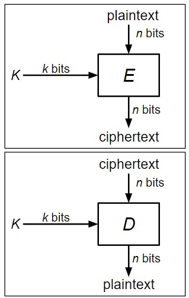

# Block-Ciphers(分组密码)

## 定义

因对于每次加密产生新的密钥是困难并且昂贵的，所以在大多数对称加密方案中，Alice和Bob共享密钥，并且使用此密钥进行重复和解密消息。  
**分组密码则是实现这种对称加密方案的基本单元**

> 分组密码: 一种加密/解密算法，用于加密固定大小的比特块

**简介：** 分组密码转换 ^^n比特固定长度的输入^^ 为 ^^n比特固定长度的输出^^ ，并且它有$2^k$个不同的打乱设置，所以它也需要 **k比特的密钥** 作为输入，以确定应该使用哪种置乱设置，每个密钥对应一个不同的打乱设置。因攻击者不知道密钥，也将无法知道正在使用哪种加密模式，因此将无法解密使用分组密码加密的消息。

{ align=right }

**分组密码有两个操作：**

- 加密：$E_k(M)$ --> C
    * 输入：k位密钥K和n位明文M
    * 输出：n位密文C
    * 也可以表示为: $\{0,1\}^k \times \{0,1\}^n \rightarrow \{0,1\}^n$
- 解密：$D_k(C)$ --> M (即加密函数的逆)
    * 输入：一个k位密钥和一个n位密文C
    * 输出：n位明文M
    * 也可以表示为: $\{0,1\}^k \times \{0,1\}^n \rightarrow \{0,1\}^n$
- 属性: 
    * 正确性：$E_K$是个变换，$D_K$是它的逆
    * 效率：加密/解密应该比较快
    * 安全性: E的行为类似于随机变换

## 分组密码：正确性

$E_K(M)$ 必须是n位串上的置换([双射函数](https://zh.wikipedia.org/wiki/%E5%8F%8C%E5%B0%84))

- 每个输入必须对应一个唯一的输出

假设$E_K(M)$不是双射函数，那么两个输入可能对应相同的输出：$E(K, x_1) = E(K, x_2) = y$，此时对于密文，将不能唯一地解密，即$D(K, y) = x_1?$ 还是$D(K, y) = x_2?$ 

所以如果给定相同的输入和密钥，分组密码应该总是给出相同的输出

然如上所定义的分组密码是一类函数，即意味着分组密码有许多不同的实现。如今，最常用的分组密码实现被称为[Advanced Encryption Standard(AES)](https://www.techtarget.com/searchsecurity/definition/Advanced-Encryption-Standard)，是由来自比利时的两位研究人员Joan Daemen和Vincent Rijmen在1998年响应NIST组织的竞赛而设计的

## 分组密码：安全性

分组密码(包括AES)本身并不是IND-CPA安全的，因为它们是确定的。也就是说，用相同的密钥对相同的消息加密两次会产生相同的输出两次

安全分组密码的行为就像从n位字符串上的所有排列集中随机选择的排列

- 随机变换：每个n位输入映射到一个随机选择的n位输出