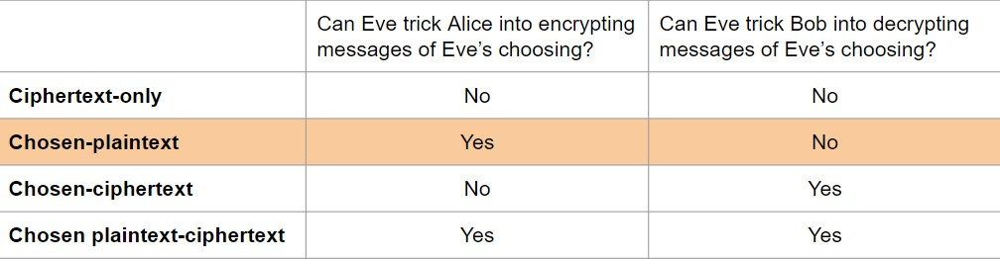

## 1. 密码学简史
**密码学(cryptography)** 一词来自拉丁语词根 *crypt* 和 *graphia*，前者意为秘密，后者意为书写。所以密码学就是研究如何写秘密信息。

- 第一阶段的秘密消息方案可追溯到古代 -->  [凯撒密码Caesar cypher](https://zh.wikipedia.org/zh-cn/%E5%87%B1%E6%92%92%E5%AF%86%E7%A2%BC)
- 第二阶段:机械时代  --> [恩尼格玛Enigma密码机](https://zh.wikipedia.org/zh-cn/%E6%81%A9%E5%B0%BC%E6%A0%BC%E7%8E%9B%E5%AF%86%E7%A0%81%E6%9C%BA)
- 现代密码学  --> Claude Shannon即[香农](https://zh.wikipedia.org/wiki/%E5%85%8B%E5%8A%B3%E5%BE%B7%C2%B7%E9%A6%99%E5%86%9C) --> 标准的加密系统[DES](https://zh.m.wikipedia.org/wiki/%E8%B3%87%E6%96%99%E5%8A%A0%E5%AF%86%E6%A8%99%E6%BA%96)
    *  现代密码学涉及大量的数学
## 2. 定义
> 密码学中最基本的问题是确保在不安全的介质上通信的安全性

为了正式研究密码学，需要定义一个数学严谨的框架

**什么是密码学？**

- Older definition：在不安全信道上进行安全通信的研究
- Newer definition: 在攻击者存在的情况下，对数据和计算的安全性提供严格的保证
    * 不仅仅是保密性(confidentiality)，还有完整性(integrity)和真实性(authenticity)    
### 定义Alice, Bob, Eve, and Mallory
- Alice and Bob: 主要角色,试图通过不安全的通信通道互相发送消息
- Eve: 一个窃听者(eavesdropper)，可以读取通过信道发送的任何数据
- Mallory: 一个操纵者，可以读取和修改通过通道发送的任何数据

**目标:** 设计一种方案，可以通过这种方式混淆Alice和Bob之间的消息，以至于Eve不知道交换内容，而Mallory无法在不被发现的情况下篡改交换的内容。即只使用不安全的信道来模拟理想的通信信道

### 定义Keys(密钥)
^^任何密码系统的最基本构建模块是密钥^^。密钥是一个秘密值，帮助我们保护消息。许多密码算法和函数都需要一个密钥作为输入来锁定或解锁一些秘密值

主要的密钥模型：

- **对称密钥** Alice和Bob都有密钥值，必须使用这个共享的密钥值来保护他们的通信
- **非对称密钥** 每个人都有一个密钥和相应的公钥

### 定义：保密性，完整性，真实性
- 保密性: 敌人不能 **读** 我们的消息  -->  进行加密( *encrypt* )
    * plaintext(明文) --> ciphertext(密文)
- 完整性: 敌人不可能在不被发现的情况下 **改变** 我们的信息
- 真实性: 可以确信消息是由声称编写它的人编写的。
    * 在你能证明消息来自特定人之前，首先必须证明消息没有被更改

PS: 保证完整性和真实性 --> 生成一个标签(tag)或签名(signature)

### 定义：Kerckhoff原则
> 即使密码系统的任何细节已为人悉知，只要密钥(keys)未泄漏，它也应是安全的

我们将假设攻击者知道加密和解密算法(甚至所有的信息)，除了 **密钥** 攻击者不知道

## 3. 威胁模型(threat models)
==^^如果Eve不仅仅是偷听/窃听呢？^^==

- 真实世界中有更多复杂的攻击，故也创造了更多复杂的threat models

根据攻击者能够获取的不同明密文信息将其攻击能力分为几个模型:

1. 仅密文攻击(Ciphertext-only attack)
    * 攻击者(Eve), 只获得了若干密文，并希望恢复明文(原始消息)
2. 已知明文攻击(Known-Plaintext)
    * Eve拦截了一个加密消息，并且已经有了一些关于明文的部分信息
3. 重放攻击(replay attack)
    * Eve 可以捕获 Alice 发送给 Bob 的加密消息，并重新发送加密消息给 Bob。
4. 选择明文攻击(Chosen-Plaintext)
    * Eve 可以欺骗 Alice 加密 Eve 自己选择的任意消息，然后观察生成的密文。^^(如果 Eve 能够访问加密系统，或者能够生成导致 Alice 响应可预测消息的外部事件，则可能发生这种情况)^^。在其他时间点，Alice 加密了一个 Eve 不知道的消息；Eve 拦截了 Alice 消息的加密，并希望根据 Eve 关于先前加密观察到的内容来恢复消息
4. 选择密文攻击(Chosen-Ciphertext)
    * Eve 可以欺骗 Bob 解密一些密文。Eve 希望利用这一点来了解另一些密文
6. 选择明文-密文攻击(chosen plaintext-ciphertext)
    * **前两种情况的组合**：Eve 可以欺骗 Alice 加密一些 Eve 选择的消息，并欺骗 Bob 解密一些 Eve 选择的密文
    * 最严重的威胁模型(实践中，密码学家也会使用的)

## 4. Cryptography Roadmap

- Hash functions
- Pseudorandom number generators(伪随机生成器)
- Public key exchange公钥交换协议 (e.g. Diffie-Hellman)
- Key management密钥管理(certificates证书)
- Password management

