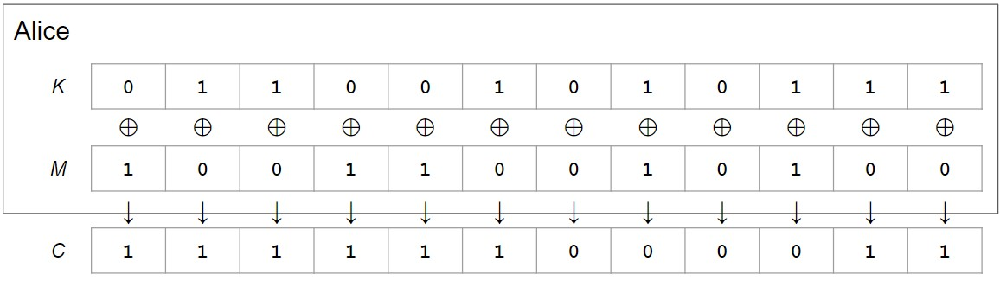

# 一次性密码本(One-time pads)

## 回顾：XOR(异或运算)
**相异为1，相同为0** -->  e.g. $0 \bigoplus 1 = 1, 1 \bigoplus 0 = 1,1 \bigoplus 1 = 0,0 \bigoplus 0 = 0$

有用的一些属性: 

- $x \bigoplus 0 = x, x \bigoplus x = 0, y \bigoplus x = x \bigoplus y$
- $(x \bigoplus y) \bigoplus z = x \bigoplus (y \bigoplus z), (x \bigoplus y) \bigoplus x = y$

## 简介
对称加密方案 *one-time pad* (OTP)，它是个简单而理想化的加密方案，对于真实世界并不实际

在这个方案中，Alice和Bob共享一个随机的n位的密钥即$K = k_1...k_n$。假设Alice想发送n位的信息$M = m_1...m_n$， 要对这个M进行加密。--> **Idea: 用XOR将$M$和$K$打乱**

怎么打乱？$M$和$K$每个对应位之间进行XOR操作，如下所示:

图中的$C$就是Alice要通过不安全信道发送给Bob的密文

Q: Bob收到密文$C$之后，如何得到原来的信息M？--> 只需$C$和$K$的对应位进行XOR即可

可以用如下三个步骤来描述：

1. KeyGen(): 随机生成一个n位的密钥(假设Alice和Bob可以安全的共享)，对于one-time pad，我们为每条消息生成一个新密钥
2. Enc(K, M) = K $\bigoplus$ M, 按位对M和K进行XOR得到C
3. Dec(K, C) = K $\bigoplus$ C, 按位对C和K进行XOR得到M

## 正确性